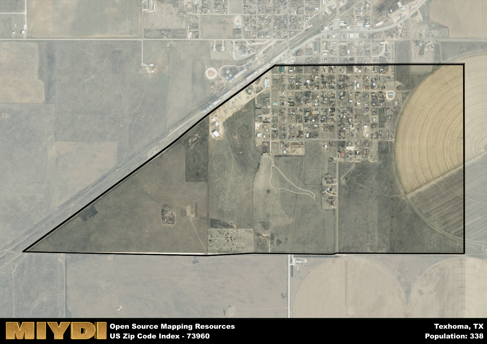

**Area Name:** Texhoma

**Zip Code:** 73960

**State:** TX

Texhoma is a part of the Guymon - OK Micro Area, and makes up  of the Metro's population.  

# Texhoma: A Unique Border Town Experience  
Located at the crossroads of Texas and Oklahoma, the zip code 73960 area of Texhoma is a small but vibrant community nestled right on the state line. Bordering the towns of Texhoma in Oklahoma and Stratford in Texas, this area serves as a unique meeting point between two distinct states. Situated within the larger Texas-Oklahoma metropolitan region, Texhoma plays a crucial role in facilitating cross-state commerce and cultural exchange.

With a rich history dating back to the early 20th century, Texhoma was originally established as a railhead for the Chicago, Rock Island, and Pacific Railroad. Over the years, the town grew in importance as a trading post and agricultural center, attracting settlers from both Texas and Oklahoma. The unique name "Texhoma" itself reflects the town's dual identity, blending the names of the two states that converge in this bustling border town.

Today, Texhoma continues to thrive as a close-knit community with a strong agricultural presence. The area boasts a variety of local businesses, including family-owned farms, ranches, and small-town shops. Residents and visitors alike can enjoy recreational activities such as fishing at Lake Texoma, exploring historic sites like the Texhoma Museum, and attending local events that celebrate the town's rich cultural heritage. With its welcoming atmosphere and distinctive charm, Texhoma remains a hidden gem within the Texas-Oklahoma border region.

# Texhoma Demographics

The population of Texhoma is 338.  
Texhoma has a population density of 293.91 per square mile.  
The area of Texhoma is 1.15 square miles.  

## Texhoma AI and Census Variables

The values presented in this dataset for Texhoma are AI-optimized, streamlined, and categorized into relevant buckets for enhanced utility in AI and mapping programs. These simplified values have been optimized to facilitate efficient analysis and integration into various technological applications, offering users accessible and actionable insights into demographics within the Texhoma area.

| AI Variables for Texhoma | Value |
|-------------|-------|
| Shape Area | 4627635.66796875 |
| Shape Length | 9990.99818411675 |
| CBSA Federal Processing Standard Code | 25100 |

## How to use this free AI optimized Geo-Spatial Data for Texhoma, TX

This data is made freely available under the Creative Commons license, allowing for unrestricted use for any purpose. Users can access static resources directly from GitHub or leverage more advanced functionalities by utilizing the GeoJSON files. All datasets originate from official government or private sector sources and are meticulously compiled into relevant datasets within QGIS. However, the versatility of the data ensures compatibility with any mapping application.

## Data Accuracy Disclaimer
It's important to note that the data provided here may contain errors or discrepancies and should be considered as 'close enough' for business applications and AI rather than a definitive source of truth. This data is aggregated from multiple sources, some of which publish information on wildly different intervals, leading to potential inconsistencies. Additionally, certain data points may not be corrected for Covid-related changes, further impacting accuracy. Moreover, the assumption that demographic trends are consistent throughout a region may lead to discrepancies, as trends often concentrate in areas of highest population density. As a result, dense areas may be slightly underrepresented, while rural areas may be slightly overrepresented, resulting in a more conservative dataset. Furthermore, the focus primarily on areas within US Major and Minor Statistical areas means that approximately 40 million Americans living outside of these areas may not be fully represented. Lastly, the historical background and area descriptions generated using AI are susceptible to potential mistakes, so users should exercise caution when interpreting the information provided.
