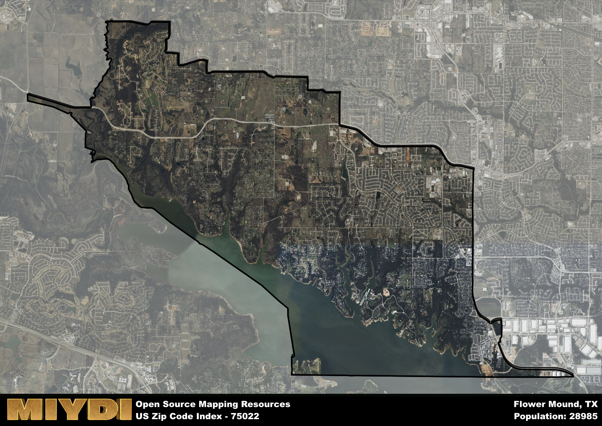

**Area Name:** Flower Mound

**Zip Code:** 75022

**State:** TX

Flower Mound is a part of the Dallas-Fort Worth-Arlington - TX Metro Area, and makes up 0.37% of the Metro's population.  

# Flower Mound: A Tranquil Suburb in the Heart of North Texas

The zip code 75022 corresponds to the peaceful neighborhood of Flower Mound, located in Denton County, Texas. Bordered by Lewisville Lake to the east and Grapevine Lake to the south, Flower Mound is situated within the Dallas-Fort Worth metropolitan area. It is in close proximity to major cities such as Lewisville, Grapevine, and Highland Village, making it a well-connected and integral part of the urban fabric of North Texas.

Flower Mound has a rich historical narrative that dates back to the mid-19th century when settlers were attracted to the area for its fertile land and abundant natural beauty. The town's name originates from a prominent 12.5-acre hill covered in wildflowers, which served as a landmark for travelers and settlers. Over the years, Flower Mound has evolved from a small agricultural community to a thriving suburb known for its excellent schools, safe neighborhoods, and strong sense of community.

Today, Flower Mound boasts a vibrant economy supported by a mix of retail, dining, and service industries. Residents enjoy access to numerous parks, trails, and recreational facilities, including the popular Twin Coves Park on the shores of Lake Grapevine. The area is also home to historic sites such as the Flower Mound Presbyterian Church, which dates back to the late 19th century, adding to the neighborhood's charm and character. With its blend of modern amenities and small-town charm, Flower Mound continues to attract families and individuals looking for a peaceful suburban lifestyle in North Texas.

# Flower Mound Demographics

The population of Flower Mound is 28985.  
Flower Mound has a population density of 1194.77 per square mile.  
The area of Flower Mound is 24.26 square miles.  

## Flower Mound Income and Economic Data

These demographic numbers are sourced from IRS return data, providing comprehensive insights into the population dynamics and economic trends within Flower Mound.

**Breakdown of return types for Flower Mound**

The table offers insight into the composition of tax returns filed with the IRS, categorizing them into three main types. Single returns represent filings by individuals, joint returns by married couples, and head of household returns by individuals who qualify as heads of households, typically having dependents. This breakdown provides an understanding of the different filing statuses adopted by taxpayers when submitting their tax documentation.

| Return Types filed for Flower Mound                              | Percentage          |
|----------------------------------------------------------|---------------------|
| Single Returns                                            | 0.38 |
| Joint Returns                                             | 0.56 |
| Head Household Returns                                    | 0.05 |

The income and economic data presented here is sourced from the IRS income brackets, utilized for categorizing tax returns by income levels. This table displays income ranges for both single filers and married couples, along with the corresponding number of returns and the percentage within each bracket, providing valuable insight into the distribution of taxes across various income groups.

| Bracket Name       | Single Filer Income Range | Married Couple Range | Number of Returns | Percentage of Returns |
|--------------------|----------------------------|----------------------|-------------------|-----------------------|
| 10% Bracket        | Up to $10,275              | Up to $20,550        | 2720 | 0.23% |
| 12% Bracket        | $10,276 - $41,775          | $20,551 - $83,550    | 1190 | 0.1% |
| 22% Bracket        | $41,776 - $89,075          | $83,551 - $178,150   | 920 | 0.08% |
| 24% Bracket        | $89,076 - $170,050         | $178,151 - $340,100  | 760 | 0.06% |
| 32% Bracket        | $170,051 - $215,950        | $340,101 - $431,900  | 2730 | 0.23% |
| 35% Bracket        | $215,951 - $539,900        | $431,901 - $647,850  | 3430 | 0.29% |

### Exploring Taxpayer Diversity: A Breakdown of Different Types of Tax Returns in Flower Mound

The table offers insights into various types of tax returns filed, reflecting different aspects of taxpayer activities and demographics. Categories include charitable returns for donations, dependent returns for claimed dependents, educator population, elderly population, real estate returns, self-employment returns, student loan returns, and unemployment returns, providing valuable insights into taxpayer behavior and demographics.

| Flower Mound Filing Types                    | Count | Percentage |
|--------------------------------------|-------|------------|
| Charitable Donations                 | 2380 | 0.203% |
| Dependents Claimed                   | 500 | 0.043% |
| Educator Residents                   | 320 | 0.027% |
| Elderly Population                   | 2550 | 0.22% |
| Farming Population                   | 90 | 0.008% |
| Real Estate Transactions             | 2540 | 0.216% |
| Self-Employed Individuals            | 1820 | 0.155% |
| Student Loan Cases                   | 480 | 0.041% |
| Unemployment Benefit Filings         | 1410 | 0.12% |

### Exploring Real Estate Trends: A Comprehensive Analysis of the Flower Mound Area and its Neighbors

This table contains an in-depth examination of the real estate market in the Flower Mound area. Sourced from trusted real estate market firms, this dataset provides a wealth of raw data detailing the local real estate landscape, along with comparative analyses juxtaposing the market dynamics with those of neighboring areas. Explore the intricacies of the Flower Mound real estate market and gain valuable insights into its relationship with adjacent regions.

| Real Estate Data for Flower Mound                       | Value    |
|------------------------------------------------|----------|
| Average Listing Price for Flower Mound               | 1686733 |
| Median Listing Price for Flower Mound                | 1480500 |
| Median Days on Market for Flower Mound               | 48 |
| Median Listing Price per Square Foot for Flower Mound| 23 |
| Median Square Feet for Flower Mound                  | 3847 |
| Real Estate Prices to Income Ratio           | 139.30% |
| Price per Square Foot Ratio                  | 145.62% |
| Price Median Ratio                           | 294.84% |
| Market Sales Speed Ratio                     | 112.4% |

This table offers essential real estate data for the Flower Mound area, including average and median listing prices, median days on market, and property size. It also presents ratio metrics as percentages, providing insights into how the local market compares to the surrounding region. A ratio of 100% signifies performance in line with the regional average, while values above or below indicate overperformance or underperformance, respectively, relative to expectations.

## Flower Mound Sports and Recreation Data

#### Annual Youth Sports Spending for Flower Mound

This table provides fundamental insights into the Sports and Recreation data for the Flower Mound area, detailing the estimated annual expenditure on Youth Athletics. This includes estimated spending by the major consumer brackets. 
| Sports Spending for Flower Mound| Value |
|-------------------------|-------|
| Athlete Spending Compared to the region | 95.49% |
| Total Youth Athlete Spending | ,993,649 |
| Athletic Spending - Essential Focused Consumer | 81,887 |
| Athletic Spending - Typical Consumer | 17,048 |
| Athletic Spending - Affluent Consumers | ,493,764 |

#### Youth Coaching Estimates for Flower Mound

This table presents the estimated number of coaches for the Flower Mound area, derived from comprehensive national coaching surveys and athletic participation rates by state. It offers valuable insights into the vital role of coaching personnel in fostering athletic development and facilitating sports participation within the local community.

| Coaching Data for Flower Mound | Value |
|-------------|-------|
| Total Coaches | 475 |
| Paid Coaches | 123 |
| Volunteer Coaches | 351 |

#### Youth Athlete Participation for Flower Mound

This table shows the estimated total number of youth athletes in the Flower Mound area, sourced from comprehensive national coaching surveys and athletic participation rates by state.

| Total YA Athletes in Flower Mound | Value |
|-------------|-------|
| Total High School Athletes | 724 |
| Total Youth Athletes | 2173 |
| Total Young Adult Athletes | 1449 |
| Total Athletes to Age 25 | 4346 |

#### High School Age Athletes - Breakdown by Sport for Flower Mound

This table shows insights regarding high school age estimated players by sport in the Flower Mound area, derived from national and state-level athletic participation trends. 

| HS Players by Sport in Flower Mound | Value |
|-------------|-------|
| Football Players | 167 |
| Basketball Players | 101 |
| Soccer Players | 80 |
| Volleyball Players | 51 |
| Baseball Players | 87 |
| Tennis Players | 43 |
| Track Athletes | 123 |
| Golf Players | 22 |
| Swimming Athletes | 22 |
| Wrestling Competitors | 22 |
| Lacrosse Players | 0 |

Estimating the number of younger athletes presents unique challenges due to their varied starting ages, typically beginning around six years old, and a gradual decline in participation rates as they age. Unlike high school-aged athletes, younger athletes are less likely to switch sports as they grow older, contributing to the stability of participation numbers within specific sports at younger ages.  

As a general trend, the total number of younger athletes is approximately three times the number of high school-aged athletes, underscoring the significant presence of youth athletes in sports programs and highlighting the importance of early engagement in athletic activities.

## Flower Mound AI and Census Variables

The values presented in this dataset for Flower Mound are AI-optimized, streamlined, and categorized into relevant buckets for enhanced utility in AI and mapping programs. These simplified values have been optimized to facilitate efficient analysis and integration into various technological applications, offering users accessible and actionable insights into demographics within the Flower Mound area.

| AI Variables for Flower Mound | Value |
|-------------|-------|
| Shape Area | 89627164.28125 |
| Shape Length | 56534.3517421299 |
| CBSA Federal Processing Standard Code | 19100 |
| RE Price per Square Foot Ratio | 145.62% |
| RE Price Average Ratio | 272.54% |
| RE Speed Ratio | 112.4% |
| RE Income Ratio | 139.30% |
| Single Opportunity Flag | 2 |
| Single Parent Risk Flag | 1 |
| Elderly Opportunity Flag | 4 |
| Farm Opportunity Flag | 3 |
| Unemployment Risk | 2 |
| Educator Opportunity Flag | 4 |
| RE Affordability Index Flag | 7 |
| Income Bracket Flag | 7 |
| RE Income Flag | 4 |
| RE Median Square Footage Price Flag | 6 |
| RE Median Square Footage Size Flag | 7 |
| RE Activity Flag | 5 |
| Poverty Line Risk Flag | 7 |

## How to use this free AI optimized Geo-Spatial Data for Flower Mound, TX

This data is made freely available under the Creative Commons license, allowing for unrestricted use for any purpose. Users can access static resources directly from GitHub or leverage more advanced functionalities by utilizing the GeoJSON files. All datasets originate from official government or private sector sources and are meticulously compiled into relevant datasets within QGIS. However, the versatility of the data ensures compatibility with any mapping application.

## Data Accuracy Disclaimer
It's important to note that the data provided here may contain errors or discrepancies and should be considered as 'close enough' for business applications and AI rather than a definitive source of truth. This data is aggregated from multiple sources, some of which publish information on wildly different intervals, leading to potential inconsistencies. Additionally, certain data points may not be corrected for Covid-related changes, further impacting accuracy. Moreover, the assumption that demographic trends are consistent throughout a region may lead to discrepancies, as trends often concentrate in areas of highest population density. As a result, dense areas may be slightly underrepresented, while rural areas may be slightly overrepresented, resulting in a more conservative dataset. Furthermore, the focus primarily on areas within US Major and Minor Statistical areas means that approximately 40 million Americans living outside of these areas may not be fully represented. Lastly, the historical background and area descriptions generated using AI are susceptible to potential mistakes, so users should exercise caution when interpreting the information provided.
