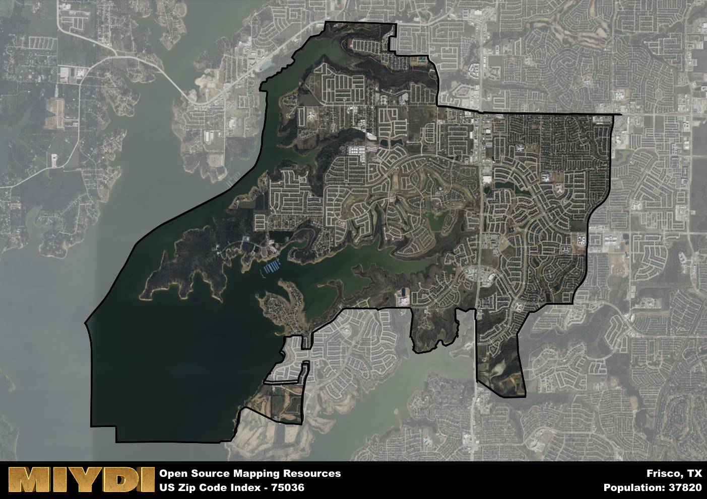

**Area Name:** Frisco

**Zip Code:** 75036

**State:** TX

Frisco is a part of the Dallas-Fort Worth-Arlington - TX Metro Area, and makes up 0.49% of the Metro's population.  

# Frisco 75036: A Thriving Neighborhood in the Dallas-Fort Worth Metroplex

Located in the northern part of the Dallas-Fort Worth Metroplex, the zip code 75036 corresponds to the vibrant neighborhood of Frisco. Bordered by the cities of Prosper to the north, Little Elm to the west, and The Colony to the south, Frisco is seamlessly integrated into the larger urban fabric of the metro area. With its proximity to major highways and easy access to downtown Dallas, Frisco serves as a bustling suburban hub for residents and visitors alike.

Frisco has a rich historical narrative, originally established as a small farming community in the late 19th century. The arrival of the St. Louis-San Francisco Railway in 1902 sparked a period of growth and development, leading to the incorporation of the town in 1908. Over the years, Frisco evolved into a dynamic city known for its strong economy, excellent schools, and family-friendly atmosphere. Today, it stands as one of the fastest-growing cities in the United States, attracting new residents and businesses seeking a high quality of life.

Presently, Frisco offers a diverse range of economic activities, from corporate headquarters to retail centers and entertainment venues. The neighborhood is home to the popular Frisco Fresh Market, a hub for local vendors and artisans, as well as the Dr Pepper Ballpark, where the Frisco RoughRiders minor league baseball team plays. Residents and visitors can enjoy an array of recreational amenities, including parks, golf courses, and sports facilities. Additionally, Frisco boasts cultural attractions such as the National Videogame Museum and the Frisco Heritage Museum, preserving the area's rich history for future generations.

# Frisco Demographics

The population of Frisco is 37820.  
Frisco has a population density of 2211.7 per square mile.  
The area of Frisco is 17.1 square miles.  

### Exploring Real Estate Trends: A Comprehensive Analysis of the Frisco Area and its Neighbors

This table contains an in-depth examination of the real estate market in the Frisco area. Sourced from trusted real estate market firms, this dataset provides a wealth of raw data detailing the local real estate landscape, along with comparative analyses juxtaposing the market dynamics with those of neighboring areas. Explore the intricacies of the Frisco real estate market and gain valuable insights into its relationship with adjacent regions.

| Real Estate Data for Frisco                       | Value    |
|------------------------------------------------|----------|
| Average Listing Price for Frisco               | 729039 |
| Median Listing Price for Frisco                | 585000 |
| Median Days on Market for Frisco               | 32 |
| Median Listing Price per Square Foot for Frisco| 49 |
| Median Square Feet for Frisco                  | 2702 |
| Real Estate Prices to Income Ratio           | 113.07% |
| Price per Square Foot Ratio                  | 112.26% |
| Price Median Ratio                           | 116.50% |
| Market Sales Speed Ratio                     | 74.9% |

This table offers essential real estate data for the Frisco area, including average and median listing prices, median days on market, and property size. It also presents ratio metrics as percentages, providing insights into how the local market compares to the surrounding region. A ratio of 100% signifies performance in line with the regional average, while values above or below indicate overperformance or underperformance, respectively, relative to expectations.

## Frisco Sports and Recreation Data

#### Annual Youth Sports Spending for Frisco

This table provides fundamental insights into the Sports and Recreation data for the Frisco area, detailing the estimated annual expenditure on Youth Athletics. This includes estimated spending by the major consumer brackets. 
| Sports Spending for Frisco| Value |
|-------------------------|-------|
| Athlete Spending Compared to the region | 124.60% |
| Total Youth Athlete Spending | ,820,981 |
| Athletic Spending - Essential Focused Consumer | 89,780 |
| Athletic Spending - Typical Consumer | ,066,148 |
| Athletic Spending - Affluent Consumers | ,863,814 |

#### Youth Coaching Estimates for Frisco

This table presents the estimated number of coaches for the Frisco area, derived from comprehensive national coaching surveys and athletic participation rates by state. It offers valuable insights into the vital role of coaching personnel in fostering athletic development and facilitating sports participation within the local community.

| Coaching Data for Frisco | Value |
|-------------|-------|
| Total Coaches | 619 |
| Paid Coaches | 161 |
| Volunteer Coaches | 458 |

#### Youth Athlete Participation for Frisco

This table shows the estimated total number of youth athletes in the Frisco area, sourced from comprehensive national coaching surveys and athletic participation rates by state.

| Total YA Athletes in Frisco | Value |
|-------------|-------|
| Total High School Athletes | 945 |
| Total Youth Athletes | 2835 |
| Total Young Adult Athletes | 1890 |
| Total Athletes to Age 25 | 5671 |

#### High School Age Athletes - Breakdown by Sport for Frisco

This table shows insights regarding high school age estimated players by sport in the Frisco area, derived from national and state-level athletic participation trends. 

| HS Players by Sport in Frisco | Value |
|-------------|-------|
| Football Players | 217 |
| Basketball Players | 132 |
| Soccer Players | 104 |
| Volleyball Players | 66 |
| Baseball Players | 113 |
| Tennis Players | 57 |
| Track Athletes | 161 |
| Golf Players | 28 |
| Swimming Athletes | 28 |
| Wrestling Competitors | 28 |
| Lacrosse Players | 0 |

Estimating the number of younger athletes presents unique challenges due to their varied starting ages, typically beginning around six years old, and a gradual decline in participation rates as they age. Unlike high school-aged athletes, younger athletes are less likely to switch sports as they grow older, contributing to the stability of participation numbers within specific sports at younger ages.  

As a general trend, the total number of younger athletes is approximately three times the number of high school-aged athletes, underscoring the significant presence of youth athletes in sports programs and highlighting the importance of early engagement in athletic activities.

## Frisco AI and Census Variables

The values presented in this dataset for Frisco are AI-optimized, streamlined, and categorized into relevant buckets for enhanced utility in AI and mapping programs. These simplified values have been optimized to facilitate efficient analysis and integration into various technological applications, offering users accessible and actionable insights into demographics within the Frisco area.

| AI Variables for Frisco | Value |
|-------------|-------|
| Shape Area | 63314267.296875 |
| Shape Length | 48965.7281554774 |
| CBSA Federal Processing Standard Code | 19100 |
| RE Price per Square Foot Ratio | 112.26% |
| RE Price Average Ratio | 117.80% |
| RE Speed Ratio | 74.9% |
| RE Income Ratio | 113.07% |
| RE Affordability Index Flag | 5 |
| Income Bracket Flag | 5 |
| RE Income Flag | 3 |
| RE Median Square Footage Price Flag | 5 |
| RE Median Square Footage Size Flag | 6 |
| RE Activity Flag | 3 |
| Poverty Line Risk Flag | 7 |

## How to use this free AI optimized Geo-Spatial Data for Frisco, TX

This data is made freely available under the Creative Commons license, allowing for unrestricted use for any purpose. Users can access static resources directly from GitHub or leverage more advanced functionalities by utilizing the GeoJSON files. All datasets originate from official government or private sector sources and are meticulously compiled into relevant datasets within QGIS. However, the versatility of the data ensures compatibility with any mapping application.

## Data Accuracy Disclaimer
It's important to note that the data provided here may contain errors or discrepancies and should be considered as 'close enough' for business applications and AI rather than a definitive source of truth. This data is aggregated from multiple sources, some of which publish information on wildly different intervals, leading to potential inconsistencies. Additionally, certain data points may not be corrected for Covid-related changes, further impacting accuracy. Moreover, the assumption that demographic trends are consistent throughout a region may lead to discrepancies, as trends often concentrate in areas of highest population density. As a result, dense areas may be slightly underrepresented, while rural areas may be slightly overrepresented, resulting in a more conservative dataset. Furthermore, the focus primarily on areas within US Major and Minor Statistical areas means that approximately 40 million Americans living outside of these areas may not be fully represented. Lastly, the historical background and area descriptions generated using AI are susceptible to potential mistakes, so users should exercise caution when interpreting the information provided.
