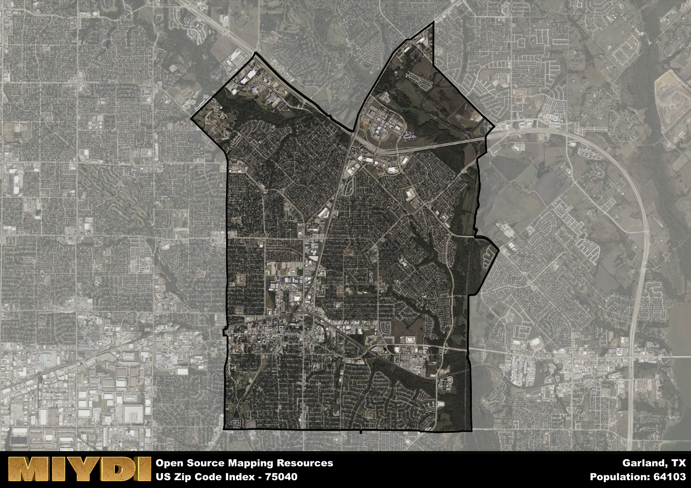

**Area Name:** Garland

**Zip Code:** 75040

**State:** TX

Garland is a part of the Dallas-Fort Worth-Arlington - TX Metro Area, and makes up 0.83% of the Metro's population.  

# Garland, Texas: Zip Code 75040

Located in the northeastern part of the city of Garland, Texas, zip code 75040 is bordered by the President George Bush Turnpike to the north, Interstate 30 to the south, North Garland Avenue to the west, and Lavon Drive to the east. This area seamlessly integrates with neighboring communities such as Richardson and Sachse, forming part of the greater Dallas-Fort Worth metropolitan area. As one of the largest suburbs in the region, Garland offers a mix of residential, commercial, and industrial spaces, with easy access to major highways and public transportation.

The history of zip code 75040 dates back to the mid-19th century when settlers began arriving in the area attracted by its fertile soil and access to water sources. Originally known as Duck Creek, the community was officially incorporated as the city of Garland in 1891. Throughout the years, Garland experienced significant growth due to its proximity to Dallas and the expansion of the railroad network. The city's economy flourished with the establishment of manufacturing plants, retail centers, and a diverse range of businesses, contributing to its reputation as a vibrant and thriving urban center.

Today, zip code 75040 is a dynamic neighborhood within Garland, offering residents a mix of housing options, shopping centers, parks, and cultural attractions. The area boasts a strong economy supported by industries such as electronics, telecommunications, and healthcare. Residents enjoy access to top-rated schools, healthcare facilities, and recreational amenities, including parks, sports fields, and community centers. Notable landmarks in the area include the Historic Downtown Garland Square, featuring charming shops and restaurants, as well as the Garland Landmark Museum, showcasing the city's rich history and heritage.

# Garland Demographics

The population of Garland is 64103.  
Garland has a population density of 4101.28 per square mile.  
The area of Garland is 15.63 square miles.  

## Garland Income and Economic Data

These demographic numbers are sourced from IRS return data, providing comprehensive insights into the population dynamics and economic trends within Garland.

**Breakdown of return types for Garland**

The table offers insight into the composition of tax returns filed with the IRS, categorizing them into three main types. Single returns represent filings by individuals, joint returns by married couples, and head of household returns by individuals who qualify as heads of households, typically having dependents. This breakdown provides an understanding of the different filing statuses adopted by taxpayers when submitting their tax documentation.

| Return Types filed for Garland                              | Percentage          |
|----------------------------------------------------------|---------------------|
| Single Returns                                            | 0.51 |
| Joint Returns                                             | 0.31 |
| Head Household Returns                                    | 0.16 |

The income and economic data presented here is sourced from the IRS income brackets, utilized for categorizing tax returns by income levels. This table displays income ranges for both single filers and married couples, along with the corresponding number of returns and the percentage within each bracket, providing valuable insight into the distribution of taxes across various income groups.

| Bracket Name       | Single Filer Income Range | Married Couple Range | Number of Returns | Percentage of Returns |
|--------------------|----------------------------|----------------------|-------------------|-----------------------|
| 10% Bracket        | Up to $10,275              | Up to $20,550        | 11690 | 0.38% |
| 12% Bracket        | $10,276 - $41,775          | $20,551 - $83,550    | 9380 | 0.31% |
| 22% Bracket        | $41,776 - $89,075          | $83,551 - $178,150   | 4560 | 0.15% |
| 24% Bracket        | $89,076 - $170,050         | $178,151 - $340,100  | 2170 | 0.07% |
| 32% Bracket        | $170,051 - $215,950        | $340,101 - $431,900  | 2490 | 0.08% |
| 35% Bracket        | $215,951 - $539,900        | $431,901 - $647,850  | 340 | 0.01% |

### Exploring Taxpayer Diversity: A Breakdown of Different Types of Tax Returns in Garland

The table offers insights into various types of tax returns filed, reflecting different aspects of taxpayer activities and demographics. Categories include charitable returns for donations, dependent returns for claimed dependents, educator population, elderly population, real estate returns, self-employment returns, student loan returns, and unemployment returns, providing valuable insights into taxpayer behavior and demographics.

| Garland Filing Types                    | Count | Percentage |
|--------------------------------------|-------|------------|
| Charitable Donations                 | 980 | 0.032% |
| Dependents Claimed                   | 820 | 0.027% |
| Educator Residents                   | 520 | 0.017% |
| Elderly Population                   | 5510 | 0.18% |
| Farming Population                   | 40 | 0.001% |
| Real Estate Transactions             | 1050 | 0.034% |
| Self-Employed Individuals            | 5760 | 0.188% |
| Student Loan Cases                   | 1470 | 0.048% |
| Unemployment Benefit Filings         | 5500 | 0.18% |

### Exploring Real Estate Trends: A Comprehensive Analysis of the Garland Area and its Neighbors

This table contains an in-depth examination of the real estate market in the Garland area. Sourced from trusted real estate market firms, this dataset provides a wealth of raw data detailing the local real estate landscape, along with comparative analyses juxtaposing the market dynamics with those of neighboring areas. Explore the intricacies of the Garland real estate market and gain valuable insights into its relationship with adjacent regions.

| Real Estate Data for Garland                       | Value    |
|------------------------------------------------|----------|
| Average Listing Price for Garland               | 357644 |
| Median Listing Price for Garland                | 342472 |
| Median Days on Market for Garland               | 33 |
| Median Listing Price per Square Foot for Garland| 98 |
| Median Square Feet for Garland                  | 1758 |
| Real Estate Prices to Income Ratio           | 51.65% |
| Price per Square Foot Ratio                  | 89.26% |
| Price Median Ratio                           | 68.20% |
| Market Sales Speed Ratio                     | 77.2% |

This table offers essential real estate data for the Garland area, including average and median listing prices, median days on market, and property size. It also presents ratio metrics as percentages, providing insights into how the local market compares to the surrounding region. A ratio of 100% signifies performance in line with the regional average, while values above or below indicate overperformance or underperformance, respectively, relative to expectations.

## Garland Sports and Recreation Data

#### Annual Youth Sports Spending for Garland

This table provides fundamental insights into the Sports and Recreation data for the Garland area, detailing the estimated annual expenditure on Youth Athletics. This includes estimated spending by the major consumer brackets. 
| Sports Spending for Garland| Value |
|-------------------------|-------|
| Athlete Spending Compared to the region | 211.20% |
| Total Youth Athlete Spending | 3,256,087 |
| Athletic Spending - Essential Focused Consumer | ,508,123 |
| Athletic Spending - Typical Consumer | ,807,056 |
| Athletic Spending - Affluent Consumers | ,938,808 |

#### Youth Coaching Estimates for Garland

This table presents the estimated number of coaches for the Garland area, derived from comprehensive national coaching surveys and athletic participation rates by state. It offers valuable insights into the vital role of coaching personnel in fostering athletic development and facilitating sports participation within the local community.

| Coaching Data for Garland | Value |
|-------------|-------|
| Total Coaches | 1050 |
| Paid Coaches | 273 |
| Volunteer Coaches | 777 |

#### Youth Athlete Participation for Garland

This table shows the estimated total number of youth athletes in the Garland area, sourced from comprehensive national coaching surveys and athletic participation rates by state.

| Total YA Athletes in Garland | Value |
|-------------|-------|
| Total High School Athletes | 1602 |
| Total Youth Athletes | 4806 |
| Total Young Adult Athletes | 3204 |
| Total Athletes to Age 25 | 9612 |

#### High School Age Athletes - Breakdown by Sport for Garland

This table shows insights regarding high school age estimated players by sport in the Garland area, derived from national and state-level athletic participation trends. 

| HS Players by Sport in Garland | Value |
|-------------|-------|
| Football Players | 368 |
| Basketball Players | 224 |
| Soccer Players | 176 |
| Volleyball Players | 112 |
| Baseball Players | 192 |
| Tennis Players | 96 |
| Track Athletes | 272 |
| Golf Players | 48 |
| Swimming Athletes | 48 |
| Wrestling Competitors | 48 |
| Lacrosse Players | 0 |

Estimating the number of younger athletes presents unique challenges due to their varied starting ages, typically beginning around six years old, and a gradual decline in participation rates as they age. Unlike high school-aged athletes, younger athletes are less likely to switch sports as they grow older, contributing to the stability of participation numbers within specific sports at younger ages.  

As a general trend, the total number of younger athletes is approximately three times the number of high school-aged athletes, underscoring the significant presence of youth athletes in sports programs and highlighting the importance of early engagement in athletic activities.

## Garland AI and Census Variables

The values presented in this dataset for Garland are AI-optimized, streamlined, and categorized into relevant buckets for enhanced utility in AI and mapping programs. These simplified values have been optimized to facilitate efficient analysis and integration into various technological applications, offering users accessible and actionable insights into demographics within the Garland area.

| AI Variables for Garland | Value |
|-------------|-------|
| Shape Area | 57614352.9492188 |
| Shape Length | 36339.5789334247 |
| CBSA Federal Processing Standard Code | 19100 |
| RE Price per Square Foot Ratio | 89.26% |
| RE Price Average Ratio | 57.79% |
| RE Speed Ratio | 77.2% |
| RE Income Ratio | 51.65% |
| Single Opportunity Flag | 5 |
| Single Parent Risk Flag | 5 |
| Elderly Opportunity Flag | 4 |
| Farm Opportunity Flag | 1 |
| Unemployment Risk | 6 |
| Educator Opportunity Flag | 2 |
| RE Affordability Index Flag | 2 |
| Income Bracket Flag | 5 |
| RE Income Flag | 1 |
| RE Median Square Footage Price Flag | 4 |
| RE Median Square Footage Size Flag | 4 |
| RE Activity Flag | 3 |
| Poverty Line Risk Flag | 3 |

## How to use this free AI optimized Geo-Spatial Data for Garland, TX

This data is made freely available under the Creative Commons license, allowing for unrestricted use for any purpose. Users can access static resources directly from GitHub or leverage more advanced functionalities by utilizing the GeoJSON files. All datasets originate from official government or private sector sources and are meticulously compiled into relevant datasets within QGIS. However, the versatility of the data ensures compatibility with any mapping application.

## Data Accuracy Disclaimer
It's important to note that the data provided here may contain errors or discrepancies and should be considered as 'close enough' for business applications and AI rather than a definitive source of truth. This data is aggregated from multiple sources, some of which publish information on wildly different intervals, leading to potential inconsistencies. Additionally, certain data points may not be corrected for Covid-related changes, further impacting accuracy. Moreover, the assumption that demographic trends are consistent throughout a region may lead to discrepancies, as trends often concentrate in areas of highest population density. As a result, dense areas may be slightly underrepresented, while rural areas may be slightly overrepresented, resulting in a more conservative dataset. Furthermore, the focus primarily on areas within US Major and Minor Statistical areas means that approximately 40 million Americans living outside of these areas may not be fully represented. Lastly, the historical background and area descriptions generated using AI are susceptible to potential mistakes, so users should exercise caution when interpreting the information provided.
