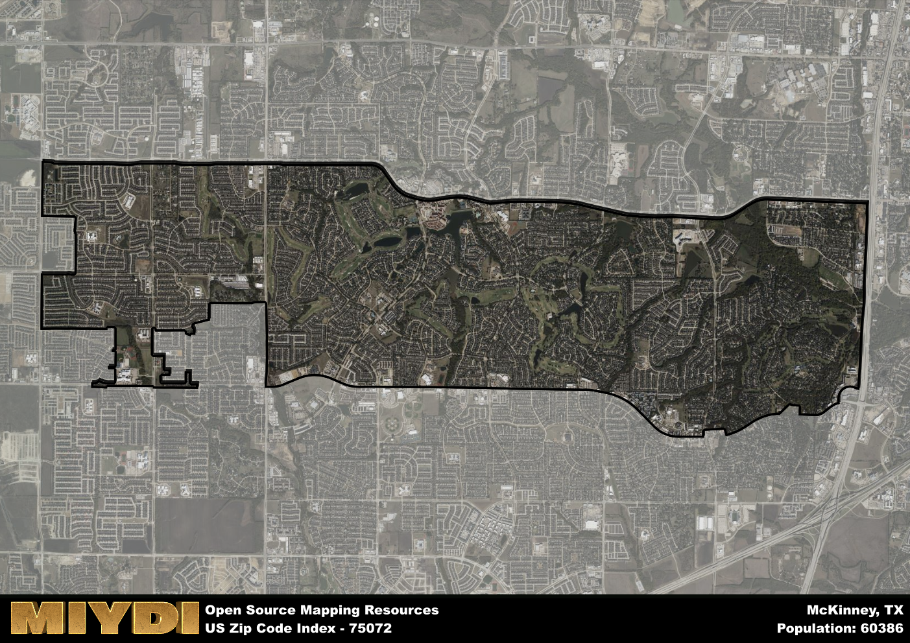

**Area Name:** McKinney

**Zip Code:** 75072

**State:** TX

McKinney is a part of the Dallas-Fort Worth-Arlington - TX Metro Area, and makes up 0.78% of the Metro's population.  

# McKinney, TX 75072: A Thriving Neighborhood in the Heart of North Texas  

Located in the northern part of Texas, the zip code 75072 corresponds to the vibrant neighborhood of McKinney. Bordered by Frisco to the west and Allen to the east, McKinney seamlessly integrates with the larger Dallas-Fort Worth metropolitan area. With easy access to major highways such as the Sam Rayburn Tollway and US Route 75, residents of 75072 enjoy a convenient proximity to urban centers while maintaining a suburban atmosphere.

McKinney has a rich historical narrative that dates back to the mid-19th century when it was established as a trading post. Over the years, the area experienced significant growth due to its strategic location along the railroad lines, attracting settlers and businesses alike. McKinney's charming downtown area still retains many historic buildings and landmarks, serving as a reminder of its past while embracing modern development.

Today, McKinney's 75072 zip code is a bustling community known for its diverse economic activities, from corporate headquarters to small businesses. Residents can enjoy a variety of neighborhood-specific services, including top-rated schools, healthcare facilities, and shopping centers. The area also boasts numerous parks, recreational amenities, and cultural sites, such as the Heard Natural Science Museum and Wildlife Sanctuary, making it a desirable place to live within the North Texas region.

# McKinney Demographics

The population of McKinney is 60386.  
McKinney has a population density of 4717.66 per square mile.  
The area of McKinney is 12.8 square miles.  

### Exploring Real Estate Trends: A Comprehensive Analysis of the McKinney Area and its Neighbors

This table contains an in-depth examination of the real estate market in the McKinney area. Sourced from trusted real estate market firms, this dataset provides a wealth of raw data detailing the local real estate landscape, along with comparative analyses juxtaposing the market dynamics with those of neighboring areas. Explore the intricacies of the McKinney real estate market and gain valuable insights into its relationship with adjacent regions.

| Real Estate Data for McKinney                       | Value    |
|------------------------------------------------|----------|
| Average Listing Price for McKinney               | 802881 |
| Median Listing Price for McKinney                | 646250 |
| Median Days on Market for McKinney               | 33 |
| Median Listing Price per Square Foot for McKinney| 19 |
| Median Square Feet for McKinney                  | 3036 |
| Real Estate Prices to Income Ratio           | 189.12% |
| Price per Square Foot Ratio                  | 98.73% |
| Price Median Ratio                           | 128.70% |
| Market Sales Speed Ratio                     | 77.2% |

This table offers essential real estate data for the McKinney area, including average and median listing prices, median days on market, and property size. It also presents ratio metrics as percentages, providing insights into how the local market compares to the surrounding region. A ratio of 100% signifies performance in line with the regional average, while values above or below indicate overperformance or underperformance, respectively, relative to expectations.

## McKinney Sports and Recreation Data

#### Annual Youth Sports Spending for McKinney

This table provides fundamental insights into the Sports and Recreation data for the McKinney area, detailing the estimated annual expenditure on Youth Athletics. This includes estimated spending by the major consumer brackets. 
| Sports Spending for McKinney| Value |
|-------------------------|-------|
| Athlete Spending Compared to the region | 198.94% |
| Total Youth Athlete Spending | 2,486,539 |
| Athletic Spending - Essential Focused Consumer | ,420,573 |
| Athletic Spending - Typical Consumer | ,702,152 |
| Athletic Spending - Affluent Consumers | ,361,836 |

#### Youth Coaching Estimates for McKinney

This table presents the estimated number of coaches for the McKinney area, derived from comprehensive national coaching surveys and athletic participation rates by state. It offers valuable insights into the vital role of coaching personnel in fostering athletic development and facilitating sports participation within the local community.

| Coaching Data for McKinney | Value |
|-------------|-------|
| Total Coaches | 989 |
| Paid Coaches | 257 |
| Volunteer Coaches | 732 |

#### Youth Athlete Participation for McKinney

This table shows the estimated total number of youth athletes in the McKinney area, sourced from comprehensive national coaching surveys and athletic participation rates by state.

| Total YA Athletes in McKinney | Value |
|-------------|-------|
| Total High School Athletes | 1509 |
| Total Youth Athletes | 4527 |
| Total Young Adult Athletes | 3018 |
| Total Athletes to Age 25 | 9054 |

#### High School Age Athletes - Breakdown by Sport for McKinney

This table shows insights regarding high school age estimated players by sport in the McKinney area, derived from national and state-level athletic participation trends. 

| HS Players by Sport in McKinney | Value |
|-------------|-------|
| Football Players | 347 |
| Basketball Players | 211 |
| Soccer Players | 166 |
| Volleyball Players | 106 |
| Baseball Players | 181 |
| Tennis Players | 91 |
| Track Athletes | 257 |
| Golf Players | 45 |
| Swimming Athletes | 45 |
| Wrestling Competitors | 45 |
| Lacrosse Players | 0 |

Estimating the number of younger athletes presents unique challenges due to their varied starting ages, typically beginning around six years old, and a gradual decline in participation rates as they age. Unlike high school-aged athletes, younger athletes are less likely to switch sports as they grow older, contributing to the stability of participation numbers within specific sports at younger ages.  

As a general trend, the total number of younger athletes is approximately three times the number of high school-aged athletes, underscoring the significant presence of youth athletes in sports programs and highlighting the importance of early engagement in athletic activities.

## McKinney AI and Census Variables

The values presented in this dataset for McKinney are AI-optimized, streamlined, and categorized into relevant buckets for enhanced utility in AI and mapping programs. These simplified values have been optimized to facilitate efficient analysis and integration into various technological applications, offering users accessible and actionable insights into demographics within the McKinney area.

| AI Variables for McKinney | Value |
|-------------|-------|
| Shape Area | 47476666.5820313 |
| Shape Length | 44848.5513102908 |
| CBSA Federal Processing Standard Code | 19100 |
| RE Price per Square Foot Ratio | 98.73% |
| RE Price Average Ratio | 129.73% |
| RE Speed Ratio | 77.2% |
| RE Income Ratio | 189.12% |
| RE Affordability Index Flag | 6 |
| Income Bracket Flag | 3 |
| RE Income Flag | 5 |
| RE Median Square Footage Price Flag | 5 |
| RE Median Square Footage Size Flag | 7 |
| RE Activity Flag | 3 |
| Poverty Line Risk Flag | 7 |

## How to use this free AI optimized Geo-Spatial Data for McKinney, TX

This data is made freely available under the Creative Commons license, allowing for unrestricted use for any purpose. Users can access static resources directly from GitHub or leverage more advanced functionalities by utilizing the GeoJSON files. All datasets originate from official government or private sector sources and are meticulously compiled into relevant datasets within QGIS. However, the versatility of the data ensures compatibility with any mapping application.

## Data Accuracy Disclaimer
It's important to note that the data provided here may contain errors or discrepancies and should be considered as 'close enough' for business applications and AI rather than a definitive source of truth. This data is aggregated from multiple sources, some of which publish information on wildly different intervals, leading to potential inconsistencies. Additionally, certain data points may not be corrected for Covid-related changes, further impacting accuracy. Moreover, the assumption that demographic trends are consistent throughout a region may lead to discrepancies, as trends often concentrate in areas of highest population density. As a result, dense areas may be slightly underrepresented, while rural areas may be slightly overrepresented, resulting in a more conservative dataset. Furthermore, the focus primarily on areas within US Major and Minor Statistical areas means that approximately 40 million Americans living outside of these areas may not be fully represented. Lastly, the historical background and area descriptions generated using AI are susceptible to potential mistakes, so users should exercise caution when interpreting the information provided.
