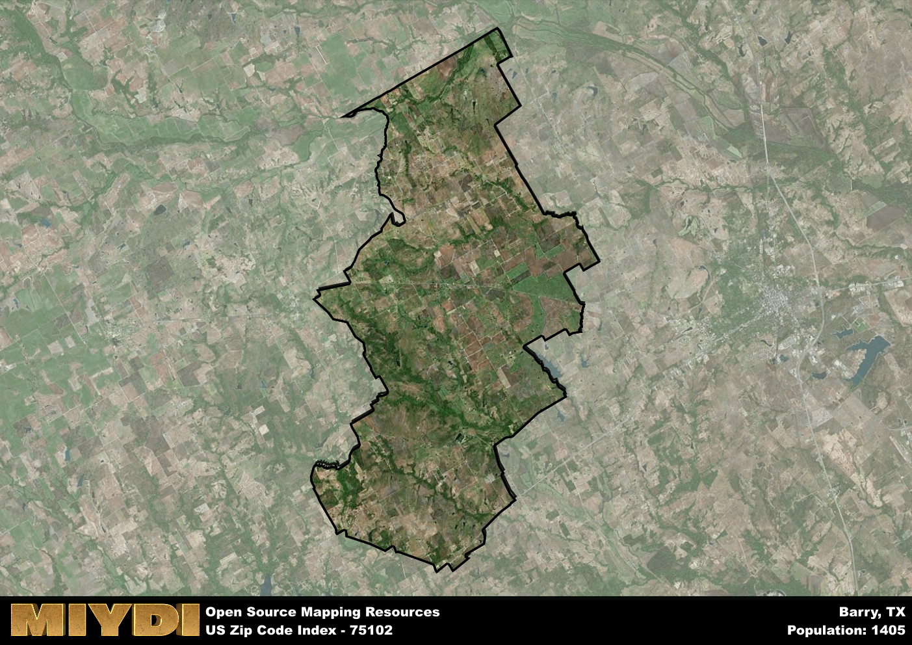

**Area Name:** Barry

**Zip Code:** 75102

**State:** TX

Barry is a part of the Corsicana - TX Micro Area, and makes up  of the Metro's population.  

# Barry: A Quaint Neighborhood in Texas  
Located in Kaufman County, Texas, the zip code area 75102 corresponds to the charming neighborhood of Barry. Situated southwest of Dallas, Barry is a small community surrounded by rural landscapes and agricultural fields. It is in close proximity to the cities of Corsicana and Waxahachie, offering residents a peaceful retreat while still being easily accessible to urban amenities.

The area now known as Barry was first settled in the mid-19th century, primarily by farmers attracted to the fertile soil of the region. The community grew around a central square, where a few businesses and homes were established. Over the years, Barry has maintained its agricultural roots, with farming and ranching continuing to be important economic activities for the residents. The neighborhood takes pride in its historic buildings and landmarks, showcasing a glimpse into its past.

Today, Barry remains a close-knit community with a strong sense of pride in its history and heritage. Residents enjoy a peaceful lifestyle surrounded by nature, with opportunities for outdoor activities such as hiking and fishing in the nearby lakes. The neighborhood features local businesses, including family-owned shops and restaurants, providing essential services to the community. Barry also boasts a few historic sites, such as the Barry Baptist Church, which add to its cultural charm and appeal.

# Barry Demographics

The population of Barry is 1405.  
Barry has a population density of 17.6 per square mile.  
The area of Barry is 79.85 square miles.  

## Barry Income and Economic Data

These demographic numbers are sourced from IRS return data, providing comprehensive insights into the population dynamics and economic trends within Barry.

**Breakdown of return types for Barry**

The table offers insight into the composition of tax returns filed with the IRS, categorizing them into three main types. Single returns represent filings by individuals, joint returns by married couples, and head of household returns by individuals who qualify as heads of households, typically having dependents. This breakdown provides an understanding of the different filing statuses adopted by taxpayers when submitting their tax documentation.

| Return Types filed for Barry                              | Percentage          |
|----------------------------------------------------------|---------------------|
| Single Returns                                            | 0.37 |
| Joint Returns                                             | 0.47 |
| Head Household Returns                                    | 0.15 |

The income and economic data presented here is sourced from the IRS income brackets, utilized for categorizing tax returns by income levels. This table displays income ranges for both single filers and married couples, along with the corresponding number of returns and the percentage within each bracket, providing valuable insight into the distribution of taxes across various income groups.

| Bracket Name       | Single Filer Income Range | Married Couple Range | Number of Returns | Percentage of Returns |
|--------------------|----------------------------|----------------------|-------------------|-----------------------|
| 10% Bracket        | Up to $10,275              | Up to $20,550        | 200 | 0.33% |
| 12% Bracket        | $10,276 - $41,775          | $20,551 - $83,550    | 150 | 0.25% |
| 22% Bracket        | $41,776 - $89,075          | $83,551 - $178,150   | 110 | 0.18% |
| 24% Bracket        | $89,076 - $170,050         | $178,151 - $340,100  | 50 | 0.08% |
| 32% Bracket        | $170,051 - $215,950        | $340,101 - $431,900  | 90 | 0.15% |
| 35% Bracket        | $215,951 - $539,900        | $431,901 - $647,850  | 0 | 0% |

### Exploring Taxpayer Diversity: A Breakdown of Different Types of Tax Returns in Barry

The table offers insights into various types of tax returns filed, reflecting different aspects of taxpayer activities and demographics. Categories include charitable returns for donations, dependent returns for claimed dependents, educator population, elderly population, real estate returns, self-employment returns, student loan returns, and unemployment returns, providing valuable insights into taxpayer behavior and demographics.

| Barry Filing Types                    | Count | Percentage |
|--------------------------------------|-------|------------|
| Charitable Donations                 | 0 | 0% |
| Dependents Claimed                   | 20 | 0.033% |
| Educator Residents                   | 20 | 0.033% |
| Elderly Population                   | 130 | 0.22% |
| Farming Population                   | 110 | 0.183% |
| Real Estate Transactions             | 0 | 0% |
| Self-Employed Individuals            | 110 | 0.183% |
| Student Loan Cases                   | 30 | 0.05% |
| Unemployment Benefit Filings         | 60 | 0.1% |

## Barry AI and Census Variables

The values presented in this dataset for Barry are AI-optimized, streamlined, and categorized into relevant buckets for enhanced utility in AI and mapping programs. These simplified values have been optimized to facilitate efficient analysis and integration into various technological applications, offering users accessible and actionable insights into demographics within the Barry area.

| AI Variables for Barry | Value |
|-------------|-------|
| Shape Area | 288965773.507813 |
| Shape Length | 111153.267381864 |
| CBSA Federal Processing Standard Code | 18620 |

## How to use this free AI optimized Geo-Spatial Data for Barry, TX

This data is made freely available under the Creative Commons license, allowing for unrestricted use for any purpose. Users can access static resources directly from GitHub or leverage more advanced functionalities by utilizing the GeoJSON files. All datasets originate from official government or private sector sources and are meticulously compiled into relevant datasets within QGIS. However, the versatility of the data ensures compatibility with any mapping application.

## Data Accuracy Disclaimer
It's important to note that the data provided here may contain errors or discrepancies and should be considered as 'close enough' for business applications and AI rather than a definitive source of truth. This data is aggregated from multiple sources, some of which publish information on wildly different intervals, leading to potential inconsistencies. Additionally, certain data points may not be corrected for Covid-related changes, further impacting accuracy. Moreover, the assumption that demographic trends are consistent throughout a region may lead to discrepancies, as trends often concentrate in areas of highest population density. As a result, dense areas may be slightly underrepresented, while rural areas may be slightly overrepresented, resulting in a more conservative dataset. Furthermore, the focus primarily on areas within US Major and Minor Statistical areas means that approximately 40 million Americans living outside of these areas may not be fully represented. Lastly, the historical background and area descriptions generated using AI are susceptible to potential mistakes, so users should exercise caution when interpreting the information provided.
