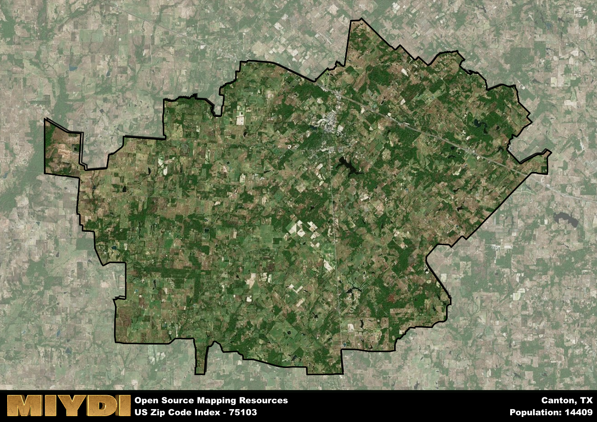

**Area Name:** Canton

**Zip Code:** 75103

**State:** TX

# Canton, Texas (Zip Code: 75103)

Canton, Texas, located in zip code 75103, is a charming neighborhood situated in the eastern part of the state. Bordered by rolling hills and lush forests, Canton is known for its picturesque landscapes and close proximity to major cities such as Dallas and Tyler. The zip code area seamlessly integrates with the larger urban fabric, serving as a peaceful retreat for residents while still offering easy access to urban amenities.

Originally settled in the mid-19th century, Canton has a rich historical narrative that includes its role as a major trading post for early pioneers traveling westward. The area experienced significant growth during the Texas oil boom in the early 20th century, leading to the development of a vibrant community centered around agriculture and commerce. Today, Canton is best known for its famous First Monday Trade Days, a massive flea market that attracts visitors from across the state.

Present-day Canton is a thriving community with a diverse economy that includes agriculture, tourism, and retail. The area offers a range of neighborhood-specific services, from locally-owned shops to family-owned restaurants, creating a strong sense of community pride. Canton also boasts a number of recreational amenities, such as parks, golf courses, and hiking trails, making it an ideal destination for outdoor enthusiasts. Additionally, the area is home to several historic sites that highlight its unique heritage and cultural significance within the larger urban landscape.

# Canton Demographics

The population of Canton is 14409.  
Canton has a population density of 71.62 per square mile.  
The area of Canton is 201.2 square miles.  

## Canton Income and Economic Data

These demographic numbers are sourced from IRS return data, providing comprehensive insights into the population dynamics and economic trends within Canton.

**Breakdown of return types for Canton**

The table offers insight into the composition of tax returns filed with the IRS, categorizing them into three main types. Single returns represent filings by individuals, joint returns by married couples, and head of household returns by individuals who qualify as heads of households, typically having dependents. This breakdown provides an understanding of the different filing statuses adopted by taxpayers when submitting their tax documentation.

| Return Types filed for Canton                              | Percentage          |
|----------------------------------------------------------|---------------------|
| Single Returns                                            | 0.42 |
| Joint Returns                                             | 0.46 |
| Head Household Returns                                    | 0.11 |

The income and economic data presented here is sourced from the IRS income brackets, utilized for categorizing tax returns by income levels. This table displays income ranges for both single filers and married couples, along with the corresponding number of returns and the percentage within each bracket, providing valuable insight into the distribution of taxes across various income groups.

| Bracket Name       | Single Filer Income Range | Married Couple Range | Number of Returns | Percentage of Returns |
|--------------------|----------------------------|----------------------|-------------------|-----------------------|
| 10% Bracket        | Up to $10,275              | Up to $20,550        | 2110 | 0.33% |
| 12% Bracket        | $10,276 - $41,775          | $20,551 - $83,550    | 1560 | 0.24% |
| 22% Bracket        | $41,776 - $89,075          | $83,551 - $178,150   | 940 | 0.15% |
| 24% Bracket        | $89,076 - $170,050         | $178,151 - $340,100  | 610 | 0.1% |
| 32% Bracket        | $170,051 - $215,950        | $340,101 - $431,900  | 960 | 0.15% |
| 35% Bracket        | $215,951 - $539,900        | $431,901 - $647,850  | 230 | 0.04% |

### Exploring Taxpayer Diversity: A Breakdown of Different Types of Tax Returns in Canton

The table offers insights into various types of tax returns filed, reflecting different aspects of taxpayer activities and demographics. Categories include charitable returns for donations, dependent returns for claimed dependents, educator population, elderly population, real estate returns, self-employment returns, student loan returns, and unemployment returns, providing valuable insights into taxpayer behavior and demographics.

| Canton Filing Types                    | Count | Percentage |
|--------------------------------------|-------|------------|
| Charitable Donations                 | 350 | 0.055% |
| Dependents Claimed                   | 220 | 0.034% |
| Educator Residents                   | 170 | 0.027% |
| Elderly Population                   | 1850 | 0.29% |
| Farming Population                   | 620 | 0.097% |
| Real Estate Transactions             | 320 | 0.05% |
| Self-Employed Individuals            | 990 | 0.154% |
| Student Loan Cases                   | 340 | 0.053% |
| Unemployment Benefit Filings         | 740 | 0.12% |

## Canton AI and Census Variables

The values presented in this dataset for Canton are AI-optimized, streamlined, and categorized into relevant buckets for enhanced utility in AI and mapping programs. These simplified values have been optimized to facilitate efficient analysis and integration into various technological applications, offering users accessible and actionable insights into demographics within the Canton area.

| AI Variables for Canton | Value |
|-------------|-------|
| Shape Area | 734848864.308594 |
| Shape Length | 167876.163515903 |

## How to use this free AI optimized Geo-Spatial Data for Canton, TX

This data is made freely available under the Creative Commons license, allowing for unrestricted use for any purpose. Users can access static resources directly from GitHub or leverage more advanced functionalities by utilizing the GeoJSON files. All datasets originate from official government or private sector sources and are meticulously compiled into relevant datasets within QGIS. However, the versatility of the data ensures compatibility with any mapping application.

## Data Accuracy Disclaimer
It's important to note that the data provided here may contain errors or discrepancies and should be considered as 'close enough' for business applications and AI rather than a definitive source of truth. This data is aggregated from multiple sources, some of which publish information on wildly different intervals, leading to potential inconsistencies. Additionally, certain data points may not be corrected for Covid-related changes, further impacting accuracy. Moreover, the assumption that demographic trends are consistent throughout a region may lead to discrepancies, as trends often concentrate in areas of highest population density. As a result, dense areas may be slightly underrepresented, while rural areas may be slightly overrepresented, resulting in a more conservative dataset. Furthermore, the focus primarily on areas within US Major and Minor Statistical areas means that approximately 40 million Americans living outside of these areas may not be fully represented. Lastly, the historical background and area descriptions generated using AI are susceptible to potential mistakes, so users should exercise caution when interpreting the information provided.
