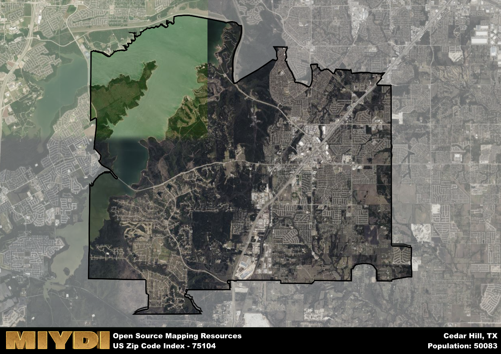

**Area Name:** Cedar Hill

**Zip Code:** 75104

**State:** TX

Cedar Hill is a part of the Dallas-Fort Worth-Arlington - TX Metro Area, and makes up 0.65% of the Metro's population.  

# Cedar Hill: A Vibrant Neighborhood in the Dallas-Fort Worth Metroplex

Cedar Hill, located within the 75104 zip code, is a bustling neighborhood situated in the southern region of the Dallas-Fort Worth Metroplex. Bordered by the cities of Grand Prairie and DeSoto, Cedar Hill seamlessly integrates with the larger urban fabric of the metro area. As part of the Dallas-Fort Worth Metroplex, Cedar Hill benefits from its proximity to major transportation routes, shopping centers, and recreational facilities.

The history of Cedar Hill dates back to the mid-19th century when settlers established the area as a farming community. Over the years, Cedar Hill evolved into a vibrant suburb known for its scenic beauty, including the Cedar Hill State Park and Joe Pool Lake. The neighborhood's growth was further accelerated with the construction of major highways, attracting residents looking for a peaceful yet convenient place to call home.

Today, Cedar Hill is a thriving community with a diverse economy that includes retail, healthcare, and education sectors. Residents of Cedar Hill enjoy a range of amenities, including shopping centers, restaurants, and parks. The neighborhood is also home to cultural and historic sites, such as the Cedar Hill Museum of History, offering visitors a glimpse into the area's rich heritage. With its unique blend of natural beauty and urban conveniences, Cedar Hill continues to be a sought-after destination in the Dallas-Fort Worth Metroplex.

# Cedar Hill Demographics

The population of Cedar Hill is 50083.  
Cedar Hill has a population density of 1131.31 per square mile.  
The area of Cedar Hill is 44.27 square miles.  

## Cedar Hill Income and Economic Data

These demographic numbers are sourced from IRS return data, providing comprehensive insights into the population dynamics and economic trends within Cedar Hill.

**Breakdown of return types for Cedar Hill**

The table offers insight into the composition of tax returns filed with the IRS, categorizing them into three main types. Single returns represent filings by individuals, joint returns by married couples, and head of household returns by individuals who qualify as heads of households, typically having dependents. This breakdown provides an understanding of the different filing statuses adopted by taxpayers when submitting their tax documentation.

| Return Types filed for Cedar Hill                              | Percentage          |
|----------------------------------------------------------|---------------------|
| Single Returns                                            | 0.49 |
| Joint Returns                                             | 0.27 |
| Head Household Returns                                    | 0.22 |

The income and economic data presented here is sourced from the IRS income brackets, utilized for categorizing tax returns by income levels. This table displays income ranges for both single filers and married couples, along with the corresponding number of returns and the percentage within each bracket, providing valuable insight into the distribution of taxes across various income groups.

| Bracket Name       | Single Filer Income Range | Married Couple Range | Number of Returns | Percentage of Returns |
|--------------------|----------------------------|----------------------|-------------------|-----------------------|
| 10% Bracket        | Up to $10,275              | Up to $20,550        | 8030 | 0.33% |
| 12% Bracket        | $10,276 - $41,775          | $20,551 - $83,550    | 6600 | 0.27% |
| 22% Bracket        | $41,776 - $89,075          | $83,551 - $178,150   | 3900 | 0.16% |
| 24% Bracket        | $89,076 - $170,050         | $178,151 - $340,100  | 2180 | 0.09% |
| 32% Bracket        | $170,051 - $215,950        | $340,101 - $431,900  | 2820 | 0.12% |
| 35% Bracket        | $215,951 - $539,900        | $431,901 - $647,850  | 770 | 0.03% |

### Exploring Taxpayer Diversity: A Breakdown of Different Types of Tax Returns in Cedar Hill

The table offers insights into various types of tax returns filed, reflecting different aspects of taxpayer activities and demographics. Categories include charitable returns for donations, dependent returns for claimed dependents, educator population, elderly population, real estate returns, self-employment returns, student loan returns, and unemployment returns, providing valuable insights into taxpayer behavior and demographics.

| Cedar Hill Filing Types                    | Count | Percentage |
|--------------------------------------|-------|------------|
| Charitable Donations                 | 2560 | 0.105% |
| Dependents Claimed                   | 970 | 0.04% |
| Educator Residents                   | 820 | 0.034% |
| Elderly Population                   | 4770 | 0.2% |
| Farming Population                   | 80 | 0.003% |
| Real Estate Transactions             | 2330 | 0.096% |
| Self-Employed Individuals            | 2910 | 0.12% |
| Student Loan Cases                   | 1560 | 0.064% |
| Unemployment Benefit Filings         | 4030 | 0.17% |

### Exploring Real Estate Trends: A Comprehensive Analysis of the Cedar Hill Area and its Neighbors

This table contains an in-depth examination of the real estate market in the Cedar Hill area. Sourced from trusted real estate market firms, this dataset provides a wealth of raw data detailing the local real estate landscape, along with comparative analyses juxtaposing the market dynamics with those of neighboring areas. Explore the intricacies of the Cedar Hill real estate market and gain valuable insights into its relationship with adjacent regions.

| Real Estate Data for Cedar Hill                       | Value    |
|------------------------------------------------|----------|
| Average Listing Price for Cedar Hill               | 755469 |
| Median Listing Price for Cedar Hill                | 440650 |
| Median Days on Market for Cedar Hill               | 43 |
| Median Listing Price per Square Foot for Cedar Hill| 78 |
| Median Square Feet for Cedar Hill                  | 2868 |
| Real Estate Prices to Income Ratio           | 97.55% |
| Price per Square Foot Ratio                  | 80.25% |
| Price Median Ratio                           | 87.75% |
| Market Sales Speed Ratio                     | 100.7% |

This table offers essential real estate data for the Cedar Hill area, including average and median listing prices, median days on market, and property size. It also presents ratio metrics as percentages, providing insights into how the local market compares to the surrounding region. A ratio of 100% signifies performance in line with the regional average, while values above or below indicate overperformance or underperformance, respectively, relative to expectations.

## Cedar Hill Sports and Recreation Data

#### Annual Youth Sports Spending for Cedar Hill

This table provides fundamental insights into the Sports and Recreation data for the Cedar Hill area, detailing the estimated annual expenditure on Youth Athletics. This includes estimated spending by the major consumer brackets. 
| Sports Spending for Cedar Hill| Value |
|-------------------------|-------|
| Athlete Spending Compared to the region | 164.99% |
| Total Youth Athlete Spending | 0,355,801 |
| Athletic Spending - Essential Focused Consumer | ,178,162 |
| Athletic Spending - Typical Consumer | ,411,692 |
| Athletic Spending - Affluent Consumers | ,764,306 |

#### Youth Coaching Estimates for Cedar Hill

This table presents the estimated number of coaches for the Cedar Hill area, derived from comprehensive national coaching surveys and athletic participation rates by state. It offers valuable insights into the vital role of coaching personnel in fostering athletic development and facilitating sports participation within the local community.

| Coaching Data for Cedar Hill | Value |
|-------------|-------|
| Total Coaches | 820 |
| Paid Coaches | 213 |
| Volunteer Coaches | 607 |

#### Youth Athlete Participation for Cedar Hill

This table shows the estimated total number of youth athletes in the Cedar Hill area, sourced from comprehensive national coaching surveys and athletic participation rates by state.

| Total YA Athletes in Cedar Hill | Value |
|-------------|-------|
| Total High School Athletes | 1252 |
| Total Youth Athletes | 3755 |
| Total Young Adult Athletes | 2503 |
| Total Athletes to Age 25 | 7509 |

#### High School Age Athletes - Breakdown by Sport for Cedar Hill

This table shows insights regarding high school age estimated players by sport in the Cedar Hill area, derived from national and state-level athletic participation trends. 

| HS Players by Sport in Cedar Hill | Value |
|-------------|-------|
| Football Players | 288 |
| Basketball Players | 175 |
| Soccer Players | 138 |
| Volleyball Players | 88 |
| Baseball Players | 150 |
| Tennis Players | 75 |
| Track Athletes | 213 |
| Golf Players | 38 |
| Swimming Athletes | 38 |
| Wrestling Competitors | 38 |
| Lacrosse Players | 0 |

Estimating the number of younger athletes presents unique challenges due to their varied starting ages, typically beginning around six years old, and a gradual decline in participation rates as they age. Unlike high school-aged athletes, younger athletes are less likely to switch sports as they grow older, contributing to the stability of participation numbers within specific sports at younger ages.  

As a general trend, the total number of younger athletes is approximately three times the number of high school-aged athletes, underscoring the significant presence of youth athletes in sports programs and highlighting the importance of early engagement in athletic activities.

## Cedar Hill AI and Census Variables

The values presented in this dataset for Cedar Hill are AI-optimized, streamlined, and categorized into relevant buckets for enhanced utility in AI and mapping programs. These simplified values have been optimized to facilitate efficient analysis and integration into various technological applications, offering users accessible and actionable insights into demographics within the Cedar Hill area.

| AI Variables for Cedar Hill | Value |
|-------------|-------|
| Shape Area | 161983816.414063 |
| Shape Length | 74460.0226462783 |
| CBSA Federal Processing Standard Code | 19100 |
| RE Price per Square Foot Ratio | 80.25% |
| RE Price Average Ratio | 122.07% |
| RE Speed Ratio | 100.7% |
| RE Income Ratio | 97.55% |
| Single Opportunity Flag | 4 |
| Single Parent Risk Flag | 7 |
| Elderly Opportunity Flag | 5 |
| Farm Opportunity Flag | 2 |
| Unemployment Risk | 6 |
| Educator Opportunity Flag | 7 |
| RE Affordability Index Flag | 6 |
| Income Bracket Flag | 6 |
| RE Income Flag | 3 |
| RE Median Square Footage Price Flag | 4 |
| RE Median Square Footage Size Flag | 7 |
| RE Activity Flag | 5 |
| Poverty Line Risk Flag | 4 |

## How to use this free AI optimized Geo-Spatial Data for Cedar Hill, TX

This data is made freely available under the Creative Commons license, allowing for unrestricted use for any purpose. Users can access static resources directly from GitHub or leverage more advanced functionalities by utilizing the GeoJSON files. All datasets originate from official government or private sector sources and are meticulously compiled into relevant datasets within QGIS. However, the versatility of the data ensures compatibility with any mapping application.

## Data Accuracy Disclaimer
It's important to note that the data provided here may contain errors or discrepancies and should be considered as 'close enough' for business applications and AI rather than a definitive source of truth. This data is aggregated from multiple sources, some of which publish information on wildly different intervals, leading to potential inconsistencies. Additionally, certain data points may not be corrected for Covid-related changes, further impacting accuracy. Moreover, the assumption that demographic trends are consistent throughout a region may lead to discrepancies, as trends often concentrate in areas of highest population density. As a result, dense areas may be slightly underrepresented, while rural areas may be slightly overrepresented, resulting in a more conservative dataset. Furthermore, the focus primarily on areas within US Major and Minor Statistical areas means that approximately 40 million Americans living outside of these areas may not be fully represented. Lastly, the historical background and area descriptions generated using AI are susceptible to potential mistakes, so users should exercise caution when interpreting the information provided.
