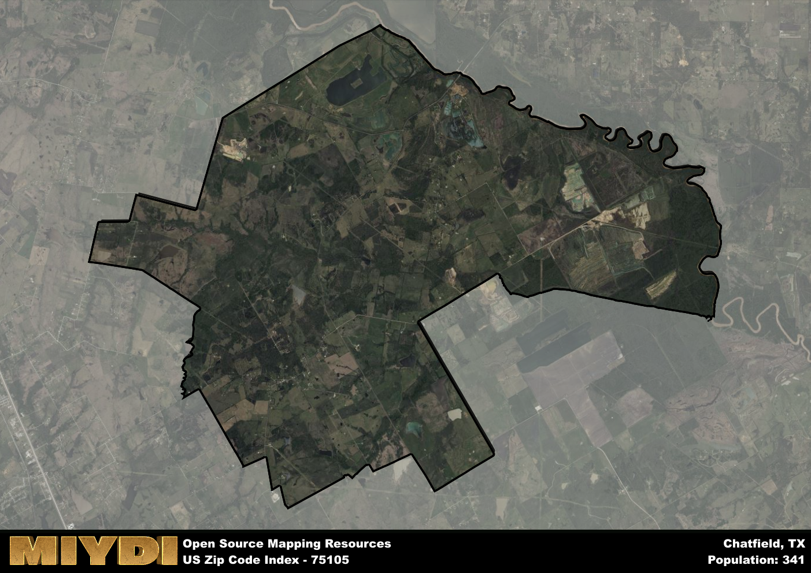

**Area Name:** Chatfield

**Zip Code:** 75105

**State:** TX

Chatfield is a part of the Corsicana - TX Micro Area, and makes up  of the Metro's population.  

# Exploring Chatfield: A Historic Gem in Ellis County

Located in Ellis County, Texas, the zip code 75105 encompasses the charming neighborhood of Chatfield. Situated just south of the city of Ennis, Chatfield is a small, tight-knit community that seamlessly integrates with the surrounding rural landscape. The area is surrounded by rolling hills, creeks, and farmland, providing residents with a peaceful and picturesque setting. Despite its rural feel, Chatfield is conveniently located near major highways, offering easy access to nearby cities like Dallas and Fort Worth.

Chatfield has a rich historical background, having been established in the late 19th century as a stop along the Texas and New Orleans Railroad. The town saw significant growth during the early 20th century, with the establishment of churches, schools, and businesses. The name "Chatfield" is believed to have been inspired by an early settler named Thomas Chatfield, who played a key role in the town's development. Today, Chatfield maintains its historic charm with well-preserved buildings and a strong sense of community pride.

Presently, Chatfield is a thriving community with a mix of residential, commercial, and agricultural activities. The area is known for its local shops and businesses, providing residents with essential services and amenities. Chatfield also offers a variety of recreational opportunities, including parks, hiking trails, and fishing spots along nearby Cedar Creek. The town's historic sites, such as the Chatfield Cemetery and the Chatfield Methodist Church, serve as reminders of its past while contributing to its unique character within the Ellis County region.

# Chatfield Demographics

The population of Chatfield is 341.  
Chatfield has a population density of 7.54 per square mile.  
The area of Chatfield is 45.22 square miles.  

## Chatfield Income and Economic Data

These demographic numbers are sourced from IRS return data, providing comprehensive insights into the population dynamics and economic trends within Chatfield.

**Breakdown of return types for Chatfield**

The table offers insight into the composition of tax returns filed with the IRS, categorizing them into three main types. Single returns represent filings by individuals, joint returns by married couples, and head of household returns by individuals who qualify as heads of households, typically having dependents. This breakdown provides an understanding of the different filing statuses adopted by taxpayers when submitting their tax documentation.

| Return Types filed for Chatfield                              | Percentage          |
|----------------------------------------------------------|---------------------|
| Single Returns                                            | 0.38 |
| Joint Returns                                             | 0.62 |
| Head Household Returns                                    | 0 |

The income and economic data presented here is sourced from the IRS income brackets, utilized for categorizing tax returns by income levels. This table displays income ranges for both single filers and married couples, along with the corresponding number of returns and the percentage within each bracket, providing valuable insight into the distribution of taxes across various income groups.

| Bracket Name       | Single Filer Income Range | Married Couple Range | Number of Returns | Percentage of Returns |
|--------------------|----------------------------|----------------------|-------------------|-----------------------|
| 10% Bracket        | Up to $10,275              | Up to $20,550        | 30 | 0.23% |
| 12% Bracket        | $10,276 - $41,775          | $20,551 - $83,550    | 40 | 0.31% |
| 22% Bracket        | $41,776 - $89,075          | $83,551 - $178,150   | 40 | 0.31% |
| 24% Bracket        | $89,076 - $170,050         | $178,151 - $340,100  | 0 | 0% |
| 32% Bracket        | $170,051 - $215,950        | $340,101 - $431,900  | 20 | 0.15% |
| 35% Bracket        | $215,951 - $539,900        | $431,901 - $647,850  | 0 | 0% |

### Exploring Taxpayer Diversity: A Breakdown of Different Types of Tax Returns in Chatfield

The table offers insights into various types of tax returns filed, reflecting different aspects of taxpayer activities and demographics. Categories include charitable returns for donations, dependent returns for claimed dependents, educator population, elderly population, real estate returns, self-employment returns, student loan returns, and unemployment returns, providing valuable insights into taxpayer behavior and demographics.

| Chatfield Filing Types                    | Count | Percentage |
|--------------------------------------|-------|------------|
| Charitable Donations                 | 0 | 0% |
| Dependents Claimed                   | 0 | 0% |
| Educator Residents                   | 0 | 0% |
| Elderly Population                   | 40 | 0.31% |
| Farming Population                   | 20 | 0.154% |
| Real Estate Transactions             | 0 | 0% |
| Self-Employed Individuals            | 0 | 0% |
| Student Loan Cases                   | 0 | 0% |
| Unemployment Benefit Filings         | 0 | 0% |

## Chatfield AI and Census Variables

The values presented in this dataset for Chatfield are AI-optimized, streamlined, and categorized into relevant buckets for enhanced utility in AI and mapping programs. These simplified values have been optimized to facilitate efficient analysis and integration into various technological applications, offering users accessible and actionable insights into demographics within the Chatfield area.

| AI Variables for Chatfield | Value |
|-------------|-------|
| Shape Area | 164301596.046875 |
| Shape Length | 78360.5980528992 |
| CBSA Federal Processing Standard Code | 18620 |

## How to use this free AI optimized Geo-Spatial Data for Chatfield, TX

This data is made freely available under the Creative Commons license, allowing for unrestricted use for any purpose. Users can access static resources directly from GitHub or leverage more advanced functionalities by utilizing the GeoJSON files. All datasets originate from official government or private sector sources and are meticulously compiled into relevant datasets within QGIS. However, the versatility of the data ensures compatibility with any mapping application.

## Data Accuracy Disclaimer
It's important to note that the data provided here may contain errors or discrepancies and should be considered as 'close enough' for business applications and AI rather than a definitive source of truth. This data is aggregated from multiple sources, some of which publish information on wildly different intervals, leading to potential inconsistencies. Additionally, certain data points may not be corrected for Covid-related changes, further impacting accuracy. Moreover, the assumption that demographic trends are consistent throughout a region may lead to discrepancies, as trends often concentrate in areas of highest population density. As a result, dense areas may be slightly underrepresented, while rural areas may be slightly overrepresented, resulting in a more conservative dataset. Furthermore, the focus primarily on areas within US Major and Minor Statistical areas means that approximately 40 million Americans living outside of these areas may not be fully represented. Lastly, the historical background and area descriptions generated using AI are susceptible to potential mistakes, so users should exercise caution when interpreting the information provided.
