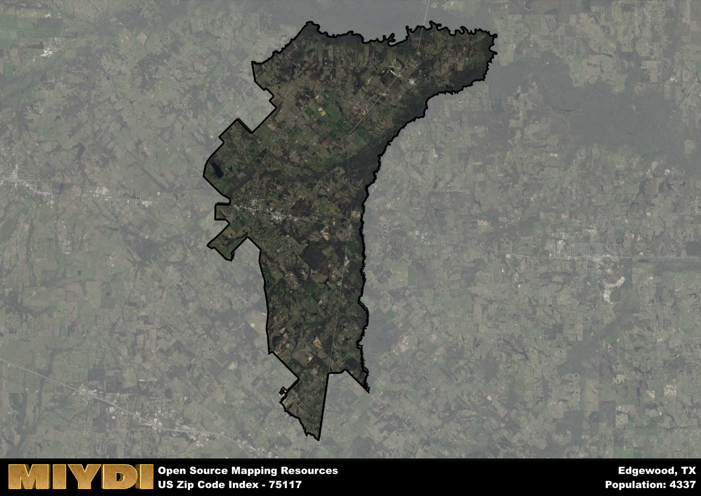

**Area Name:** Edgewood

**Zip Code:** 75117

**State:** TX

# Edgewood: A Charming Community in East Texas  

Located in the heart of East Texas, zip code 75117 encompasses the quaint neighborhood of Edgewood. Bordered by the city of Canton to the north and the town of Wills Point to the south, Edgewood is seamlessly integrated into the larger region. Situated approximately 60 miles east of Dallas, Edgewood benefits from its proximity to major population centers while maintaining its own unique charm and character.

Established in the mid-19th century, Edgewood has a rich history deeply rooted in its agricultural heritage. Originally known for its fertile land and farming community, the area saw significant growth with the arrival of the railroad in the late 1800s. This led to the development of the town center and the establishment of local businesses, shaping Edgewood into the thriving community it is today. The name "Edgewood" itself is said to have been inspired by the town's picturesque location on the edge of the woods.

Today, Edgewood is a vibrant community known for its friendly atmosphere and small-town appeal. The area boasts a mix of residential neighborhoods, locally-owned shops, and family-friendly amenities. Residents and visitors alike can enjoy the tranquil surroundings of the countryside, as well as access to nearby recreational areas for outdoor activities. Edgewood also takes pride in its historic downtown district, where charming storefronts and community events showcase the area's unique heritage.

# Edgewood Demographics

The population of Edgewood is 4337.  
Edgewood has a population density of 95.38 per square mile.  
The area of Edgewood is 45.47 square miles.  

## Edgewood Income and Economic Data

These demographic numbers are sourced from IRS return data, providing comprehensive insights into the population dynamics and economic trends within Edgewood.

**Breakdown of return types for Edgewood**

The table offers insight into the composition of tax returns filed with the IRS, categorizing them into three main types. Single returns represent filings by individuals, joint returns by married couples, and head of household returns by individuals who qualify as heads of households, typically having dependents. This breakdown provides an understanding of the different filing statuses adopted by taxpayers when submitting their tax documentation.

| Return Types filed for Edgewood                              | Percentage          |
|----------------------------------------------------------|---------------------|
| Single Returns                                            | 0.39 |
| Joint Returns                                             | 0.48 |
| Head Household Returns                                    | 0.12 |

The income and economic data presented here is sourced from the IRS income brackets, utilized for categorizing tax returns by income levels. This table displays income ranges for both single filers and married couples, along with the corresponding number of returns and the percentage within each bracket, providing valuable insight into the distribution of taxes across various income groups.

| Bracket Name       | Single Filer Income Range | Married Couple Range | Number of Returns | Percentage of Returns |
|--------------------|----------------------------|----------------------|-------------------|-----------------------|
| 10% Bracket        | Up to $10,275              | Up to $20,550        | 590 | 0.33% |
| 12% Bracket        | $10,276 - $41,775          | $20,551 - $83,550    | 430 | 0.24% |
| 22% Bracket        | $41,776 - $89,075          | $83,551 - $178,150   | 230 | 0.13% |
| 24% Bracket        | $89,076 - $170,050         | $178,151 - $340,100  | 200 | 0.11% |
| 32% Bracket        | $170,051 - $215,950        | $340,101 - $431,900  | 270 | 0.15% |
| 35% Bracket        | $215,951 - $539,900        | $431,901 - $647,850  | 60 | 0.03% |

### Exploring Taxpayer Diversity: A Breakdown of Different Types of Tax Returns in Edgewood

The table offers insights into various types of tax returns filed, reflecting different aspects of taxpayer activities and demographics. Categories include charitable returns for donations, dependent returns for claimed dependents, educator population, elderly population, real estate returns, self-employment returns, student loan returns, and unemployment returns, providing valuable insights into taxpayer behavior and demographics.

| Edgewood Filing Types                    | Count | Percentage |
|--------------------------------------|-------|------------|
| Charitable Donations                 | 70 | 0.039% |
| Dependents Claimed                   | 30 | 0.017% |
| Educator Residents                   | 50 | 0.028% |
| Elderly Population                   | 500 | 0.28% |
| Farming Population                   | 160 | 0.09% |
| Real Estate Transactions             | 70 | 0.039% |
| Self-Employed Individuals            | 260 | 0.146% |
| Student Loan Cases                   | 90 | 0.051% |
| Unemployment Benefit Filings         | 210 | 0.12% |

## Edgewood AI and Census Variables

The values presented in this dataset for Edgewood are AI-optimized, streamlined, and categorized into relevant buckets for enhanced utility in AI and mapping programs. These simplified values have been optimized to facilitate efficient analysis and integration into various technological applications, offering users accessible and actionable insights into demographics within the Edgewood area.

| AI Variables for Edgewood | Value |
|-------------|-------|
| Shape Area | 166778257.527344 |
| Shape Length | 102586.288884195 |

## How to use this free AI optimized Geo-Spatial Data for Edgewood, TX

This data is made freely available under the Creative Commons license, allowing for unrestricted use for any purpose. Users can access static resources directly from GitHub or leverage more advanced functionalities by utilizing the GeoJSON files. All datasets originate from official government or private sector sources and are meticulously compiled into relevant datasets within QGIS. However, the versatility of the data ensures compatibility with any mapping application.

## Data Accuracy Disclaimer
It's important to note that the data provided here may contain errors or discrepancies and should be considered as 'close enough' for business applications and AI rather than a definitive source of truth. This data is aggregated from multiple sources, some of which publish information on wildly different intervals, leading to potential inconsistencies. Additionally, certain data points may not be corrected for Covid-related changes, further impacting accuracy. Moreover, the assumption that demographic trends are consistent throughout a region may lead to discrepancies, as trends often concentrate in areas of highest population density. As a result, dense areas may be slightly underrepresented, while rural areas may be slightly overrepresented, resulting in a more conservative dataset. Furthermore, the focus primarily on areas within US Major and Minor Statistical areas means that approximately 40 million Americans living outside of these areas may not be fully represented. Lastly, the historical background and area descriptions generated using AI are susceptible to potential mistakes, so users should exercise caution when interpreting the information provided.
