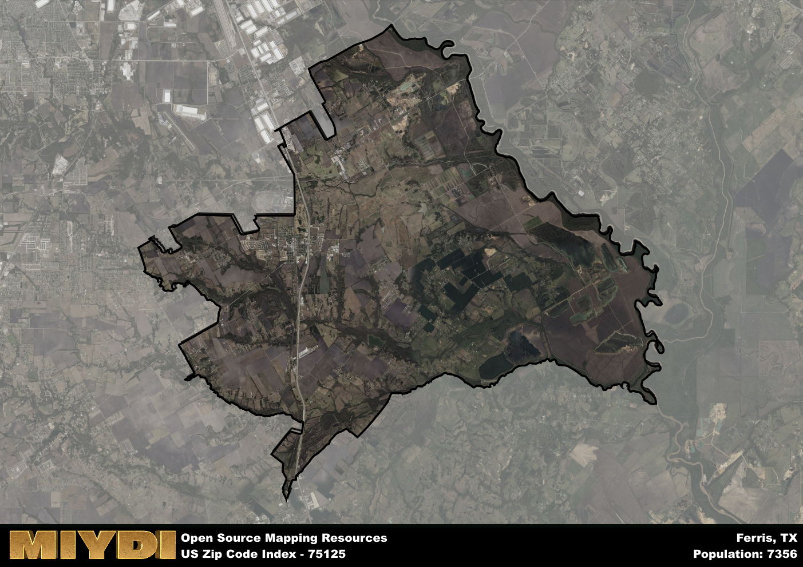

**Area Name:** Ferris

**Zip Code:** 75125

**State:** TX

Ferris is a part of the Dallas-Fort Worth-Arlington - TX Metro Area, and makes up 0.10% of the Metro's population.  

# Charming Ferris: A Historic Gem in the Dallas-Fort Worth Metroplex  

Ferris, Texas, located in zip code 75125, is situated approximately 20 miles south of downtown Dallas. The area is bordered by the city of Red Oak to the east and Ennis to the south, making it a part of the greater Dallas-Fort Worth metropolitan area. Ferris is easily accessible via Interstate 45, allowing for seamless integration with nearby cities and major population centers, while still maintaining its small-town charm and identity.  

Founded in the late 19th century, Ferris has a rich historical narrative that traces back to its origins as a railroad town. The area experienced significant growth during the early 20th century, attracting settlers and businesses due to its strategic location along the railway line. Named after Judge Justus Wesley Ferris, the town flourished as an agricultural hub, with cotton and corn being major crops. Over the years, Ferris has preserved its historic buildings and landmarks, offering visitors a glimpse into its past.  

Today, Ferris continues to thrive as a welcoming community with a strong sense of local pride. The area is known for its diverse economic activities, including manufacturing, agriculture, and retail services. Residents and visitors can enjoy a variety of recreational amenities, such as parks, sports facilities, and community events. Ferris also boasts a number of cultural and historic sites, such as the Ferris Depot Museum, which showcase the area's heritage and contribute to its unique character within the larger urban fabric of the Dallas-Fort Worth metroplex.

# Ferris Demographics

The population of Ferris is 7356.  
Ferris has a population density of 92.76 per square mile.  
The area of Ferris is 79.3 square miles.  

## Ferris Income and Economic Data

These demographic numbers are sourced from IRS return data, providing comprehensive insights into the population dynamics and economic trends within Ferris.

**Breakdown of return types for Ferris**

The table offers insight into the composition of tax returns filed with the IRS, categorizing them into three main types. Single returns represent filings by individuals, joint returns by married couples, and head of household returns by individuals who qualify as heads of households, typically having dependents. This breakdown provides an understanding of the different filing statuses adopted by taxpayers when submitting their tax documentation.

| Return Types filed for Ferris                              | Percentage          |
|----------------------------------------------------------|---------------------|
| Single Returns                                            | 0.46 |
| Joint Returns                                             | 0.33 |
| Head Household Returns                                    | 0.19 |

The income and economic data presented here is sourced from the IRS income brackets, utilized for categorizing tax returns by income levels. This table displays income ranges for both single filers and married couples, along with the corresponding number of returns and the percentage within each bracket, providing valuable insight into the distribution of taxes across various income groups.

| Bracket Name       | Single Filer Income Range | Married Couple Range | Number of Returns | Percentage of Returns |
|--------------------|----------------------------|----------------------|-------------------|-----------------------|
| 10% Bracket        | Up to $10,275              | Up to $20,550        | 1400 | 0.39% |
| 12% Bracket        | $10,276 - $41,775          | $20,551 - $83,550    | 1130 | 0.31% |
| 22% Bracket        | $41,776 - $89,075          | $83,551 - $178,150   | 510 | 0.14% |
| 24% Bracket        | $89,076 - $170,050         | $178,151 - $340,100  | 270 | 0.07% |
| 32% Bracket        | $170,051 - $215,950        | $340,101 - $431,900  | 280 | 0.08% |
| 35% Bracket        | $215,951 - $539,900        | $431,901 - $647,850  | 30 | 0.01% |

### Exploring Taxpayer Diversity: A Breakdown of Different Types of Tax Returns in Ferris

The table offers insights into various types of tax returns filed, reflecting different aspects of taxpayer activities and demographics. Categories include charitable returns for donations, dependent returns for claimed dependents, educator population, elderly population, real estate returns, self-employment returns, student loan returns, and unemployment returns, providing valuable insights into taxpayer behavior and demographics.

| Ferris Filing Types                    | Count | Percentage |
|--------------------------------------|-------|------------|
| Charitable Donations                 | 130 | 0.036% |
| Dependents Claimed                   | 100 | 0.028% |
| Educator Residents                   | 40 | 0.011% |
| Elderly Population                   | 640 | 0.18% |
| Farming Population                   | 90 | 0.025% |
| Real Estate Transactions             | 100 | 0.028% |
| Self-Employed Individuals            | 600 | 0.166% |
| Student Loan Cases                   | 120 | 0.033% |
| Unemployment Benefit Filings         | 450 | 0.12% |

### Exploring Real Estate Trends: A Comprehensive Analysis of the Ferris Area and its Neighbors

This table contains an in-depth examination of the real estate market in the Ferris area. Sourced from trusted real estate market firms, this dataset provides a wealth of raw data detailing the local real estate landscape, along with comparative analyses juxtaposing the market dynamics with those of neighboring areas. Explore the intricacies of the Ferris real estate market and gain valuable insights into its relationship with adjacent regions.

| Real Estate Data for Ferris                       | Value    |
|------------------------------------------------|----------|
| Average Listing Price for Ferris               | 733061 |
| Median Listing Price for Ferris                | 361725 |
| Median Days on Market for Ferris               | 32 |
| Median Listing Price per Square Foot for Ferris| 86 |
| Median Square Feet for Ferris                  | 2026 |
| Real Estate Prices to Income Ratio           | 458.75% |
| Price per Square Foot Ratio                  | 83.85% |
| Price Median Ratio                           | 72.04% |
| Market Sales Speed Ratio                     | 74.9% |

This table offers essential real estate data for the Ferris area, including average and median listing prices, median days on market, and property size. It also presents ratio metrics as percentages, providing insights into how the local market compares to the surrounding region. A ratio of 100% signifies performance in line with the regional average, while values above or below indicate overperformance or underperformance, respectively, relative to expectations.

## Ferris Sports and Recreation Data

#### Annual Youth Sports Spending for Ferris

This table provides fundamental insights into the Sports and Recreation data for the Ferris area, detailing the estimated annual expenditure on Youth Athletics. This includes estimated spending by the major consumer brackets. 
| Sports Spending for Ferris| Value |
|-------------------------|-------|
| Athlete Spending Compared to the region | 18.45% |
| Total Youth Athlete Spending | ,158,319 |
| Athletic Spending - Essential Focused Consumer | 74,630 |
| Athletic Spending - Typical Consumer | 23,110 |
| Athletic Spending - Affluent Consumers | 60,337 |

#### Youth Coaching Estimates for Ferris

This table presents the estimated number of coaches for the Ferris area, derived from comprehensive national coaching surveys and athletic participation rates by state. It offers valuable insights into the vital role of coaching personnel in fostering athletic development and facilitating sports participation within the local community.

| Coaching Data for Ferris | Value |
|-------------|-------|
| Total Coaches | 121 |
| Paid Coaches | 32 |
| Volunteer Coaches | 90 |

#### Youth Athlete Participation for Ferris

This table shows the estimated total number of youth athletes in the Ferris area, sourced from comprehensive national coaching surveys and athletic participation rates by state.

| Total YA Athletes in Ferris | Value |
|-------------|-------|
| Total High School Athletes | 185 |
| Total Youth Athletes | 556 |
| Total Young Adult Athletes | 371 |
| Total Athletes to Age 25 | 1113 |

#### High School Age Athletes - Breakdown by Sport for Ferris

This table shows insights regarding high school age estimated players by sport in the Ferris area, derived from national and state-level athletic participation trends. 

| HS Players by Sport in Ferris | Value |
|-------------|-------|
| Football Players | 43 |
| Basketball Players | 26 |
| Soccer Players | 20 |
| Volleyball Players | 13 |
| Baseball Players | 22 |
| Tennis Players | 11 |
| Track Athletes | 32 |
| Golf Players | 6 |
| Swimming Athletes | 6 |
| Wrestling Competitors | 6 |
| Lacrosse Players | 0 |

Estimating the number of younger athletes presents unique challenges due to their varied starting ages, typically beginning around six years old, and a gradual decline in participation rates as they age. Unlike high school-aged athletes, younger athletes are less likely to switch sports as they grow older, contributing to the stability of participation numbers within specific sports at younger ages.  

As a general trend, the total number of younger athletes is approximately three times the number of high school-aged athletes, underscoring the significant presence of youth athletes in sports programs and highlighting the importance of early engagement in athletic activities.

## Ferris AI and Census Variables

The values presented in this dataset for Ferris are AI-optimized, streamlined, and categorized into relevant buckets for enhanced utility in AI and mapping programs. These simplified values have been optimized to facilitate efficient analysis and integration into various technological applications, offering users accessible and actionable insights into demographics within the Ferris area.

| AI Variables for Ferris | Value |
|-------------|-------|
| Shape Area | 289763861.019531 |
| Shape Length | 123453.637292433 |
| CBSA Federal Processing Standard Code | 19100 |
| RE Price per Square Foot Ratio | 83.85% |
| RE Price Average Ratio | 118.45% |
| RE Speed Ratio | 74.9% |
| RE Income Ratio | 458.75% |
| Single Opportunity Flag | 3 |
| Single Parent Risk Flag | 6 |
| Elderly Opportunity Flag | 3 |
| Farm Opportunity Flag | 5 |
| Unemployment Risk | 2 |
| Educator Opportunity Flag | 1 |
| RE Affordability Index Flag | 5 |
| Income Bracket Flag | 1 |
| RE Income Flag | 7 |
| RE Median Square Footage Price Flag | 4 |
| RE Median Square Footage Size Flag | 5 |
| RE Activity Flag | 3 |
| Poverty Line Risk Flag | 2 |

## How to use this free AI optimized Geo-Spatial Data for Ferris, TX

This data is made freely available under the Creative Commons license, allowing for unrestricted use for any purpose. Users can access static resources directly from GitHub or leverage more advanced functionalities by utilizing the GeoJSON files. All datasets originate from official government or private sector sources and are meticulously compiled into relevant datasets within QGIS. However, the versatility of the data ensures compatibility with any mapping application.

## Data Accuracy Disclaimer
It's important to note that the data provided here may contain errors or discrepancies and should be considered as 'close enough' for business applications and AI rather than a definitive source of truth. This data is aggregated from multiple sources, some of which publish information on wildly different intervals, leading to potential inconsistencies. Additionally, certain data points may not be corrected for Covid-related changes, further impacting accuracy. Moreover, the assumption that demographic trends are consistent throughout a region may lead to discrepancies, as trends often concentrate in areas of highest population density. As a result, dense areas may be slightly underrepresented, while rural areas may be slightly overrepresented, resulting in a more conservative dataset. Furthermore, the focus primarily on areas within US Major and Minor Statistical areas means that approximately 40 million Americans living outside of these areas may not be fully represented. Lastly, the historical background and area descriptions generated using AI are susceptible to potential mistakes, so users should exercise caution when interpreting the information provided.
