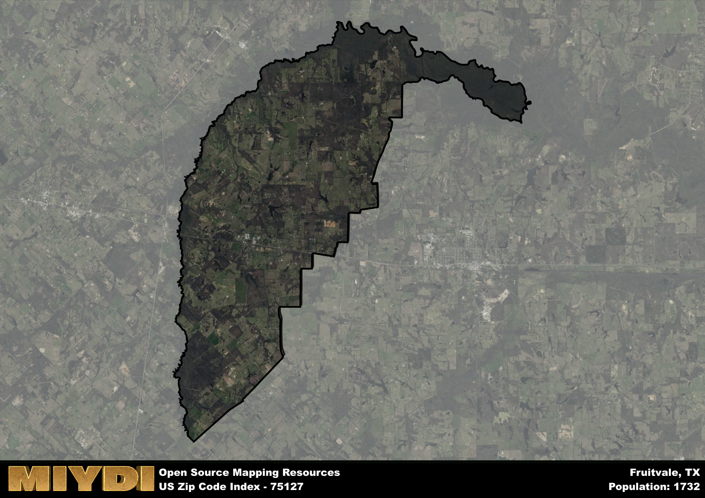

**Area Name:** Fruitvale

**Zip Code:** 75127

**State:** TX

# Exploring the Charming Neighborhood of Fruitvale (Zip Code 75127)

Located in the eastern part of Texas, zip code 75127 encompasses the quaint neighborhood of Fruitvale. Bordered by rolling hills and scenic landscapes, Fruitvale is situated within close proximity to the larger cities of Dallas and Tyler. This tight-knit community is well-connected by major highways, making it a popular residential area for those looking for a peaceful retreat while still being easily accessible to urban amenities.

Fruitvale has a rich historical background, with its origins dating back to the late 19th century. The area was initially settled by farmers attracted to the fertile land and mild climate. Over the years, Fruitvale grew into a thriving agricultural community, known for its orchards and vineyards. The neighborhood eventually earned its name from the abundance of fruit trees that dotted the landscape, becoming a symbol of the area's prosperity and abundance.

Today, Fruitvale maintains its small-town charm while offering modern conveniences to its residents. The local economy is driven by agriculture, with many residents involved in farming and ranching activities. The neighborhood boasts a range of services, including schools, shops, and restaurants, catering to the needs of its residents. Outdoor enthusiasts can enjoy the nearby lakes and parks, while history buffs can explore the area's historic sites, providing a blend of rural tranquility and cultural richness in the heart of Texas.

# Fruitvale Demographics

The population of Fruitvale is 1732.  
Fruitvale has a population density of 54.6 per square mile.  
The area of Fruitvale is 31.72 square miles.  

## Fruitvale Income and Economic Data

These demographic numbers are sourced from IRS return data, providing comprehensive insights into the population dynamics and economic trends within Fruitvale.

**Breakdown of return types for Fruitvale**

The table offers insight into the composition of tax returns filed with the IRS, categorizing them into three main types. Single returns represent filings by individuals, joint returns by married couples, and head of household returns by individuals who qualify as heads of households, typically having dependents. This breakdown provides an understanding of the different filing statuses adopted by taxpayers when submitting their tax documentation.

| Return Types filed for Fruitvale                              | Percentage          |
|----------------------------------------------------------|---------------------|
| Single Returns                                            | 0.41 |
| Joint Returns                                             | 0.45 |
| Head Household Returns                                    | 0.12 |

The income and economic data presented here is sourced from the IRS income brackets, utilized for categorizing tax returns by income levels. This table displays income ranges for both single filers and married couples, along with the corresponding number of returns and the percentage within each bracket, providing valuable insight into the distribution of taxes across various income groups.

| Bracket Name       | Single Filer Income Range | Married Couple Range | Number of Returns | Percentage of Returns |
|--------------------|----------------------------|----------------------|-------------------|-----------------------|
| 10% Bracket        | Up to $10,275              | Up to $20,550        | 280 | 0.38% |
| 12% Bracket        | $10,276 - $41,775          | $20,551 - $83,550    | 200 | 0.27% |
| 22% Bracket        | $41,776 - $89,075          | $83,551 - $178,150   | 110 | 0.15% |
| 24% Bracket        | $89,076 - $170,050         | $178,151 - $340,100  | 70 | 0.1% |
| 32% Bracket        | $170,051 - $215,950        | $340,101 - $431,900  | 70 | 0.1% |
| 35% Bracket        | $215,951 - $539,900        | $431,901 - $647,850  | 0 | 0% |

### Exploring Taxpayer Diversity: A Breakdown of Different Types of Tax Returns in Fruitvale

The table offers insights into various types of tax returns filed, reflecting different aspects of taxpayer activities and demographics. Categories include charitable returns for donations, dependent returns for claimed dependents, educator population, elderly population, real estate returns, self-employment returns, student loan returns, and unemployment returns, providing valuable insights into taxpayer behavior and demographics.

| Fruitvale Filing Types                    | Count | Percentage |
|--------------------------------------|-------|------------|
| Charitable Donations                 | 0 | 0% |
| Dependents Claimed                   | 0 | 0% |
| Educator Residents                   | 0 | 0% |
| Elderly Population                   | 190 | 0.26% |
| Farming Population                   | 70 | 0.096% |
| Real Estate Transactions             | 0 | 0% |
| Self-Employed Individuals            | 100 | 0.137% |
| Student Loan Cases                   | 30 | 0.041% |
| Unemployment Benefit Filings         | 80 | 0.11% |

## Fruitvale AI and Census Variables

The values presented in this dataset for Fruitvale are AI-optimized, streamlined, and categorized into relevant buckets for enhanced utility in AI and mapping programs. These simplified values have been optimized to facilitate efficient analysis and integration into various technological applications, offering users accessible and actionable insights into demographics within the Fruitvale area.

| AI Variables for Fruitvale | Value |
|-------------|-------|
| Shape Area | 116323968.558594 |
| Shape Length | 79245.990968653 |

## How to use this free AI optimized Geo-Spatial Data for Fruitvale, TX

This data is made freely available under the Creative Commons license, allowing for unrestricted use for any purpose. Users can access static resources directly from GitHub or leverage more advanced functionalities by utilizing the GeoJSON files. All datasets originate from official government or private sector sources and are meticulously compiled into relevant datasets within QGIS. However, the versatility of the data ensures compatibility with any mapping application.

## Data Accuracy Disclaimer
It's important to note that the data provided here may contain errors or discrepancies and should be considered as 'close enough' for business applications and AI rather than a definitive source of truth. This data is aggregated from multiple sources, some of which publish information on wildly different intervals, leading to potential inconsistencies. Additionally, certain data points may not be corrected for Covid-related changes, further impacting accuracy. Moreover, the assumption that demographic trends are consistent throughout a region may lead to discrepancies, as trends often concentrate in areas of highest population density. As a result, dense areas may be slightly underrepresented, while rural areas may be slightly overrepresented, resulting in a more conservative dataset. Furthermore, the focus primarily on areas within US Major and Minor Statistical areas means that approximately 40 million Americans living outside of these areas may not be fully represented. Lastly, the historical background and area descriptions generated using AI are susceptible to potential mistakes, so users should exercise caution when interpreting the information provided.
