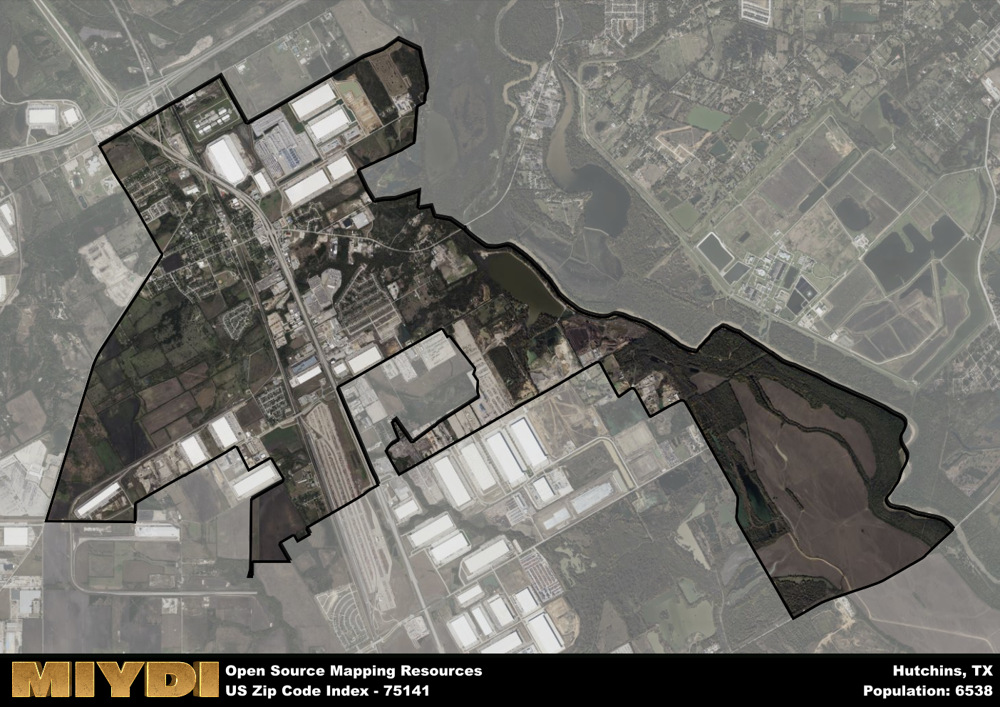

**Area Name:** Hutchins

**Zip Code:** 75141

**State:** TX

Hutchins is a part of the Dallas-Fort Worth-Arlington - TX Metro Area, and makes up  of the Metro's population.  

# Hutchins, TX (75141): A Historical and Vibrant Zip Code Area

Located in the southern region of Dallas County, Texas, the zip code area 75141 encompasses the charming neighborhood of Hutchins. Bordered by the city of Dallas to the north and the Trinity River to the west, Hutchins serves as a vital part of the Dallas-Fort Worth metropolitan area. It is conveniently situated near major highways, including Interstate 20 and Interstate 45, facilitating easy access to neighboring cities and commercial centers.

Hutchins has a rich historical background, dating back to the mid-19th century when the area was first settled. Originally known as Hord's Ridge, the neighborhood was later renamed Hutchins in honor of William J. Hutchins, a prominent local attorney. Throughout its history, Hutchins has been an important hub for agriculture and transportation, playing a significant role in the development of the region's economy.

Today, Hutchins is a thriving community with a diverse range of economic activities, including manufacturing, logistics, and retail. The neighborhood boasts a variety of local businesses, restaurants, and services that cater to residents and visitors alike. In addition, Hutchins offers a number of recreational amenities, such as parks and sports facilities, as well as cultural and historic sites that showcase its unique heritage within the larger urban fabric of the Dallas-Fort Worth metropolitan area.

# Hutchins Demographics

The population of Hutchins is 6538.  
Hutchins has a population density of 638.48 per square mile.  
The area of Hutchins is 10.24 square miles.  

## Hutchins Income and Economic Data

These demographic numbers are sourced from IRS return data, providing comprehensive insights into the population dynamics and economic trends within Hutchins.

**Breakdown of return types for Hutchins**

The table offers insight into the composition of tax returns filed with the IRS, categorizing them into three main types. Single returns represent filings by individuals, joint returns by married couples, and head of household returns by individuals who qualify as heads of households, typically having dependents. This breakdown provides an understanding of the different filing statuses adopted by taxpayers when submitting their tax documentation.

| Return Types filed for Hutchins                              | Percentage          |
|----------------------------------------------------------|---------------------|
| Single Returns                                            | 0.49 |
| Joint Returns                                             | 0.23 |
| Head Household Returns                                    | 0.28 |

The income and economic data presented here is sourced from the IRS income brackets, utilized for categorizing tax returns by income levels. This table displays income ranges for both single filers and married couples, along with the corresponding number of returns and the percentage within each bracket, providing valuable insight into the distribution of taxes across various income groups.

| Bracket Name       | Single Filer Income Range | Married Couple Range | Number of Returns | Percentage of Returns |
|--------------------|----------------------------|----------------------|-------------------|-----------------------|
| 10% Bracket        | Up to $10,275              | Up to $20,550        | 990 | 0.44% |
| 12% Bracket        | $10,276 - $41,775          | $20,551 - $83,550    | 730 | 0.33% |
| 22% Bracket        | $41,776 - $89,075          | $83,551 - $178,150   | 300 | 0.13% |
| 24% Bracket        | $89,076 - $170,050         | $178,151 - $340,100  | 130 | 0.06% |
| 32% Bracket        | $170,051 - $215,950        | $340,101 - $431,900  | 80 | 0.04% |
| 35% Bracket        | $215,951 - $539,900        | $431,901 - $647,850  | 0 | 0% |

### Exploring Taxpayer Diversity: A Breakdown of Different Types of Tax Returns in Hutchins

The table offers insights into various types of tax returns filed, reflecting different aspects of taxpayer activities and demographics. Categories include charitable returns for donations, dependent returns for claimed dependents, educator population, elderly population, real estate returns, self-employment returns, student loan returns, and unemployment returns, providing valuable insights into taxpayer behavior and demographics.

| Hutchins Filing Types                    | Count | Percentage |
|--------------------------------------|-------|------------|
| Charitable Donations                 | 80 | 0.036% |
| Dependents Claimed                   | 60 | 0.027% |
| Educator Residents                   | 20 | 0.009% |
| Elderly Population                   | 300 | 0.13% |
| Farming Population                   | 0 | 0% |
| Real Estate Transactions             | 50 | 0.022% |
| Self-Employed Individuals            | 330 | 0.148% |
| Student Loan Cases                   | 60 | 0.027% |
| Unemployment Benefit Filings         | 380 | 0.17% |

## Hutchins AI and Census Variables

The values presented in this dataset for Hutchins are AI-optimized, streamlined, and categorized into relevant buckets for enhanced utility in AI and mapping programs. These simplified values have been optimized to facilitate efficient analysis and integration into various technological applications, offering users accessible and actionable insights into demographics within the Hutchins area.

| AI Variables for Hutchins | Value |
|-------------|-------|
| Shape Area | 37499697.3789063 |
| Shape Length | 51818.5072186059 |
| CBSA Federal Processing Standard Code | 19100 |

## How to use this free AI optimized Geo-Spatial Data for Hutchins, TX

This data is made freely available under the Creative Commons license, allowing for unrestricted use for any purpose. Users can access static resources directly from GitHub or leverage more advanced functionalities by utilizing the GeoJSON files. All datasets originate from official government or private sector sources and are meticulously compiled into relevant datasets within QGIS. However, the versatility of the data ensures compatibility with any mapping application.

## Data Accuracy Disclaimer
It's important to note that the data provided here may contain errors or discrepancies and should be considered as 'close enough' for business applications and AI rather than a definitive source of truth. This data is aggregated from multiple sources, some of which publish information on wildly different intervals, leading to potential inconsistencies. Additionally, certain data points may not be corrected for Covid-related changes, further impacting accuracy. Moreover, the assumption that demographic trends are consistent throughout a region may lead to discrepancies, as trends often concentrate in areas of highest population density. As a result, dense areas may be slightly underrepresented, while rural areas may be slightly overrepresented, resulting in a more conservative dataset. Furthermore, the focus primarily on areas within US Major and Minor Statistical areas means that approximately 40 million Americans living outside of these areas may not be fully represented. Lastly, the historical background and area descriptions generated using AI are susceptible to potential mistakes, so users should exercise caution when interpreting the information provided.
