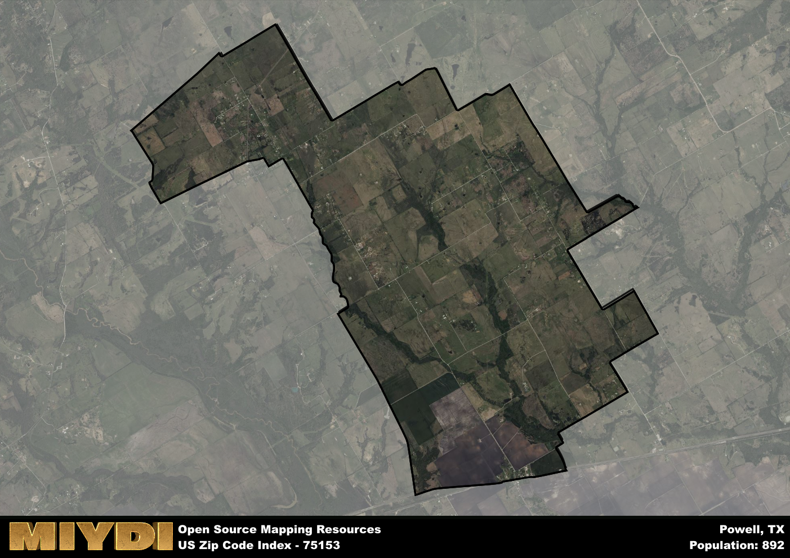

**Area Name:** Powell

**Zip Code:** 75153

**State:** TX

Powell is a part of the Corsicana - TX Micro Area, and makes up  of the Metro's population.  

# Powell: A Quaint Neighborhood in the Heart of Texas

Located in the heart of Texas, the zip code 75153 corresponds to the charming neighborhood of Powell. Situated within the larger metropolitan context of the Dallas-Fort Worth area, Powell is known for its peaceful residential streets and close-knit community. Bordered by rolling farmland to the east and bustling urban centers to the west, Powell offers a unique blend of rural tranquility and urban convenience.

Powell has a rich historical narrative that dates back to its founding in the late 19th century. Originally established as a trading post along the railroad, Powell grew rapidly as settlers were drawn to the area's fertile land and abundant natural resources. Over the years, Powell has retained its small-town charm while adapting to modern developments, making it a sought-after destination for families and retirees alike.

Today, Powell boasts a thriving economy supported by local businesses, farms, and community services. Residents can enjoy a variety of recreational amenities, including parks, hiking trails, and community events. The neighborhood is also home to several historic sites, such as the Powell Depot Museum, which preserves the area's railroad heritage. With its blend of historic charm and modern conveniences, Powell continues to be a vibrant and welcoming community in the Dallas-Fort Worth area.

# Powell Demographics

The population of Powell is 892.  
Powell has a population density of 50.88 per square mile.  
The area of Powell is 17.53 square miles.  

## Powell Income and Economic Data

These demographic numbers are sourced from IRS return data, providing comprehensive insights into the population dynamics and economic trends within Powell.

**Breakdown of return types for Powell**

The table offers insight into the composition of tax returns filed with the IRS, categorizing them into three main types. Single returns represent filings by individuals, joint returns by married couples, and head of household returns by individuals who qualify as heads of households, typically having dependents. This breakdown provides an understanding of the different filing statuses adopted by taxpayers when submitting their tax documentation.

| Return Types filed for Powell                              | Percentage          |
|----------------------------------------------------------|---------------------|
| Single Returns                                            | 0.41 |
| Joint Returns                                             | 0.41 |
| Head Household Returns                                    | 0.19 |

The income and economic data presented here is sourced from the IRS income brackets, utilized for categorizing tax returns by income levels. This table displays income ranges for both single filers and married couples, along with the corresponding number of returns and the percentage within each bracket, providing valuable insight into the distribution of taxes across various income groups.

| Bracket Name       | Single Filer Income Range | Married Couple Range | Number of Returns | Percentage of Returns |
|--------------------|----------------------------|----------------------|-------------------|-----------------------|
| 10% Bracket        | Up to $10,275              | Up to $20,550        | 130 | 0.41% |
| 12% Bracket        | $10,276 - $41,775          | $20,551 - $83,550    | 100 | 0.31% |
| 22% Bracket        | $41,776 - $89,075          | $83,551 - $178,150   | 50 | 0.16% |
| 24% Bracket        | $89,076 - $170,050         | $178,151 - $340,100  | 40 | 0.13% |
| 32% Bracket        | $170,051 - $215,950        | $340,101 - $431,900  | 0 | 0% |
| 35% Bracket        | $215,951 - $539,900        | $431,901 - $647,850  | 0 | 0% |

### Exploring Taxpayer Diversity: A Breakdown of Different Types of Tax Returns in Powell

The table offers insights into various types of tax returns filed, reflecting different aspects of taxpayer activities and demographics. Categories include charitable returns for donations, dependent returns for claimed dependents, educator population, elderly population, real estate returns, self-employment returns, student loan returns, and unemployment returns, providing valuable insights into taxpayer behavior and demographics.

| Powell Filing Types                    | Count | Percentage |
|--------------------------------------|-------|------------|
| Charitable Donations                 | 0 | 0% |
| Dependents Claimed                   | 0 | 0% |
| Educator Residents                   | 0 | 0% |
| Elderly Population                   | 70 | 0.22% |
| Farming Population                   | 30 | 0.094% |
| Real Estate Transactions             | 0 | 0% |
| Self-Employed Individuals            | 60 | 0.188% |
| Student Loan Cases                   | 0 | 0% |
| Unemployment Benefit Filings         | 40 | 0.13% |

## Powell AI and Census Variables

The values presented in this dataset for Powell are AI-optimized, streamlined, and categorized into relevant buckets for enhanced utility in AI and mapping programs. These simplified values have been optimized to facilitate efficient analysis and integration into various technological applications, offering users accessible and actionable insights into demographics within the Powell area.

| AI Variables for Powell | Value |
|-------------|-------|
| Shape Area | 63527605.59375 |
| Shape Length | 46558.3458742647 |
| CBSA Federal Processing Standard Code | 18620 |

## How to use this free AI optimized Geo-Spatial Data for Powell, TX

This data is made freely available under the Creative Commons license, allowing for unrestricted use for any purpose. Users can access static resources directly from GitHub or leverage more advanced functionalities by utilizing the GeoJSON files. All datasets originate from official government or private sector sources and are meticulously compiled into relevant datasets within QGIS. However, the versatility of the data ensures compatibility with any mapping application.

## Data Accuracy Disclaimer
It's important to note that the data provided here may contain errors or discrepancies and should be considered as 'close enough' for business applications and AI rather than a definitive source of truth. This data is aggregated from multiple sources, some of which publish information on wildly different intervals, leading to potential inconsistencies. Additionally, certain data points may not be corrected for Covid-related changes, further impacting accuracy. Moreover, the assumption that demographic trends are consistent throughout a region may lead to discrepancies, as trends often concentrate in areas of highest population density. As a result, dense areas may be slightly underrepresented, while rural areas may be slightly overrepresented, resulting in a more conservative dataset. Furthermore, the focus primarily on areas within US Major and Minor Statistical areas means that approximately 40 million Americans living outside of these areas may not be fully represented. Lastly, the historical background and area descriptions generated using AI are susceptible to potential mistakes, so users should exercise caution when interpreting the information provided.
