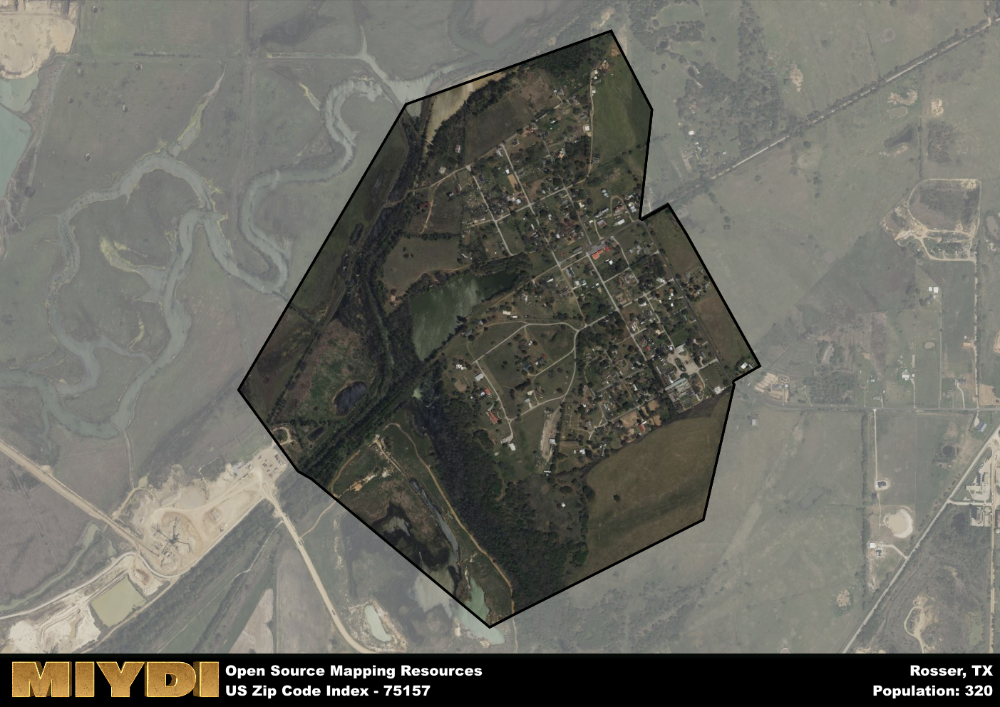

**Area Name:** Rosser

**Zip Code:** 75157

**State:** TX

Rosser is a part of the Dallas-Fort Worth-Arlington - TX Metro Area, and makes up  of the Metro's population.  

# Rosser, TX 75157: A Historic Community in the Heart of Texas  

Located in the northeastern part of Texas, the zip code 75157 corresponds to the area known as Rosser. This rural neighborhood is situated within Kaufman County and is surrounded by the towns of Crandall, Kaufman, and Ennis. Rosser is a part of the Dallas-Fort Worth metropolitan area, providing residents with access to the urban amenities of these major population centers while still maintaining its small-town charm.

Rosser has a rich historical narrative, dating back to the mid-19th century when it was first settled by pioneers seeking fertile land for farming and ranching. The town was officially established in 1881 and named after early settler Thomas Rosser. Over the years, Rosser has grown into a close-knit community known for its agricultural heritage and welcoming atmosphere.

Today, Rosser maintains its rural character while also embracing modern developments. The area is primarily agricultural, with farms and ranches dotting the landscape. Residents can enjoy local farmer's markets, community events, and outdoor recreational activities. Rosser is home to historic sites such as the Rosser Baptist Church, which dates back to the late 1800s, showcasing the area's rich cultural history.

# Rosser Demographics

The population of Rosser is 320.  
Rosser has a population density of 372.09 per square mile.  
The area of Rosser is 0.86 square miles.  

## Rosser AI and Census Variables

The values presented in this dataset for Rosser are AI-optimized, streamlined, and categorized into relevant buckets for enhanced utility in AI and mapping programs. These simplified values have been optimized to facilitate efficient analysis and integration into various technological applications, offering users accessible and actionable insights into demographics within the Rosser area.

| AI Variables for Rosser | Value |
|-------------|-------|
| Shape Area | 3140215.69921875 |
| Shape Length | 7050.49748118484 |
| CBSA Federal Processing Standard Code | 19100 |

## How to use this free AI optimized Geo-Spatial Data for Rosser, TX

This data is made freely available under the Creative Commons license, allowing for unrestricted use for any purpose. Users can access static resources directly from GitHub or leverage more advanced functionalities by utilizing the GeoJSON files. All datasets originate from official government or private sector sources and are meticulously compiled into relevant datasets within QGIS. However, the versatility of the data ensures compatibility with any mapping application.

## Data Accuracy Disclaimer
It's important to note that the data provided here may contain errors or discrepancies and should be considered as 'close enough' for business applications and AI rather than a definitive source of truth. This data is aggregated from multiple sources, some of which publish information on wildly different intervals, leading to potential inconsistencies. Additionally, certain data points may not be corrected for Covid-related changes, further impacting accuracy. Moreover, the assumption that demographic trends are consistent throughout a region may lead to discrepancies, as trends often concentrate in areas of highest population density. As a result, dense areas may be slightly underrepresented, while rural areas may be slightly overrepresented, resulting in a more conservative dataset. Furthermore, the focus primarily on areas within US Major and Minor Statistical areas means that approximately 40 million Americans living outside of these areas may not be fully represented. Lastly, the historical background and area descriptions generated using AI are susceptible to potential mistakes, so users should exercise caution when interpreting the information provided.
