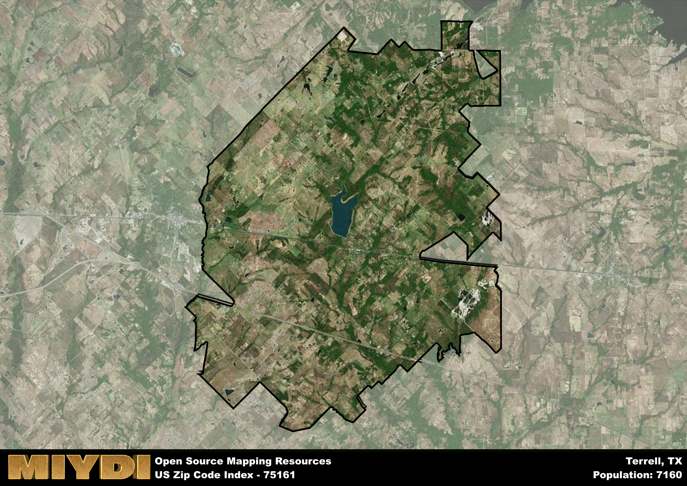

**Area Name:** Terrell

**Zip Code:** 75161

**State:** TX

Terrell is a part of the Dallas-Fort Worth-Arlington - TX Metro Area, and makes up  of the Metro's population.  

# Terrell: A Historic and Vibrant Community in Zip Code 75161  

The zip code 75161 corresponds to the charming community of Terrell, located in Kaufman County, Texas. Situated approximately 32 miles east of Dallas, Terrell is seamlessly integrated into the larger urban fabric of the Dallas-Fort Worth metroplex. Bordered by the cities of Forney, Kaufman, and Crandall, Terrell serves as a suburban enclave that offers a peaceful retreat from the bustling city life while maintaining convenient access to major population centers.

Terrell has a rich history dating back to the mid-19th century when it was founded as a railroad town. The town quickly grew into a hub for agricultural trade, thanks to its strategic location along the Texas and Pacific Railway. Over the years, Terrell has evolved into a thriving community known for its historic downtown district, Victorian-era architecture, and strong sense of community pride. The town was named after Robert A. Terrell, a pioneer settler who played a significant role in its early development.

Today, Terrell boasts a diverse economy supported by industries such as manufacturing, healthcare, and retail. The town offers a range of neighborhood-specific services, including local shops, restaurants, and schools. Residents and visitors alike can enjoy a variety of recreational amenities, from parks and green spaces to cultural and historic sites like the Terrell Heritage Museum. With its blend of historic charm and modern conveniences, Terrell continues to attract new residents seeking a peaceful yet vibrant community to call home.

# Terrell Demographics

The population of Terrell is 7160.  
Terrell has a population density of 63.19 per square mile.  
The area of Terrell is 113.31 square miles.  

## Terrell Income and Economic Data

These demographic numbers are sourced from IRS return data, providing comprehensive insights into the population dynamics and economic trends within Terrell.

**Breakdown of return types for Terrell**

The table offers insight into the composition of tax returns filed with the IRS, categorizing them into three main types. Single returns represent filings by individuals, joint returns by married couples, and head of household returns by individuals who qualify as heads of households, typically having dependents. This breakdown provides an understanding of the different filing statuses adopted by taxpayers when submitting their tax documentation.

| Return Types filed for Terrell                              | Percentage          |
|----------------------------------------------------------|---------------------|
| Single Returns                                            | 0.43 |
| Joint Returns                                             | 0.43 |
| Head Household Returns                                    | 0.12 |

The income and economic data presented here is sourced from the IRS income brackets, utilized for categorizing tax returns by income levels. This table displays income ranges for both single filers and married couples, along with the corresponding number of returns and the percentage within each bracket, providing valuable insight into the distribution of taxes across various income groups.

| Bracket Name       | Single Filer Income Range | Married Couple Range | Number of Returns | Percentage of Returns |
|--------------------|----------------------------|----------------------|-------------------|-----------------------|
| 10% Bracket        | Up to $10,275              | Up to $20,550        | 1150 | 0.33% |
| 12% Bracket        | $10,276 - $41,775          | $20,551 - $83,550    | 870 | 0.25% |
| 22% Bracket        | $41,776 - $89,075          | $83,551 - $178,150   | 540 | 0.16% |
| 24% Bracket        | $89,076 - $170,050         | $178,151 - $340,100  | 350 | 0.1% |
| 32% Bracket        | $170,051 - $215,950        | $340,101 - $431,900  | 490 | 0.14% |
| 35% Bracket        | $215,951 - $539,900        | $431,901 - $647,850  | 70 | 0.02% |

### Exploring Taxpayer Diversity: A Breakdown of Different Types of Tax Returns in Terrell

The table offers insights into various types of tax returns filed, reflecting different aspects of taxpayer activities and demographics. Categories include charitable returns for donations, dependent returns for claimed dependents, educator population, elderly population, real estate returns, self-employment returns, student loan returns, and unemployment returns, providing valuable insights into taxpayer behavior and demographics.

| Terrell Filing Types                    | Count | Percentage |
|--------------------------------------|-------|------------|
| Charitable Donations                 | 160 | 0.046% |
| Dependents Claimed                   | 70 | 0.02% |
| Educator Residents                   | 70 | 0.02% |
| Elderly Population                   | 900 | 0.26% |
| Farming Population                   | 240 | 0.069% |
| Real Estate Transactions             | 150 | 0.043% |
| Self-Employed Individuals            | 500 | 0.144% |
| Student Loan Cases                   | 150 | 0.043% |
| Unemployment Benefit Filings         | 390 | 0.11% |

## Terrell AI and Census Variables

The values presented in this dataset for Terrell are AI-optimized, streamlined, and categorized into relevant buckets for enhanced utility in AI and mapping programs. These simplified values have been optimized to facilitate efficient analysis and integration into various technological applications, offering users accessible and actionable insights into demographics within the Terrell area.

| AI Variables for Terrell | Value |
|-------------|-------|
| Shape Area | 415892956.578125 |
| Shape Length | 136668.128561526 |
| CBSA Federal Processing Standard Code | 19100 |

## How to use this free AI optimized Geo-Spatial Data for Terrell, TX

This data is made freely available under the Creative Commons license, allowing for unrestricted use for any purpose. Users can access static resources directly from GitHub or leverage more advanced functionalities by utilizing the GeoJSON files. All datasets originate from official government or private sector sources and are meticulously compiled into relevant datasets within QGIS. However, the versatility of the data ensures compatibility with any mapping application.

## Data Accuracy Disclaimer
It's important to note that the data provided here may contain errors or discrepancies and should be considered as 'close enough' for business applications and AI rather than a definitive source of truth. This data is aggregated from multiple sources, some of which publish information on wildly different intervals, leading to potential inconsistencies. Additionally, certain data points may not be corrected for Covid-related changes, further impacting accuracy. Moreover, the assumption that demographic trends are consistent throughout a region may lead to discrepancies, as trends often concentrate in areas of highest population density. As a result, dense areas may be slightly underrepresented, while rural areas may be slightly overrepresented, resulting in a more conservative dataset. Furthermore, the focus primarily on areas within US Major and Minor Statistical areas means that approximately 40 million Americans living outside of these areas may not be fully represented. Lastly, the historical background and area descriptions generated using AI are susceptible to potential mistakes, so users should exercise caution when interpreting the information provided.
