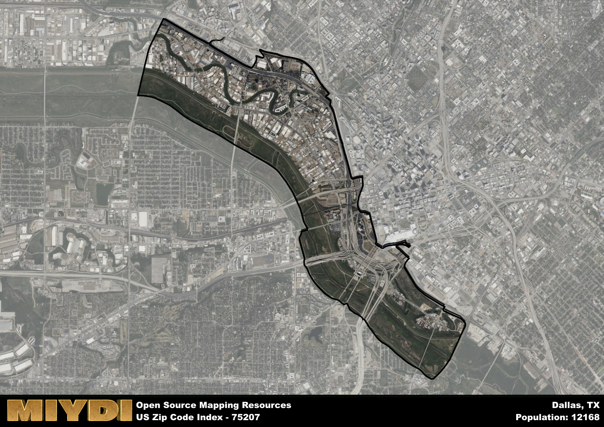

**Area Name:** Dallas

**Zip Code:** 75207

**State:** TX

Dallas is a part of the Dallas-Fort Worth-Arlington - TX Metro Area, and makes up  of the Metro's population.  

# Historic Design District: A Vibrant Neighborhood in Dallas

Located in the heart of Dallas, Texas, the zip code 75207 corresponds to the Historic Design District, a bustling neighborhood known for its unique blend of historic architecture and contemporary design. Bordered by Stemmons Freeway to the west and the Trinity River to the east, this area seamlessly integrates with nearby districts such as Victory Park and Uptown, offering residents and visitors easy access to a variety of dining, shopping, and entertainment options.

Originally established as a hub for manufacturing and industry in the early 20th century, the Historic Design District has evolved into a vibrant cultural hub showcasing the city's design and artistic talents. The area's growth was fueled by the construction of the Dallas Design District in the 1980s, which attracted a wave of artists, designers, and creative entrepreneurs. Over the years, the neighborhood has become synonymous with cutting-edge design, hosting an array of galleries, showrooms, and studios that showcase the latest trends in art and design.

Today, the Historic Design District is a thriving community that offers a mix of residential lofts, upscale restaurants, and trendy boutiques. The area is home to a diverse range of businesses, from high-end furniture stores to innovative tech startups, making it a sought-after destination for both residents and businesses alike. In addition to its commercial offerings, the neighborhood boasts a number of green spaces, art installations, and cultural landmarks, making it a dynamic and engaging place to live, work, and play in the bustling city of Dallas.

# Dallas Demographics

The population of Dallas is 12168.  
Dallas has a population density of 2583.44 per square mile.  
The area of Dallas is 4.71 square miles.  

## Dallas Income and Economic Data

These demographic numbers are sourced from IRS return data, providing comprehensive insights into the population dynamics and economic trends within Dallas.

**Breakdown of return types for Dallas**

The table offers insight into the composition of tax returns filed with the IRS, categorizing them into three main types. Single returns represent filings by individuals, joint returns by married couples, and head of household returns by individuals who qualify as heads of households, typically having dependents. This breakdown provides an understanding of the different filing statuses adopted by taxpayers when submitting their tax documentation.

| Return Types filed for Dallas                              | Percentage          |
|----------------------------------------------------------|---------------------|
| Single Returns                                            | 0.8 |
| Joint Returns                                             | 0.1 |
| Head Household Returns                                    | 0.07 |

The income and economic data presented here is sourced from the IRS income brackets, utilized for categorizing tax returns by income levels. This table displays income ranges for both single filers and married couples, along with the corresponding number of returns and the percentage within each bracket, providing valuable insight into the distribution of taxes across various income groups.

| Bracket Name       | Single Filer Income Range | Married Couple Range | Number of Returns | Percentage of Returns |
|--------------------|----------------------------|----------------------|-------------------|-----------------------|
| 10% Bracket        | Up to $10,275              | Up to $20,550        | 410 | 0.2% |
| 12% Bracket        | $10,276 - $41,775          | $20,551 - $83,550    | 550 | 0.26% |
| 22% Bracket        | $41,776 - $89,075          | $83,551 - $178,150   | 540 | 0.26% |
| 24% Bracket        | $89,076 - $170,050         | $178,151 - $340,100  | 230 | 0.11% |
| 32% Bracket        | $170,051 - $215,950        | $340,101 - $431,900  | 260 | 0.12% |
| 35% Bracket        | $215,951 - $539,900        | $431,901 - $647,850  | 110 | 0.05% |

### Exploring Taxpayer Diversity: A Breakdown of Different Types of Tax Returns in Dallas

The table offers insights into various types of tax returns filed, reflecting different aspects of taxpayer activities and demographics. Categories include charitable returns for donations, dependent returns for claimed dependents, educator population, elderly population, real estate returns, self-employment returns, student loan returns, and unemployment returns, providing valuable insights into taxpayer behavior and demographics.

| Dallas Filing Types                    | Count | Percentage |
|--------------------------------------|-------|------------|
| Charitable Donations                 | 110 | 0.052% |
| Dependents Claimed                   | 0 | 0% |
| Educator Residents                   | 30 | 0.014% |
| Elderly Population                   | 140 | 0.07% |
| Farming Population                   | 0 | 0% |
| Real Estate Transactions             | 70 | 0.033% |
| Self-Employed Individuals            | 280 | 0.133% |
| Student Loan Cases                   | 320 | 0.152% |
| Unemployment Benefit Filings         | 360 | 0.17% |

## Dallas AI and Census Variables

The values presented in this dataset for Dallas are AI-optimized, streamlined, and categorized into relevant buckets for enhanced utility in AI and mapping programs. These simplified values have been optimized to facilitate efficient analysis and integration into various technological applications, offering users accessible and actionable insights into demographics within the Dallas area.

| AI Variables for Dallas | Value |
|-------------|-------|
| Shape Area | 17296860.921875 |
| Shape Length | 27176.8454414625 |
| CBSA Federal Processing Standard Code | 19100 |

## How to use this free AI optimized Geo-Spatial Data for Dallas, TX

This data is made freely available under the Creative Commons license, allowing for unrestricted use for any purpose. Users can access static resources directly from GitHub or leverage more advanced functionalities by utilizing the GeoJSON files. All datasets originate from official government or private sector sources and are meticulously compiled into relevant datasets within QGIS. However, the versatility of the data ensures compatibility with any mapping application.

## Data Accuracy Disclaimer
It's important to note that the data provided here may contain errors or discrepancies and should be considered as 'close enough' for business applications and AI rather than a definitive source of truth. This data is aggregated from multiple sources, some of which publish information on wildly different intervals, leading to potential inconsistencies. Additionally, certain data points may not be corrected for Covid-related changes, further impacting accuracy. Moreover, the assumption that demographic trends are consistent throughout a region may lead to discrepancies, as trends often concentrate in areas of highest population density. As a result, dense areas may be slightly underrepresented, while rural areas may be slightly overrepresented, resulting in a more conservative dataset. Furthermore, the focus primarily on areas within US Major and Minor Statistical areas means that approximately 40 million Americans living outside of these areas may not be fully represented. Lastly, the historical background and area descriptions generated using AI are susceptible to potential mistakes, so users should exercise caution when interpreting the information provided.
