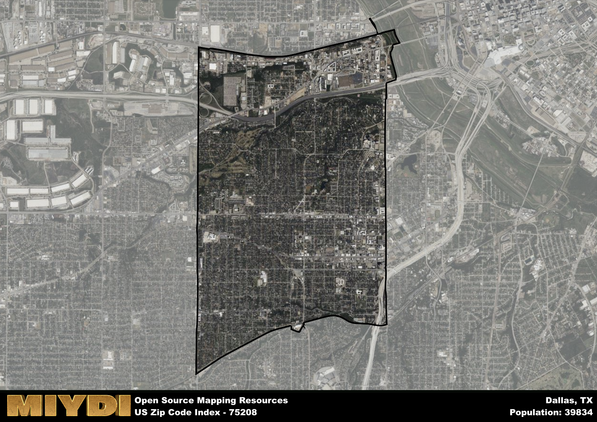

**Area Name:** Dallas

**Zip Code:** 75208

**State:** TX

Dallas is a part of the Dallas-Fort Worth-Arlington - TX Metro Area, and makes up 0.51% of the Metro's population.  

# Historic Bishop Arts District in Dallas, TX (Zip Code: 75208)

The Bishop Arts District, located in the zip code 75208 area of Dallas, Texas, is a vibrant neighborhood situated in the southern part of the city. Bordered by the Trinity River to the west and Interstate 35E to the east, the Bishop Arts District seamlessly integrates with the larger urban fabric of Dallas. It is known for its eclectic mix of shops, restaurants, and art galleries, drawing visitors from all over the city.

The Bishop Arts District has a rich historical narrative that dates back to the early 1900s when it was established as a streetcar suburb. Over the years, the area has gone through cycles of growth and decline, eventually experiencing revitalization in the late 20th century. Today, it is a thriving cultural hub with a strong sense of community and a nod to its past through preserved historic buildings and landmarks.

Currently, the Bishop Arts District is a bustling neighborhood with a mix of residential and commercial spaces. The area is home to a variety of local businesses, including boutiques, cafes, and art studios. Residents and visitors alike can enjoy the district's numerous dining options, ranging from cozy coffee shops to upscale restaurants. The neighborhood also boasts a vibrant arts scene, with galleries showcasing the work of local artists. Additionally, the Bishop Arts District is known for its community events and festivals that celebrate the area's unique identity.

# Dallas Demographics

The population of Dallas is 39834.  
Dallas has a population density of 6694.79 per square mile.  
The area of Dallas is 5.95 square miles.  

## Dallas Income and Economic Data

These demographic numbers are sourced from IRS return data, providing comprehensive insights into the population dynamics and economic trends within Dallas.

**Breakdown of return types for Dallas**

The table offers insight into the composition of tax returns filed with the IRS, categorizing them into three main types. Single returns represent filings by individuals, joint returns by married couples, and head of household returns by individuals who qualify as heads of households, typically having dependents. This breakdown provides an understanding of the different filing statuses adopted by taxpayers when submitting their tax documentation.

| Return Types filed for Dallas                              | Percentage          |
|----------------------------------------------------------|---------------------|
| Single Returns                                            | 0.58 |
| Joint Returns                                             | 0.27 |
| Head Household Returns                                    | 0.13 |

The income and economic data presented here is sourced from the IRS income brackets, utilized for categorizing tax returns by income levels. This table displays income ranges for both single filers and married couples, along with the corresponding number of returns and the percentage within each bracket, providing valuable insight into the distribution of taxes across various income groups.

| Bracket Name       | Single Filer Income Range | Married Couple Range | Number of Returns | Percentage of Returns |
|--------------------|----------------------------|----------------------|-------------------|-----------------------|
| 10% Bracket        | Up to $10,275              | Up to $20,550        | 4630 | 0.3% |
| 12% Bracket        | $10,276 - $41,775          | $20,551 - $83,550    | 4230 | 0.28% |
| 22% Bracket        | $41,776 - $89,075          | $83,551 - $178,150   | 2420 | 0.16% |
| 24% Bracket        | $89,076 - $170,050         | $178,151 - $340,100  | 1110 | 0.07% |
| 32% Bracket        | $170,051 - $215,950        | $340,101 - $431,900  | 1680 | 0.11% |
| 35% Bracket        | $215,951 - $539,900        | $431,901 - $647,850  | 1230 | 0.08% |

### Exploring Taxpayer Diversity: A Breakdown of Different Types of Tax Returns in Dallas

The table offers insights into various types of tax returns filed, reflecting different aspects of taxpayer activities and demographics. Categories include charitable returns for donations, dependent returns for claimed dependents, educator population, elderly population, real estate returns, self-employment returns, student loan returns, and unemployment returns, providing valuable insights into taxpayer behavior and demographics.

| Dallas Filing Types                    | Count | Percentage |
|--------------------------------------|-------|------------|
| Charitable Donations                 | 1190 | 0.078% |
| Dependents Claimed                   | 380 | 0.025% |
| Educator Residents                   | 310 | 0.02% |
| Elderly Population                   | 2410 | 0.16% |
| Farming Population                   | 30 | 0.002% |
| Real Estate Transactions             | 1290 | 0.084% |
| Self-Employed Individuals            | 2490 | 0.163% |
| Student Loan Cases                   | 1020 | 0.067% |
| Unemployment Benefit Filings         | 2160 | 0.14% |

### Exploring Real Estate Trends: A Comprehensive Analysis of the Dallas Area and its Neighbors

This table contains an in-depth examination of the real estate market in the Dallas area. Sourced from trusted real estate market firms, this dataset provides a wealth of raw data detailing the local real estate landscape, along with comparative analyses juxtaposing the market dynamics with those of neighboring areas. Explore the intricacies of the Dallas real estate market and gain valuable insights into its relationship with adjacent regions.

| Real Estate Data for Dallas                       | Value    |
|------------------------------------------------|----------|
| Average Listing Price for Dallas               | 723469 |
| Median Listing Price for Dallas                | 625000 |
| Median Days on Market for Dallas               | 45 |
| Median Listing Price per Square Foot for Dallas| 03 |
| Median Square Feet for Dallas                  | 2027 |
| Real Estate Prices to Income Ratio           | 111.92% |
| Price per Square Foot Ratio                  | 136.60% |
| Price Median Ratio                           | 124.47% |
| Market Sales Speed Ratio                     | 105.3% |

This table offers essential real estate data for the Dallas area, including average and median listing prices, median days on market, and property size. It also presents ratio metrics as percentages, providing insights into how the local market compares to the surrounding region. A ratio of 100% signifies performance in line with the regional average, while values above or below indicate overperformance or underperformance, respectively, relative to expectations.

## Dallas Sports and Recreation Data

#### Annual Youth Sports Spending for Dallas

This table provides fundamental insights into the Sports and Recreation data for the Dallas area, detailing the estimated annual expenditure on Youth Athletics. This includes estimated spending by the major consumer brackets. 
| Sports Spending for Dallas| Value |
|-------------------------|-------|
| Athlete Spending Compared to the region | 131.24% |
| Total Youth Athlete Spending | ,237,474 |
| Athletic Spending - Essential Focused Consumer | 37,164 |
| Athletic Spending - Typical Consumer | ,122,924 |
| Athletic Spending - Affluent Consumers | ,176,082 |

#### Youth Coaching Estimates for Dallas

This table presents the estimated number of coaches for the Dallas area, derived from comprehensive national coaching surveys and athletic participation rates by state. It offers valuable insights into the vital role of coaching personnel in fostering athletic development and facilitating sports participation within the local community.

| Coaching Data for Dallas | Value |
|-------------|-------|
| Total Coaches | 652 |
| Paid Coaches | 170 |
| Volunteer Coaches | 483 |

#### Youth Athlete Participation for Dallas

This table shows the estimated total number of youth athletes in the Dallas area, sourced from comprehensive national coaching surveys and athletic participation rates by state.

| Total YA Athletes in Dallas | Value |
|-------------|-------|
| Total High School Athletes | 995 |
| Total Youth Athletes | 2986 |
| Total Young Adult Athletes | 1991 |
| Total Athletes to Age 25 | 5973 |

#### High School Age Athletes - Breakdown by Sport for Dallas

This table shows insights regarding high school age estimated players by sport in the Dallas area, derived from national and state-level athletic participation trends. 

| HS Players by Sport in Dallas | Value |
|-------------|-------|
| Football Players | 229 |
| Basketball Players | 139 |
| Soccer Players | 109 |
| Volleyball Players | 70 |
| Baseball Players | 119 |
| Tennis Players | 60 |
| Track Athletes | 169 |
| Golf Players | 30 |
| Swimming Athletes | 30 |
| Wrestling Competitors | 30 |
| Lacrosse Players | 0 |

Estimating the number of younger athletes presents unique challenges due to their varied starting ages, typically beginning around six years old, and a gradual decline in participation rates as they age. Unlike high school-aged athletes, younger athletes are less likely to switch sports as they grow older, contributing to the stability of participation numbers within specific sports at younger ages.  

As a general trend, the total number of younger athletes is approximately three times the number of high school-aged athletes, underscoring the significant presence of youth athletes in sports programs and highlighting the importance of early engagement in athletic activities.

## Dallas AI and Census Variables

The values presented in this dataset for Dallas are AI-optimized, streamlined, and categorized into relevant buckets for enhanced utility in AI and mapping programs. These simplified values have been optimized to facilitate efficient analysis and integration into various technological applications, offering users accessible and actionable insights into demographics within the Dallas area.

| AI Variables for Dallas | Value |
|-------------|-------|
| Shape Area | 21843310.1757813 |
| Shape Length | 21996.6706248672 |
| CBSA Federal Processing Standard Code | 19100 |
| RE Price per Square Foot Ratio | 136.60% |
| RE Price Average Ratio | 116.90% |
| RE Speed Ratio | 105.3% |
| RE Income Ratio | 111.92% |
| Single Opportunity Flag | 6 |
| Single Parent Risk Flag | 4 |
| Elderly Opportunity Flag | 3 |
| Farm Opportunity Flag | 1 |
| Unemployment Risk | 5 |
| Educator Opportunity Flag | 4 |
| RE Affordability Index Flag | 5 |
| Income Bracket Flag | 5 |
| RE Income Flag | 3 |
| RE Median Square Footage Price Flag | 6 |
| RE Median Square Footage Size Flag | 5 |
| RE Activity Flag | 5 |
| Poverty Line Risk Flag | 1 |

## How to use this free AI optimized Geo-Spatial Data for Dallas, TX

This data is made freely available under the Creative Commons license, allowing for unrestricted use for any purpose. Users can access static resources directly from GitHub or leverage more advanced functionalities by utilizing the GeoJSON files. All datasets originate from official government or private sector sources and are meticulously compiled into relevant datasets within QGIS. However, the versatility of the data ensures compatibility with any mapping application.

## Data Accuracy Disclaimer
It's important to note that the data provided here may contain errors or discrepancies and should be considered as 'close enough' for business applications and AI rather than a definitive source of truth. This data is aggregated from multiple sources, some of which publish information on wildly different intervals, leading to potential inconsistencies. Additionally, certain data points may not be corrected for Covid-related changes, further impacting accuracy. Moreover, the assumption that demographic trends are consistent throughout a region may lead to discrepancies, as trends often concentrate in areas of highest population density. As a result, dense areas may be slightly underrepresented, while rural areas may be slightly overrepresented, resulting in a more conservative dataset. Furthermore, the focus primarily on areas within US Major and Minor Statistical areas means that approximately 40 million Americans living outside of these areas may not be fully represented. Lastly, the historical background and area descriptions generated using AI are susceptible to potential mistakes, so users should exercise caution when interpreting the information provided.
