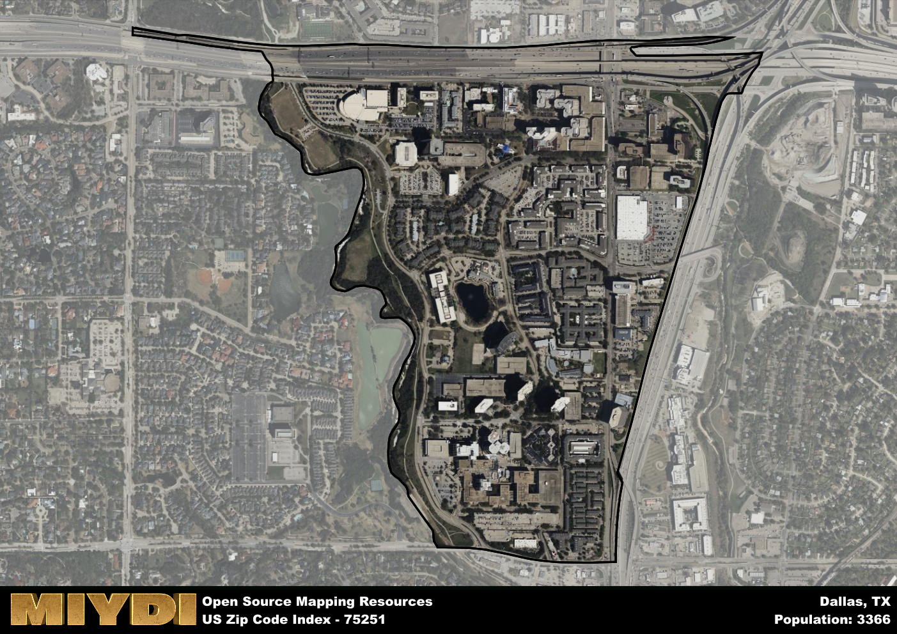

**Area Name:** Dallas

**Zip Code:** 75251

**State:** TX

Dallas is a part of the Dallas-Fort Worth-Arlington - TX Metro Area, and makes up  of the Metro's population.  

# Vibrant Community of Far North Dallas: Zip Code 75251

Located in the northern part of Dallas, the zip code 75251 encompasses the neighborhood of Far North Dallas. Bordered by the LBJ Freeway to the south, Coit Road to the east, Arapaho Road to the north, and Preston Road to the west, this area seamlessly integrates with neighboring Richardson and Plano, forming part of the bustling Dallas-Fort Worth metropolitan area. Far North Dallas serves as a residential hub for many professionals working in the nearby corporate offices and is easily accessible via major highways and public transportation.

Far North Dallas has a rich historical narrative dating back to the mid-19th century when it was primarily farmland. The area experienced significant growth in the 1960s and 1970s with the development of residential communities, shopping centers, and schools. The neighborhood's name reflects its location as one of the northernmost parts of Dallas and its distinct identity as a suburban haven within the urban landscape. Over the years, Far North Dallas has evolved into a diverse community with a mix of single-family homes, apartment complexes, and commercial establishments.

Today, Far North Dallas is a thriving community with a strong economic foundation supported by a variety of businesses, including retail stores, restaurants, and corporate headquarters. Residents can enjoy a range of amenities, from parks and recreational facilities to shopping centers and entertainment venues. The neighborhood is also home to several cultural and historic sites, such as museums and art galleries, highlighting its unique character within the larger urban fabric of Dallas. With its blend of residential charm and urban convenience, Far North Dallas continues to attract new residents and businesses seeking a dynamic and welcoming environment.

# Dallas Demographics

The population of Dallas is 3366.  
Dallas has a population density of 4950 per square mile.  
The area of Dallas is 0.68 square miles.  

## Dallas Income and Economic Data

These demographic numbers are sourced from IRS return data, providing comprehensive insights into the population dynamics and economic trends within Dallas.

**Breakdown of return types for Dallas**

The table offers insight into the composition of tax returns filed with the IRS, categorizing them into three main types. Single returns represent filings by individuals, joint returns by married couples, and head of household returns by individuals who qualify as heads of households, typically having dependents. This breakdown provides an understanding of the different filing statuses adopted by taxpayers when submitting their tax documentation.

| Return Types filed for Dallas                              | Percentage          |
|----------------------------------------------------------|---------------------|
| Single Returns                                            | 0.7 |
| Joint Returns                                             | 0.15 |
| Head Household Returns                                    | 0.13 |

The income and economic data presented here is sourced from the IRS income brackets, utilized for categorizing tax returns by income levels. This table displays income ranges for both single filers and married couples, along with the corresponding number of returns and the percentage within each bracket, providing valuable insight into the distribution of taxes across various income groups.

| Bracket Name       | Single Filer Income Range | Married Couple Range | Number of Returns | Percentage of Returns |
|--------------------|----------------------------|----------------------|-------------------|-----------------------|
| 10% Bracket        | Up to $10,275              | Up to $20,550        | 580 | 0.28% |
| 12% Bracket        | $10,276 - $41,775          | $20,551 - $83,550    | 630 | 0.3% |
| 22% Bracket        | $41,776 - $89,075          | $83,551 - $178,150   | 420 | 0.2% |
| 24% Bracket        | $89,076 - $170,050         | $178,151 - $340,100  | 200 | 0.1% |
| 32% Bracket        | $170,051 - $215,950        | $340,101 - $431,900  | 200 | 0.1% |
| 35% Bracket        | $215,951 - $539,900        | $431,901 - $647,850  | 70 | 0.03% |

### Exploring Taxpayer Diversity: A Breakdown of Different Types of Tax Returns in Dallas

The table offers insights into various types of tax returns filed, reflecting different aspects of taxpayer activities and demographics. Categories include charitable returns for donations, dependent returns for claimed dependents, educator population, elderly population, real estate returns, self-employment returns, student loan returns, and unemployment returns, providing valuable insights into taxpayer behavior and demographics.

| Dallas Filing Types                    | Count | Percentage |
|--------------------------------------|-------|------------|
| Charitable Donations                 | 80 | 0.038% |
| Dependents Claimed                   | 40 | 0.019% |
| Educator Residents                   | 50 | 0.024% |
| Elderly Population                   | 270 | 0.13% |
| Farming Population                   | 0 | 0% |
| Real Estate Transactions             | 50 | 0.024% |
| Self-Employed Individuals            | 280 | 0.133% |
| Student Loan Cases                   | 250 | 0.119% |
| Unemployment Benefit Filings         | 330 | 0.16% |

## Dallas AI and Census Variables

The values presented in this dataset for Dallas are AI-optimized, streamlined, and categorized into relevant buckets for enhanced utility in AI and mapping programs. These simplified values have been optimized to facilitate efficient analysis and integration into various technological applications, offering users accessible and actionable insights into demographics within the Dallas area.

| AI Variables for Dallas | Value |
|-------------|-------|
| Shape Area | 2492801.5 |
| Shape Length | 9483.73878611073 |
| CBSA Federal Processing Standard Code | 19100 |

## How to use this free AI optimized Geo-Spatial Data for Dallas, TX

This data is made freely available under the Creative Commons license, allowing for unrestricted use for any purpose. Users can access static resources directly from GitHub or leverage more advanced functionalities by utilizing the GeoJSON files. All datasets originate from official government or private sector sources and are meticulously compiled into relevant datasets within QGIS. However, the versatility of the data ensures compatibility with any mapping application.

## Data Accuracy Disclaimer
It's important to note that the data provided here may contain errors or discrepancies and should be considered as 'close enough' for business applications and AI rather than a definitive source of truth. This data is aggregated from multiple sources, some of which publish information on wildly different intervals, leading to potential inconsistencies. Additionally, certain data points may not be corrected for Covid-related changes, further impacting accuracy. Moreover, the assumption that demographic trends are consistent throughout a region may lead to discrepancies, as trends often concentrate in areas of highest population density. As a result, dense areas may be slightly underrepresented, while rural areas may be slightly overrepresented, resulting in a more conservative dataset. Furthermore, the focus primarily on areas within US Major and Minor Statistical areas means that approximately 40 million Americans living outside of these areas may not be fully represented. Lastly, the historical background and area descriptions generated using AI are susceptible to potential mistakes, so users should exercise caution when interpreting the information provided.
