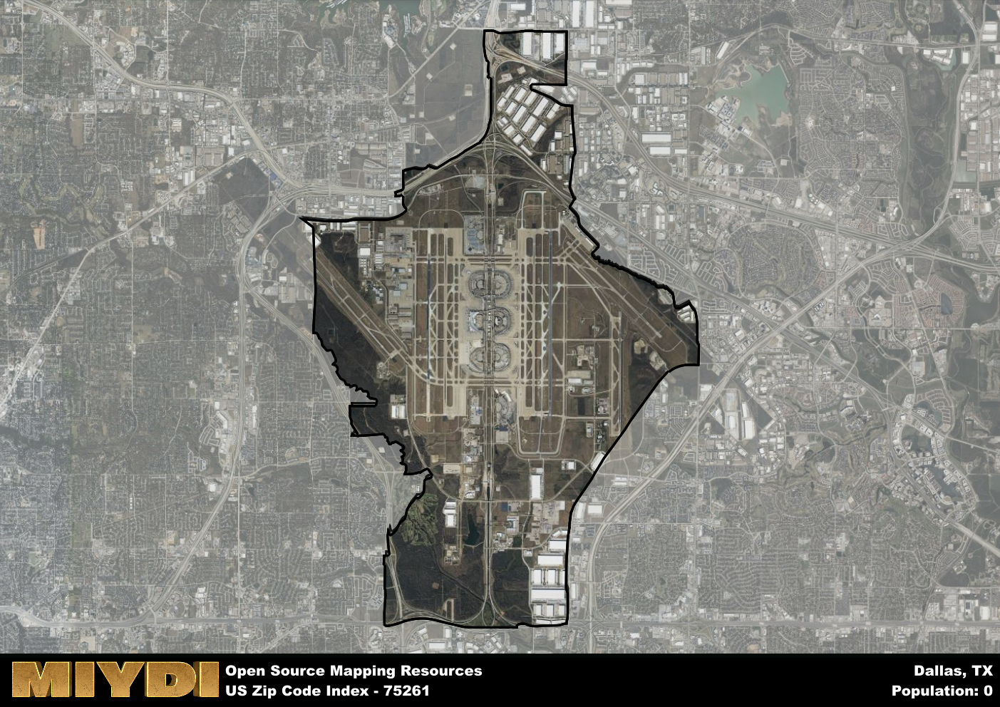

**Area Name:** Dallas

**Zip Code:** 75261

**State:** TX

Dallas is a part of the Dallas-Fort Worth-Arlington - TX Metro Area, and makes up  of the Metro's population.  

# The Neighborhood of DFW Airport (75261), Dallas, Texas

Located within the city of Dallas, Texas, the zip code 75261 corresponds to the neighborhood surrounding Dallas/Fort Worth International Airport (DFW). Situated in the northwest part of the city, this area is a crucial hub for transportation, connecting Dallas to the rest of the country and the world. It integrates seamlessly with neighboring cities like Fort Worth and Arlington, forming a key part of the Dallas-Fort Worth metropolitan area.

The history of the 75261 area is closely tied to the establishment and growth of DFW Airport. Opened in 1974, the airport quickly became one of the busiest in the nation, driving economic development in the surrounding neighborhoods. The area experienced rapid growth as businesses and services catering to travelers and airport employees sprang up, shaping the unique identity of the neighborhood as a bustling transportation hub.

Today, the 75261 area is a vibrant mix of commercial, industrial, and residential spaces. With a diverse range of businesses, from logistics companies to hospitality services, the neighborhood is a major economic engine for the region. Residents and visitors can enjoy a variety of amenities, including hotels, restaurants, and shopping centers. Additionally, the area is home to cultural and historic sites that showcase the rich heritage of Dallas and its connection to the wider world.

# Dallas Demographics

The population of Dallas is 0.  
Dallas has a population density of 0 per square mile.  
The area of Dallas is 23.24 square miles.  

## Dallas AI and Census Variables

The values presented in this dataset for Dallas are AI-optimized, streamlined, and categorized into relevant buckets for enhanced utility in AI and mapping programs. These simplified values have been optimized to facilitate efficient analysis and integration into various technological applications, offering users accessible and actionable insights into demographics within the Dallas area.

| AI Variables for Dallas | Value |
|-------------|-------|
| Shape Area | 85608720.90625 |
| Shape Length | 55064.3024675526 |
| CBSA Federal Processing Standard Code | 19100 |

## How to use this free AI optimized Geo-Spatial Data for Dallas, TX

This data is made freely available under the Creative Commons license, allowing for unrestricted use for any purpose. Users can access static resources directly from GitHub or leverage more advanced functionalities by utilizing the GeoJSON files. All datasets originate from official government or private sector sources and are meticulously compiled into relevant datasets within QGIS. However, the versatility of the data ensures compatibility with any mapping application.

## Data Accuracy Disclaimer
It's important to note that the data provided here may contain errors or discrepancies and should be considered as 'close enough' for business applications and AI rather than a definitive source of truth. This data is aggregated from multiple sources, some of which publish information on wildly different intervals, leading to potential inconsistencies. Additionally, certain data points may not be corrected for Covid-related changes, further impacting accuracy. Moreover, the assumption that demographic trends are consistent throughout a region may lead to discrepancies, as trends often concentrate in areas of highest population density. As a result, dense areas may be slightly underrepresented, while rural areas may be slightly overrepresented, resulting in a more conservative dataset. Furthermore, the focus primarily on areas within US Major and Minor Statistical areas means that approximately 40 million Americans living outside of these areas may not be fully represented. Lastly, the historical background and area descriptions generated using AI are susceptible to potential mistakes, so users should exercise caution when interpreting the information provided.
