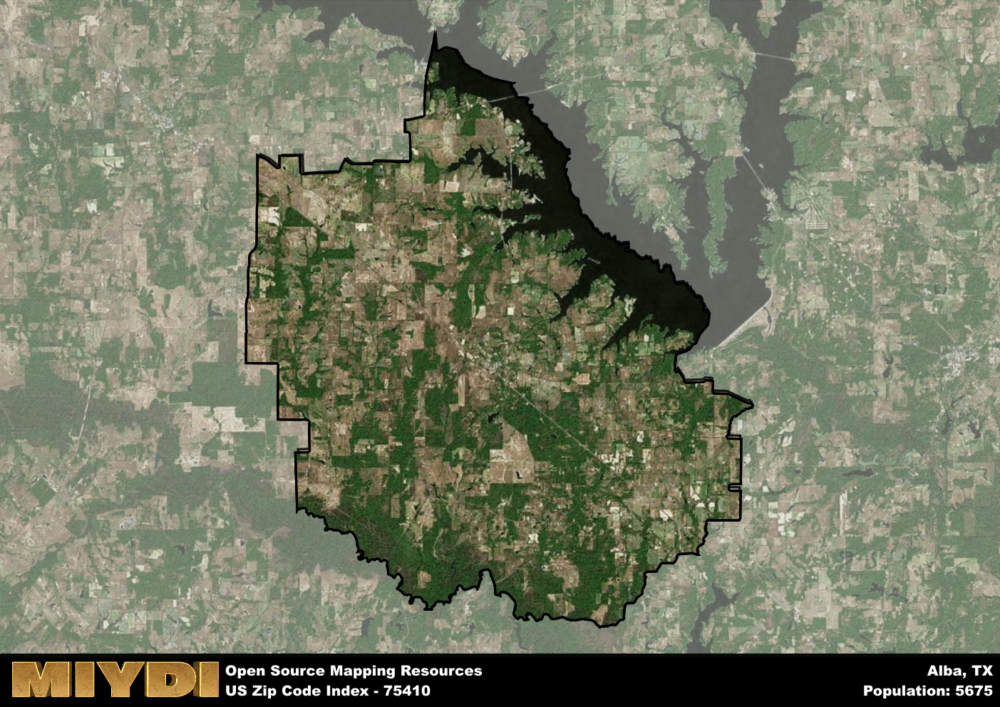

**Area Name:** Alba

**Zip Code:** 75410

**State:** TX

# Alba, TX 75410: A Quaint Lakeside Community in East Texas  

Located in Wood County, Texas, the zip code 75410 corresponds to the charming lakeside community of Alba. Situated in the northeastern part of the state, Alba is bordered by Lake Fork to the west and the city of Emory to the east. It is part of the larger metropolitan area of Dallas-Fort Worth, providing residents with a peaceful retreat from the bustling urban centers while still being easily accessible via major highways.

Alba has a rich historical narrative dating back to the mid-19th century when it was established as a farming community. Over the years, its economy diversified with the growth of industries such as agriculture, tourism, and small businesses. The area was officially incorporated in 1978 and has since maintained its small-town charm while steadily growing in population and development.

Today, Alba offers a mix of residential neighborhoods, local businesses, and recreational opportunities. The community is known for its proximity to Lake Fork, a popular fishing destination, as well as its annual events celebrating local heritage and culture. Residents and visitors alike can enjoy various outdoor activities, dining options, and community events that highlight the unique character of this lakeside town in East Texas.

# Alba Demographics

The population of Alba is 5675.  
Alba has a population density of 57.88 per square mile.  
The area of Alba is 98.05 square miles.  

## Alba Income and Economic Data

These demographic numbers are sourced from IRS return data, providing comprehensive insights into the population dynamics and economic trends within Alba.

**Breakdown of return types for Alba**

The table offers insight into the composition of tax returns filed with the IRS, categorizing them into three main types. Single returns represent filings by individuals, joint returns by married couples, and head of household returns by individuals who qualify as heads of households, typically having dependents. This breakdown provides an understanding of the different filing statuses adopted by taxpayers when submitting their tax documentation.

| Return Types filed for Alba                              | Percentage          |
|----------------------------------------------------------|---------------------|
| Single Returns                                            | 0.4 |
| Joint Returns                                             | 0.5 |
| Head Household Returns                                    | 0.1 |

The income and economic data presented here is sourced from the IRS income brackets, utilized for categorizing tax returns by income levels. This table displays income ranges for both single filers and married couples, along with the corresponding number of returns and the percentage within each bracket, providing valuable insight into the distribution of taxes across various income groups.

| Bracket Name       | Single Filer Income Range | Married Couple Range | Number of Returns | Percentage of Returns |
|--------------------|----------------------------|----------------------|-------------------|-----------------------|
| 10% Bracket        | Up to $10,275              | Up to $20,550        | 810 | 0.36% |
| 12% Bracket        | $10,276 - $41,775          | $20,551 - $83,550    | 560 | 0.25% |
| 22% Bracket        | $41,776 - $89,075          | $83,551 - $178,150   | 330 | 0.15% |
| 24% Bracket        | $89,076 - $170,050         | $178,151 - $340,100  | 220 | 0.1% |
| 32% Bracket        | $170,051 - $215,950        | $340,101 - $431,900  | 270 | 0.12% |
| 35% Bracket        | $215,951 - $539,900        | $431,901 - $647,850  | 70 | 0.03% |

### Exploring Taxpayer Diversity: A Breakdown of Different Types of Tax Returns in Alba

The table offers insights into various types of tax returns filed, reflecting different aspects of taxpayer activities and demographics. Categories include charitable returns for donations, dependent returns for claimed dependents, educator population, elderly population, real estate returns, self-employment returns, student loan returns, and unemployment returns, providing valuable insights into taxpayer behavior and demographics.

| Alba Filing Types                    | Count | Percentage |
|--------------------------------------|-------|------------|
| Charitable Donations                 | 60 | 0.027% |
| Dependents Claimed                   | 40 | 0.018% |
| Educator Residents                   | 50 | 0.022% |
| Elderly Population                   | 820 | 0.36% |
| Farming Population                   | 210 | 0.093% |
| Real Estate Transactions             | 70 | 0.031% |
| Self-Employed Individuals            | 350 | 0.155% |
| Student Loan Cases                   | 70 | 0.031% |
| Unemployment Benefit Filings         | 260 | 0.12% |

## Alba AI and Census Variables

The values presented in this dataset for Alba are AI-optimized, streamlined, and categorized into relevant buckets for enhanced utility in AI and mapping programs. These simplified values have been optimized to facilitate efficient analysis and integration into various technological applications, offering users accessible and actionable insights into demographics within the Alba area.

| AI Variables for Alba | Value |
|-------------|-------|
| Shape Area | 360352035.652344 |
| Shape Length | 108307.426031322 |

## How to use this free AI optimized Geo-Spatial Data for Alba, TX

This data is made freely available under the Creative Commons license, allowing for unrestricted use for any purpose. Users can access static resources directly from GitHub or leverage more advanced functionalities by utilizing the GeoJSON files. All datasets originate from official government or private sector sources and are meticulously compiled into relevant datasets within QGIS. However, the versatility of the data ensures compatibility with any mapping application.

## Data Accuracy Disclaimer
It's important to note that the data provided here may contain errors or discrepancies and should be considered as 'close enough' for business applications and AI rather than a definitive source of truth. This data is aggregated from multiple sources, some of which publish information on wildly different intervals, leading to potential inconsistencies. Additionally, certain data points may not be corrected for Covid-related changes, further impacting accuracy. Moreover, the assumption that demographic trends are consistent throughout a region may lead to discrepancies, as trends often concentrate in areas of highest population density. As a result, dense areas may be slightly underrepresented, while rural areas may be slightly overrepresented, resulting in a more conservative dataset. Furthermore, the focus primarily on areas within US Major and Minor Statistical areas means that approximately 40 million Americans living outside of these areas may not be fully represented. Lastly, the historical background and area descriptions generated using AI are susceptible to potential mistakes, so users should exercise caution when interpreting the information provided.
