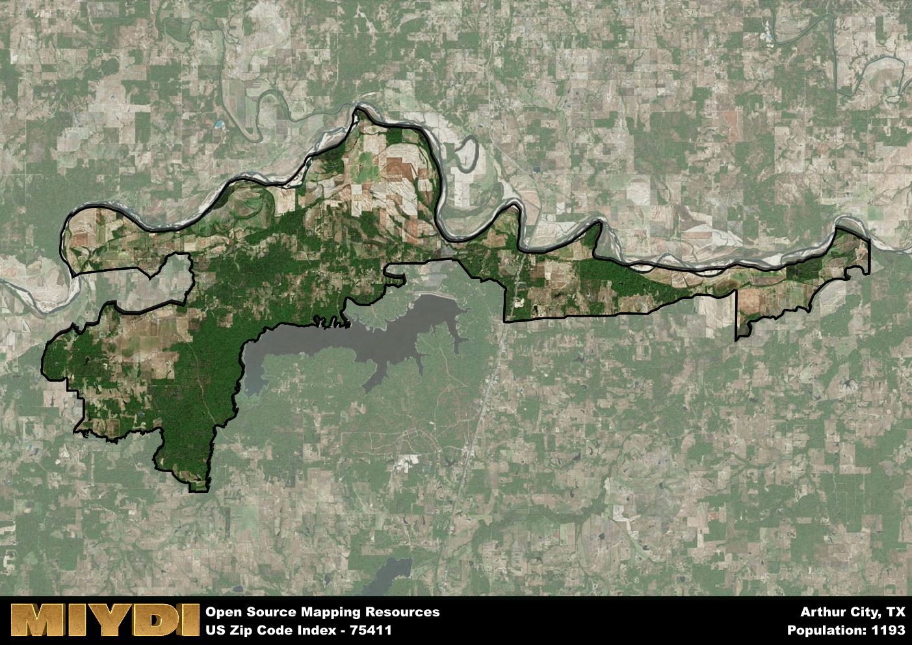

**Area Name:** Arthur City

**Zip Code:** 75411

**State:** TX

Arthur City is a part of the Paris - TX Micro Area, and makes up  of the Metro's population.  

# Arthur City, TX (Zip Code: 75411)

Located in the northeastern corner of Texas, Arthur City is a small, rural community that falls within the boundaries of Lamar County. Situated near the border with Oklahoma, Arthur City is surrounded by other small towns such as Powderly and Chicota. While it is predominantly a rural area, Arthur City is also within driving distance of larger cities like Paris and Hugo, Oklahoma, which offer more urban amenities and services.

Arthur City has a rich historical background, with its name likely derived from an early settler or prominent figure in the area's history. The community was established in the late 19th century and grew as a hub for agriculture and farming. Over the years, Arthur City has maintained its rural charm and close-knit community feel, with many residents proud of their heritage and connection to the land.

Today, Arthur City remains a peaceful and picturesque area, known for its rolling farmland and scenic views. The local economy is still primarily based on agriculture, with farming and ranching playing a significant role in the community. Residents enjoy a slower pace of life, with access to outdoor recreational activities such as hunting, fishing, and hiking. While there are limited commercial establishments in Arthur City itself, the nearby towns provide essential services and amenities for the residents of this charming rural community.

# Arthur City Demographics

The population of Arthur City is 1193.  
Arthur City has a population density of 12.9 per square mile.  
The area of Arthur City is 92.5 square miles.  

## Arthur City Income and Economic Data

These demographic numbers are sourced from IRS return data, providing comprehensive insights into the population dynamics and economic trends within Arthur City.

**Breakdown of return types for Arthur City**

The table offers insight into the composition of tax returns filed with the IRS, categorizing them into three main types. Single returns represent filings by individuals, joint returns by married couples, and head of household returns by individuals who qualify as heads of households, typically having dependents. This breakdown provides an understanding of the different filing statuses adopted by taxpayers when submitting their tax documentation.

| Return Types filed for Arthur City                              | Percentage          |
|----------------------------------------------------------|---------------------|
| Single Returns                                            | 0.42 |
| Joint Returns                                             | 0.44 |
| Head Household Returns                                    | 0.12 |

The income and economic data presented here is sourced from the IRS income brackets, utilized for categorizing tax returns by income levels. This table displays income ranges for both single filers and married couples, along with the corresponding number of returns and the percentage within each bracket, providing valuable insight into the distribution of taxes across various income groups.

| Bracket Name       | Single Filer Income Range | Married Couple Range | Number of Returns | Percentage of Returns |
|--------------------|----------------------------|----------------------|-------------------|-----------------------|
| 10% Bracket        | Up to $10,275              | Up to $20,550        | 160 | 0.37% |
| 12% Bracket        | $10,276 - $41,775          | $20,551 - $83,550    | 120 | 0.28% |
| 22% Bracket        | $41,776 - $89,075          | $83,551 - $178,150   | 70 | 0.16% |
| 24% Bracket        | $89,076 - $170,050         | $178,151 - $340,100  | 30 | 0.07% |
| 32% Bracket        | $170,051 - $215,950        | $340,101 - $431,900  | 50 | 0.12% |
| 35% Bracket        | $215,951 - $539,900        | $431,901 - $647,850  | 0 | 0% |

### Exploring Taxpayer Diversity: A Breakdown of Different Types of Tax Returns in Arthur City

The table offers insights into various types of tax returns filed, reflecting different aspects of taxpayer activities and demographics. Categories include charitable returns for donations, dependent returns for claimed dependents, educator population, elderly population, real estate returns, self-employment returns, student loan returns, and unemployment returns, providing valuable insights into taxpayer behavior and demographics.

| Arthur City Filing Types                    | Count | Percentage |
|--------------------------------------|-------|------------|
| Charitable Donations                 | 0 | 0% |
| Dependents Claimed                   | 0 | 0% |
| Educator Residents                   | 0 | 0% |
| Elderly Population                   | 130 | 0.3% |
| Farming Population                   | 70 | 0.163% |
| Real Estate Transactions             | 0 | 0% |
| Self-Employed Individuals            | 50 | 0.116% |
| Student Loan Cases                   | 0 | 0% |
| Unemployment Benefit Filings         | 50 | 0.12% |

## Arthur City AI and Census Variables

The values presented in this dataset for Arthur City are AI-optimized, streamlined, and categorized into relevant buckets for enhanced utility in AI and mapping programs. These simplified values have been optimized to facilitate efficient analysis and integration into various technological applications, offering users accessible and actionable insights into demographics within the Arthur City area.

| AI Variables for Arthur City | Value |
|-------------|-------|
| Shape Area | 348313918.070313 |
| Shape Length | 201459.111475007 |
| CBSA Federal Processing Standard Code | 37580 |

## How to use this free AI optimized Geo-Spatial Data for Arthur City, TX

This data is made freely available under the Creative Commons license, allowing for unrestricted use for any purpose. Users can access static resources directly from GitHub or leverage more advanced functionalities by utilizing the GeoJSON files. All datasets originate from official government or private sector sources and are meticulously compiled into relevant datasets within QGIS. However, the versatility of the data ensures compatibility with any mapping application.

## Data Accuracy Disclaimer
It's important to note that the data provided here may contain errors or discrepancies and should be considered as 'close enough' for business applications and AI rather than a definitive source of truth. This data is aggregated from multiple sources, some of which publish information on wildly different intervals, leading to potential inconsistencies. Additionally, certain data points may not be corrected for Covid-related changes, further impacting accuracy. Moreover, the assumption that demographic trends are consistent throughout a region may lead to discrepancies, as trends often concentrate in areas of highest population density. As a result, dense areas may be slightly underrepresented, while rural areas may be slightly overrepresented, resulting in a more conservative dataset. Furthermore, the focus primarily on areas within US Major and Minor Statistical areas means that approximately 40 million Americans living outside of these areas may not be fully represented. Lastly, the historical background and area descriptions generated using AI are susceptible to potential mistakes, so users should exercise caution when interpreting the information provided.
