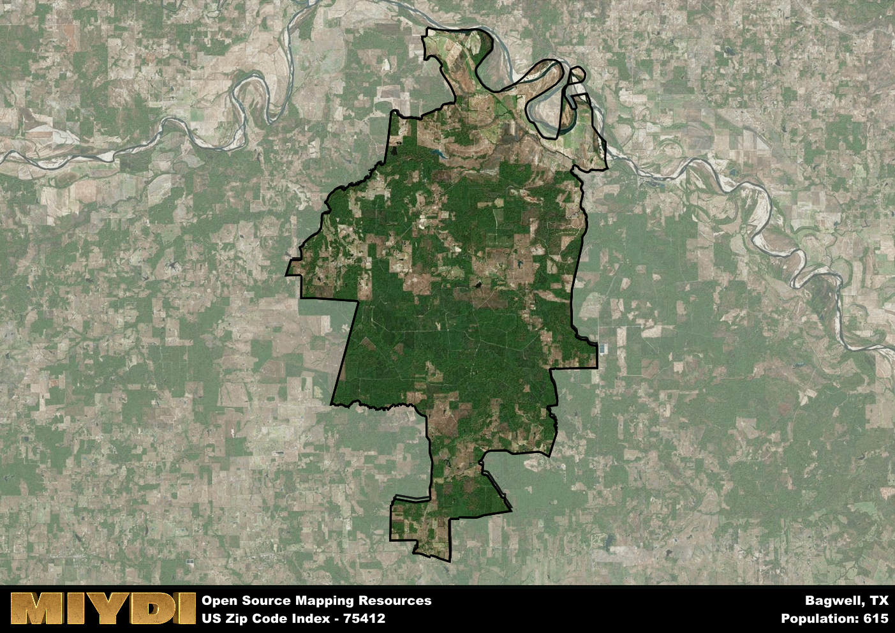

**Area Name:** Bagwell

**Zip Code:** 75412

**State:** TX

# Bagwell: A Quaint Community in Northeast Texas

Located in the northeastern part of Texas, the zip code area 75412 corresponds to the small community of Bagwell. Surrounded by the vast expanse of rural landscapes, Bagwell is situated within close proximity to major cities like Paris and Clarksville. Despite its rural setting, Bagwell is seamlessly integrated into the larger fabric of Northeast Texas, offering residents a peaceful retreat from the hustle and bustle of urban life.

Bagwell has a rich historical narrative that dates back to its initial settlement in the late 19th century. Originally established as a farming community, Bagwell grew rapidly due to its strategic location along the railroad. Over the years, the community has maintained its small-town charm while adapting to modern developments. The area's name is believed to be derived from a prominent local family, highlighting the close-knit nature of the community.

Today, Bagwell remains a tight-knit community with a strong focus on agriculture and small businesses. The area boasts a range of neighborhood-specific services, including local shops, schools, and churches that serve as the heart of the community. Residents and visitors alike can enjoy the natural beauty of the surrounding countryside, with opportunities for outdoor activities like hiking, fishing, and birdwatching. Bagwell also features a few historic sites that offer a glimpse into its past, making it a unique destination within Northeast Texas.

# Bagwell Demographics

The population of Bagwell is 615.  
Bagwell has a population density of 5.27 per square mile.  
The area of Bagwell is 116.8 square miles.  

## Bagwell Income and Economic Data

These demographic numbers are sourced from IRS return data, providing comprehensive insights into the population dynamics and economic trends within Bagwell.

**Breakdown of return types for Bagwell**

The table offers insight into the composition of tax returns filed with the IRS, categorizing them into three main types. Single returns represent filings by individuals, joint returns by married couples, and head of household returns by individuals who qualify as heads of households, typically having dependents. This breakdown provides an understanding of the different filing statuses adopted by taxpayers when submitting their tax documentation.

| Return Types filed for Bagwell                              | Percentage          |
|----------------------------------------------------------|---------------------|
| Single Returns                                            | 0.45 |
| Joint Returns                                             | 0.41 |
| Head Household Returns                                    | 0.07 |

The income and economic data presented here is sourced from the IRS income brackets, utilized for categorizing tax returns by income levels. This table displays income ranges for both single filers and married couples, along with the corresponding number of returns and the percentage within each bracket, providing valuable insight into the distribution of taxes across various income groups.

| Bracket Name       | Single Filer Income Range | Married Couple Range | Number of Returns | Percentage of Returns |
|--------------------|----------------------------|----------------------|-------------------|-----------------------|
| 10% Bracket        | Up to $10,275              | Up to $20,550        | 110 | 0.38% |
| 12% Bracket        | $10,276 - $41,775          | $20,551 - $83,550    | 80 | 0.28% |
| 22% Bracket        | $41,776 - $89,075          | $83,551 - $178,150   | 40 | 0.14% |
| 24% Bracket        | $89,076 - $170,050         | $178,151 - $340,100  | 30 | 0.1% |
| 32% Bracket        | $170,051 - $215,950        | $340,101 - $431,900  | 30 | 0.1% |
| 35% Bracket        | $215,951 - $539,900        | $431,901 - $647,850  | 0 | 0% |

### Exploring Taxpayer Diversity: A Breakdown of Different Types of Tax Returns in Bagwell

The table offers insights into various types of tax returns filed, reflecting different aspects of taxpayer activities and demographics. Categories include charitable returns for donations, dependent returns for claimed dependents, educator population, elderly population, real estate returns, self-employment returns, student loan returns, and unemployment returns, providing valuable insights into taxpayer behavior and demographics.

| Bagwell Filing Types                    | Count | Percentage |
|--------------------------------------|-------|------------|
| Charitable Donations                 | 0 | 0% |
| Dependents Claimed                   | 0 | 0% |
| Educator Residents                   | 0 | 0% |
| Elderly Population                   | 80 | 0.28% |
| Farming Population                   | 60 | 0.207% |
| Real Estate Transactions             | 0 | 0% |
| Self-Employed Individuals            | 30 | 0.103% |
| Student Loan Cases                   | 0 | 0% |
| Unemployment Benefit Filings         | 30 | 0.1% |

## Bagwell AI and Census Variables

The values presented in this dataset for Bagwell are AI-optimized, streamlined, and categorized into relevant buckets for enhanced utility in AI and mapping programs. These simplified values have been optimized to facilitate efficient analysis and integration into various technological applications, offering users accessible and actionable insights into demographics within the Bagwell area.

| AI Variables for Bagwell | Value |
|-------------|-------|
| Shape Area | 439299868.902344 |
| Shape Length | 160718.30346215 |

## How to use this free AI optimized Geo-Spatial Data for Bagwell, TX

This data is made freely available under the Creative Commons license, allowing for unrestricted use for any purpose. Users can access static resources directly from GitHub or leverage more advanced functionalities by utilizing the GeoJSON files. All datasets originate from official government or private sector sources and are meticulously compiled into relevant datasets within QGIS. However, the versatility of the data ensures compatibility with any mapping application.

## Data Accuracy Disclaimer
It's important to note that the data provided here may contain errors or discrepancies and should be considered as 'close enough' for business applications and AI rather than a definitive source of truth. This data is aggregated from multiple sources, some of which publish information on wildly different intervals, leading to potential inconsistencies. Additionally, certain data points may not be corrected for Covid-related changes, further impacting accuracy. Moreover, the assumption that demographic trends are consistent throughout a region may lead to discrepancies, as trends often concentrate in areas of highest population density. As a result, dense areas may be slightly underrepresented, while rural areas may be slightly overrepresented, resulting in a more conservative dataset. Furthermore, the focus primarily on areas within US Major and Minor Statistical areas means that approximately 40 million Americans living outside of these areas may not be fully represented. Lastly, the historical background and area descriptions generated using AI are susceptible to potential mistakes, so users should exercise caution when interpreting the information provided.
