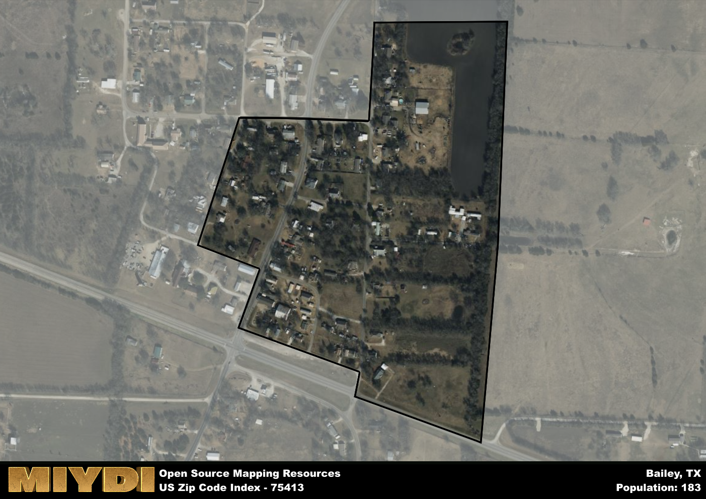

**Area Name:** Bailey

**Zip Code:** 75413

**State:** TX

Bailey is a part of the Bonham - TX Micro Area, and makes up  of the Metro's population.  

# Bailey: A Quaint Community in Northeast Texas  

Bailey, Texas, located within the 75413 zip code, is a charming community situated in the northeast region of the state. Bordered by the cities of Bonham to the west and Honey Grove to the east, Bailey serves as a peaceful residential area within Fannin County. Despite its small size, Bailey is well-connected to major population centers such as Dallas and Sherman, making it an ideal location for those seeking a tranquil lifestyle within reach of urban amenities.

Founded in the late 19th century, Bailey has a rich history rooted in agriculture and ranching. The town was named after a local family who were prominent landowners in the area. Over the years, Bailey has experienced steady growth as families and individuals have been drawn to its tight-knit community and picturesque surroundings. The town's historic downtown area still retains its charm, with well-preserved buildings that harken back to a bygone era.

Presently, Bailey is a thriving community with a focus on agriculture and small businesses. The town boasts local shops, restaurants, and services that cater to residents and visitors alike. Outdoor enthusiasts can enjoy the nearby parks and recreational areas, while history buffs can explore the town's historic sites and landmarks. Bailey's strong sense of community and dedication to preserving its heritage make it a unique and welcoming place to call home in Northeast Texas.

# Bailey Demographics

The population of Bailey is 183.  
Bailey has a population density of 2033.33 per square mile.  
The area of Bailey is 0.09 square miles.  

## Bailey AI and Census Variables

The values presented in this dataset for Bailey are AI-optimized, streamlined, and categorized into relevant buckets for enhanced utility in AI and mapping programs. These simplified values have been optimized to facilitate efficient analysis and integration into various technological applications, offering users accessible and actionable insights into demographics within the Bailey area.

| AI Variables for Bailey | Value |
|-------------|-------|
| Shape Area | 319127.21875 |
| Shape Length | 2601.14483806821 |
| CBSA Federal Processing Standard Code | 14300 |

## How to use this free AI optimized Geo-Spatial Data for Bailey, TX

This data is made freely available under the Creative Commons license, allowing for unrestricted use for any purpose. Users can access static resources directly from GitHub or leverage more advanced functionalities by utilizing the GeoJSON files. All datasets originate from official government or private sector sources and are meticulously compiled into relevant datasets within QGIS. However, the versatility of the data ensures compatibility with any mapping application.

## Data Accuracy Disclaimer
It's important to note that the data provided here may contain errors or discrepancies and should be considered as 'close enough' for business applications and AI rather than a definitive source of truth. This data is aggregated from multiple sources, some of which publish information on wildly different intervals, leading to potential inconsistencies. Additionally, certain data points may not be corrected for Covid-related changes, further impacting accuracy. Moreover, the assumption that demographic trends are consistent throughout a region may lead to discrepancies, as trends often concentrate in areas of highest population density. As a result, dense areas may be slightly underrepresented, while rural areas may be slightly overrepresented, resulting in a more conservative dataset. Furthermore, the focus primarily on areas within US Major and Minor Statistical areas means that approximately 40 million Americans living outside of these areas may not be fully represented. Lastly, the historical background and area descriptions generated using AI are susceptible to potential mistakes, so users should exercise caution when interpreting the information provided.
