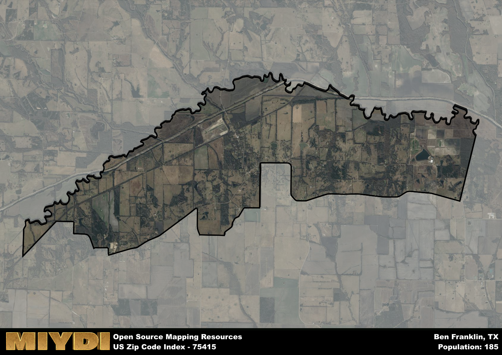

**Area Name:** Ben Franklin

**Zip Code:** 75415

**State:** TX

Ben Franklin is a part of the Paris - TX Micro Area, and makes up  of the Metro's population.  

# Ben Franklin: A Historic Community in Northeast Texas

Located in the northeastern region of Texas, zip code 75415 encompasses the charming community of Ben Franklin. Situated within Delta County, this area is surrounded by the towns of Pecan Gap, Charleston, and Cooper. Ben Franklin is approximately 20 miles southeast of the city of Paris, which serves as the county seat. The zip code area is characterized by its rural landscape, dotted with farms and ranches, providing a peaceful and picturesque setting for residents.

Ben Franklin has a rich historical narrative, dating back to its establishment in the late 19th century. Named after the American statesman, the town was initially a hub for agriculture and trade, with a post office, general store, and school serving the local population. Over the years, Ben Franklin has maintained its small-town charm while adapting to modern times. The community prides itself on its strong sense of community and preservation of its heritage.

Today, Ben Franklin remains a close-knit community with a focus on agriculture and local businesses. Residents enjoy access to essential services such as schools, churches, and a community center. The area also offers recreational amenities, including parks and outdoor spaces for residents to enjoy. Ben Franklin is a place where neighbors come together for events and celebrations, fostering a sense of belonging and pride in their unique corner of Northeast Texas.

# Ben Franklin Demographics

The population of Ben Franklin is 185.  
Ben Franklin has a population density of 16.61 per square mile.  
The area of Ben Franklin is 11.14 square miles.  

## Ben Franklin AI and Census Variables

The values presented in this dataset for Ben Franklin are AI-optimized, streamlined, and categorized into relevant buckets for enhanced utility in AI and mapping programs. These simplified values have been optimized to facilitate efficient analysis and integration into various technological applications, offering users accessible and actionable insights into demographics within the Ben Franklin area.

| AI Variables for Ben Franklin | Value |
|-------------|-------|
| Shape Area | 41571279.1210938 |
| Shape Length | 51109.685738964 |
| CBSA Federal Processing Standard Code | 37580 |

## How to use this free AI optimized Geo-Spatial Data for Ben Franklin, TX

This data is made freely available under the Creative Commons license, allowing for unrestricted use for any purpose. Users can access static resources directly from GitHub or leverage more advanced functionalities by utilizing the GeoJSON files. All datasets originate from official government or private sector sources and are meticulously compiled into relevant datasets within QGIS. However, the versatility of the data ensures compatibility with any mapping application.

## Data Accuracy Disclaimer
It's important to note that the data provided here may contain errors or discrepancies and should be considered as 'close enough' for business applications and AI rather than a definitive source of truth. This data is aggregated from multiple sources, some of which publish information on wildly different intervals, leading to potential inconsistencies. Additionally, certain data points may not be corrected for Covid-related changes, further impacting accuracy. Moreover, the assumption that demographic trends are consistent throughout a region may lead to discrepancies, as trends often concentrate in areas of highest population density. As a result, dense areas may be slightly underrepresented, while rural areas may be slightly overrepresented, resulting in a more conservative dataset. Furthermore, the focus primarily on areas within US Major and Minor Statistical areas means that approximately 40 million Americans living outside of these areas may not be fully represented. Lastly, the historical background and area descriptions generated using AI are susceptible to potential mistakes, so users should exercise caution when interpreting the information provided.
