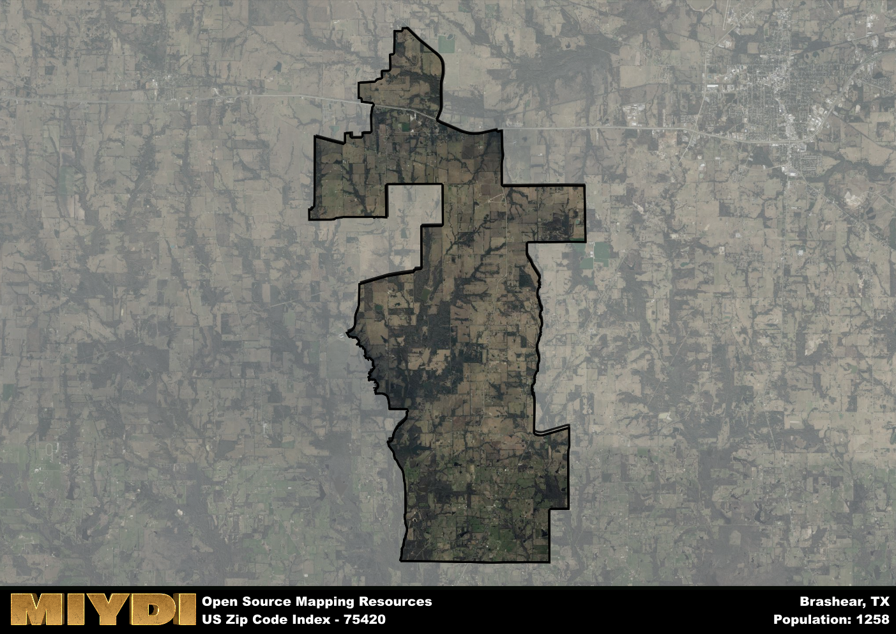

**Area Name:** Brashear

**Zip Code:** 75420

**State:** TX

Brashear is a part of the Sulphur Springs - TX Micro Area, and makes up  of the Metro's population.  

# Brashear: A Charming Community in Northeast Texas  

Located in Hopkins County, Texas, the zip code area 75420 encompasses the small, rural community of Brashear. Situated southeast of the county seat of Sulphur Springs, Brashear is surrounded by vast farmland and rolling hills. Despite its rural setting, Brashear is well-connected to nearby towns and cities such as Commerce and Greenville, making it a convenient and peaceful place to live within the larger Northeast Texas region.

Originally settled in the mid-19th century, Brashear was named after a local landowner and has since grown into a close-knit community with a rich agricultural heritage. Over the years, Brashear has maintained its small-town charm while welcoming new residents and businesses. The area has also been home to various historical events, including the development of the railroad that helped spur its initial growth.

Today, Brashear offers residents a quiet and picturesque setting to call home. The community is supported by local farms and businesses, providing essential services to its residents. In addition to its agricultural roots, Brashear boasts recreational amenities such as parks and outdoor spaces for residents to enjoy. With a strong sense of community pride and a dedication to preserving its history, Brashear continues to thrive as a hidden gem in Northeast Texas.

# Brashear Demographics

The population of Brashear is 1258.  
Brashear has a population density of 31.73 per square mile.  
The area of Brashear is 39.65 square miles.  

## Brashear Income and Economic Data

These demographic numbers are sourced from IRS return data, providing comprehensive insights into the population dynamics and economic trends within Brashear.

**Breakdown of return types for Brashear**

The table offers insight into the composition of tax returns filed with the IRS, categorizing them into three main types. Single returns represent filings by individuals, joint returns by married couples, and head of household returns by individuals who qualify as heads of households, typically having dependents. This breakdown provides an understanding of the different filing statuses adopted by taxpayers when submitting their tax documentation.

| Return Types filed for Brashear                              | Percentage          |
|----------------------------------------------------------|---------------------|
| Single Returns                                            | 0.41 |
| Joint Returns                                             | 0.48 |
| Head Household Returns                                    | 0.11 |

The income and economic data presented here is sourced from the IRS income brackets, utilized for categorizing tax returns by income levels. This table displays income ranges for both single filers and married couples, along with the corresponding number of returns and the percentage within each bracket, providing valuable insight into the distribution of taxes across various income groups.

| Bracket Name       | Single Filer Income Range | Married Couple Range | Number of Returns | Percentage of Returns |
|--------------------|----------------------------|----------------------|-------------------|-----------------------|
| 10% Bracket        | Up to $10,275              | Up to $20,550        | 190 | 0.31% |
| 12% Bracket        | $10,276 - $41,775          | $20,551 - $83,550    | 170 | 0.28% |
| 22% Bracket        | $41,776 - $89,075          | $83,551 - $178,150   | 110 | 0.18% |
| 24% Bracket        | $89,076 - $170,050         | $178,151 - $340,100  | 50 | 0.08% |
| 32% Bracket        | $170,051 - $215,950        | $340,101 - $431,900  | 90 | 0.15% |
| 35% Bracket        | $215,951 - $539,900        | $431,901 - $647,850  | 0 | 0% |

### Exploring Taxpayer Diversity: A Breakdown of Different Types of Tax Returns in Brashear

The table offers insights into various types of tax returns filed, reflecting different aspects of taxpayer activities and demographics. Categories include charitable returns for donations, dependent returns for claimed dependents, educator population, elderly population, real estate returns, self-employment returns, student loan returns, and unemployment returns, providing valuable insights into taxpayer behavior and demographics.

| Brashear Filing Types                    | Count | Percentage |
|--------------------------------------|-------|------------|
| Charitable Donations                 | 0 | 0% |
| Dependents Claimed                   | 0 | 0% |
| Educator Residents                   | 0 | 0% |
| Elderly Population                   | 170 | 0.28% |
| Farming Population                   | 100 | 0.164% |
| Real Estate Transactions             | 0 | 0% |
| Self-Employed Individuals            | 100 | 0.164% |
| Student Loan Cases                   | 20 | 0.033% |
| Unemployment Benefit Filings         | 60 | 0.1% |

## Brashear AI and Census Variables

The values presented in this dataset for Brashear are AI-optimized, streamlined, and categorized into relevant buckets for enhanced utility in AI and mapping programs. These simplified values have been optimized to facilitate efficient analysis and integration into various technological applications, offering users accessible and actionable insights into demographics within the Brashear area.

| AI Variables for Brashear | Value |
|-------------|-------|
| Shape Area | 146608509.84375 |
| Shape Length | 87657.300144898 |
| CBSA Federal Processing Standard Code | 44860 |

## How to use this free AI optimized Geo-Spatial Data for Brashear, TX

This data is made freely available under the Creative Commons license, allowing for unrestricted use for any purpose. Users can access static resources directly from GitHub or leverage more advanced functionalities by utilizing the GeoJSON files. All datasets originate from official government or private sector sources and are meticulously compiled into relevant datasets within QGIS. However, the versatility of the data ensures compatibility with any mapping application.

## Data Accuracy Disclaimer
It's important to note that the data provided here may contain errors or discrepancies and should be considered as 'close enough' for business applications and AI rather than a definitive source of truth. This data is aggregated from multiple sources, some of which publish information on wildly different intervals, leading to potential inconsistencies. Additionally, certain data points may not be corrected for Covid-related changes, further impacting accuracy. Moreover, the assumption that demographic trends are consistent throughout a region may lead to discrepancies, as trends often concentrate in areas of highest population density. As a result, dense areas may be slightly underrepresented, while rural areas may be slightly overrepresented, resulting in a more conservative dataset. Furthermore, the focus primarily on areas within US Major and Minor Statistical areas means that approximately 40 million Americans living outside of these areas may not be fully represented. Lastly, the historical background and area descriptions generated using AI are susceptible to potential mistakes, so users should exercise caution when interpreting the information provided.
