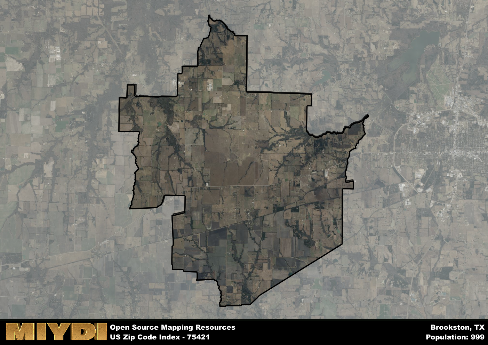

**Area Name:** Brookston

**Zip Code:** 75421

**State:** TX

Brookston is a part of the Paris - TX Micro Area, and makes up  of the Metro's population.  

# Brookston: A Historic Gem in Northeast Texas  

Located in the northeastern region of Texas, the zip code area 75421 encompasses the charming neighborhood of Brookston. Bordered by the city of Paris to the west and Deport to the east, Brookston is a close-knit community that is just a short drive away from major population centers like Dallas and Texarkana. Despite its proximity to larger cities, Brookston maintains its small-town charm and distinctive character within the larger urban fabric of Northeast Texas.

Brookston has a rich historical narrative that dates back to its establishment in the late 19th century. Initially founded as a railroad town, Brookston experienced steady growth due to its strategic location along the railway line. The area flourished as a hub for agricultural trade, particularly cotton farming, which contributed to its economic prosperity. Over the years, Brookston has preserved its heritage through historic buildings and landmarks that showcase its vibrant past.

Today, Brookston continues to thrive as a peaceful residential area with a strong community spirit. The neighborhood is home to a mix of local businesses, including family-owned shops and restaurants that offer a taste of traditional Texan cuisine. Residents and visitors alike can enjoy recreational activities at the nearby parks and nature trails, or explore the area's historic sites such as the Brookston Depot Museum. With its blend of history, culture, and modern amenities, Brookston remains a hidden gem in Northeast Texas.

# Brookston Demographics

The population of Brookston is 999.  
Brookston has a population density of 15.64 per square mile.  
The area of Brookston is 63.87 square miles.  

## Brookston Income and Economic Data

These demographic numbers are sourced from IRS return data, providing comprehensive insights into the population dynamics and economic trends within Brookston.

**Breakdown of return types for Brookston**

The table offers insight into the composition of tax returns filed with the IRS, categorizing them into three main types. Single returns represent filings by individuals, joint returns by married couples, and head of household returns by individuals who qualify as heads of households, typically having dependents. This breakdown provides an understanding of the different filing statuses adopted by taxpayers when submitting their tax documentation.

| Return Types filed for Brookston                              | Percentage          |
|----------------------------------------------------------|---------------------|
| Single Returns                                            | 0.45 |
| Joint Returns                                             | 0.43 |
| Head Household Returns                                    | 0.12 |

The income and economic data presented here is sourced from the IRS income brackets, utilized for categorizing tax returns by income levels. This table displays income ranges for both single filers and married couples, along with the corresponding number of returns and the percentage within each bracket, providing valuable insight into the distribution of taxes across various income groups.

| Bracket Name       | Single Filer Income Range | Married Couple Range | Number of Returns | Percentage of Returns |
|--------------------|----------------------------|----------------------|-------------------|-----------------------|
| 10% Bracket        | Up to $10,275              | Up to $20,550        | 190 | 0.39% |
| 12% Bracket        | $10,276 - $41,775          | $20,551 - $83,550    | 120 | 0.24% |
| 22% Bracket        | $41,776 - $89,075          | $83,551 - $178,150   | 70 | 0.14% |
| 24% Bracket        | $89,076 - $170,050         | $178,151 - $340,100  | 50 | 0.1% |
| 32% Bracket        | $170,051 - $215,950        | $340,101 - $431,900  | 60 | 0.12% |
| 35% Bracket        | $215,951 - $539,900        | $431,901 - $647,850  | 0 | 0% |

### Exploring Taxpayer Diversity: A Breakdown of Different Types of Tax Returns in Brookston

The table offers insights into various types of tax returns filed, reflecting different aspects of taxpayer activities and demographics. Categories include charitable returns for donations, dependent returns for claimed dependents, educator population, elderly population, real estate returns, self-employment returns, student loan returns, and unemployment returns, providing valuable insights into taxpayer behavior and demographics.

| Brookston Filing Types                    | Count | Percentage |
|--------------------------------------|-------|------------|
| Charitable Donations                 | 0 | 0% |
| Dependents Claimed                   | 0 | 0% |
| Educator Residents                   | 0 | 0% |
| Elderly Population                   | 120 | 0.24% |
| Farming Population                   | 90 | 0.184% |
| Real Estate Transactions             | 0 | 0% |
| Self-Employed Individuals            | 80 | 0.163% |
| Student Loan Cases                   | 0 | 0% |
| Unemployment Benefit Filings         | 60 | 0.12% |

## Brookston AI and Census Variables

The values presented in this dataset for Brookston are AI-optimized, streamlined, and categorized into relevant buckets for enhanced utility in AI and mapping programs. These simplified values have been optimized to facilitate efficient analysis and integration into various technological applications, offering users accessible and actionable insights into demographics within the Brookston area.

| AI Variables for Brookston | Value |
|-------------|-------|
| Shape Area | 239330994.039063 |
| Shape Length | 92113.0501194592 |
| CBSA Federal Processing Standard Code | 37580 |

## How to use this free AI optimized Geo-Spatial Data for Brookston, TX

This data is made freely available under the Creative Commons license, allowing for unrestricted use for any purpose. Users can access static resources directly from GitHub or leverage more advanced functionalities by utilizing the GeoJSON files. All datasets originate from official government or private sector sources and are meticulously compiled into relevant datasets within QGIS. However, the versatility of the data ensures compatibility with any mapping application.

## Data Accuracy Disclaimer
It's important to note that the data provided here may contain errors or discrepancies and should be considered as 'close enough' for business applications and AI rather than a definitive source of truth. This data is aggregated from multiple sources, some of which publish information on wildly different intervals, leading to potential inconsistencies. Additionally, certain data points may not be corrected for Covid-related changes, further impacting accuracy. Moreover, the assumption that demographic trends are consistent throughout a region may lead to discrepancies, as trends often concentrate in areas of highest population density. As a result, dense areas may be slightly underrepresented, while rural areas may be slightly overrepresented, resulting in a more conservative dataset. Furthermore, the focus primarily on areas within US Major and Minor Statistical areas means that approximately 40 million Americans living outside of these areas may not be fully represented. Lastly, the historical background and area descriptions generated using AI are susceptible to potential mistakes, so users should exercise caution when interpreting the information provided.
