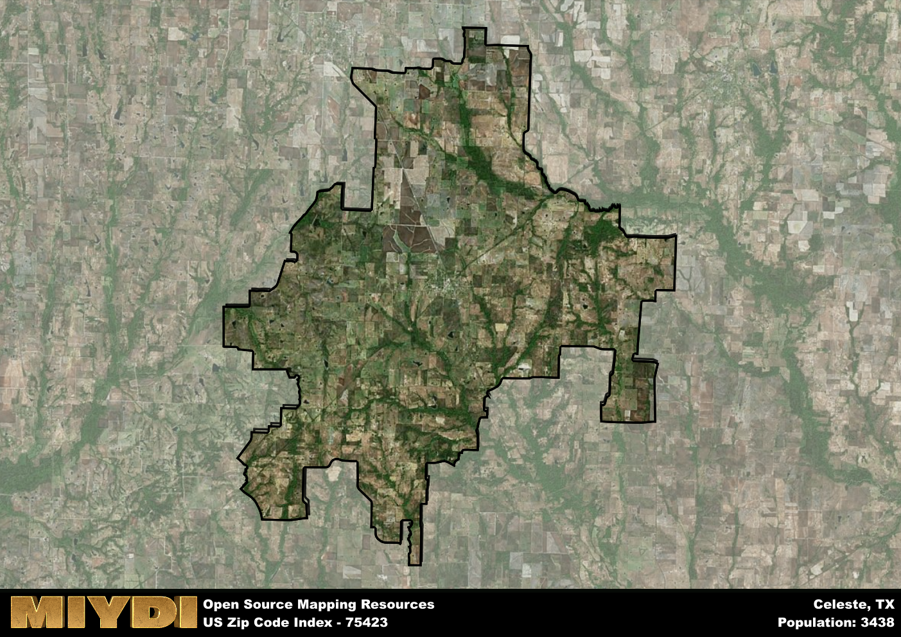

**Area Name:** Celeste

**Zip Code:** 75423

**State:** TX

Celeste is a part of the Dallas-Fort Worth-Arlington - TX Metro Area, and makes up 0.04% of the Metro's population.  

# Hidden Gem: Discover the Charm of Celeste, TX (Zip Code: 75423)  

Celeste, located in the northeastern part of Texas, is a small town that falls within the 75423 zip code. Bordered by rural landscapes and neighboring towns such as Greenville and Leonard, Celeste is a quiet and close-knit community that is integrated into the larger fabric of Hunt County. Despite its small size, Celeste is easily accessible from major highways, making it a convenient stop for travelers passing through the region.

Founded in the late 19th century, Celeste has a rich history rooted in agriculture and the railroad industry. The town flourished as a trading hub for farmers in the surrounding area, and its growth was further fueled by the arrival of the railway. Over the years, Celeste has maintained its small-town charm while adapting to modern developments, making it a desirable place to live for those seeking a peaceful and welcoming environment.

Today, Celeste continues to thrive with a mix of local businesses, including family-owned shops and restaurants that cater to residents and visitors alike. The town boasts several parks and recreational facilities, providing ample opportunities for outdoor activities. Additionally, Celeste is home to historic sites that showcase its past, such as the Old City Hall and the Celeste Heritage Museum, giving residents a glimpse into the town's heritage. With its strong sense of community and diverse offerings, Celeste remains a hidden gem in the heart of Texas.

# Celeste Demographics

The population of Celeste is 3438.  
Celeste has a population density of 43.16 per square mile.  
The area of Celeste is 79.66 square miles.  

## Celeste Income and Economic Data

These demographic numbers are sourced from IRS return data, providing comprehensive insights into the population dynamics and economic trends within Celeste.

**Breakdown of return types for Celeste**

The table offers insight into the composition of tax returns filed with the IRS, categorizing them into three main types. Single returns represent filings by individuals, joint returns by married couples, and head of household returns by individuals who qualify as heads of households, typically having dependents. This breakdown provides an understanding of the different filing statuses adopted by taxpayers when submitting their tax documentation.

| Return Types filed for Celeste                              | Percentage          |
|----------------------------------------------------------|---------------------|
| Single Returns                                            | 0.39 |
| Joint Returns                                             | 0.45 |
| Head Household Returns                                    | 0.14 |

The income and economic data presented here is sourced from the IRS income brackets, utilized for categorizing tax returns by income levels. This table displays income ranges for both single filers and married couples, along with the corresponding number of returns and the percentage within each bracket, providing valuable insight into the distribution of taxes across various income groups.

| Bracket Name       | Single Filer Income Range | Married Couple Range | Number of Returns | Percentage of Returns |
|--------------------|----------------------------|----------------------|-------------------|-----------------------|
| 10% Bracket        | Up to $10,275              | Up to $20,550        | 440 | 0.32% |
| 12% Bracket        | $10,276 - $41,775          | $20,551 - $83,550    | 330 | 0.24% |
| 22% Bracket        | $41,776 - $89,075          | $83,551 - $178,150   | 220 | 0.16% |
| 24% Bracket        | $89,076 - $170,050         | $178,151 - $340,100  | 150 | 0.11% |
| 32% Bracket        | $170,051 - $215,950        | $340,101 - $431,900  | 200 | 0.14% |
| 35% Bracket        | $215,951 - $539,900        | $431,901 - $647,850  | 40 | 0.03% |

### Exploring Taxpayer Diversity: A Breakdown of Different Types of Tax Returns in Celeste

The table offers insights into various types of tax returns filed, reflecting different aspects of taxpayer activities and demographics. Categories include charitable returns for donations, dependent returns for claimed dependents, educator population, elderly population, real estate returns, self-employment returns, student loan returns, and unemployment returns, providing valuable insights into taxpayer behavior and demographics.

| Celeste Filing Types                    | Count | Percentage |
|--------------------------------------|-------|------------|
| Charitable Donations                 | 50 | 0.036% |
| Dependents Claimed                   | 40 | 0.029% |
| Educator Residents                   | 30 | 0.022% |
| Elderly Population                   | 350 | 0.25% |
| Farming Population                   | 160 | 0.116% |
| Real Estate Transactions             | 50 | 0.036% |
| Self-Employed Individuals            | 190 | 0.138% |
| Student Loan Cases                   | 70 | 0.051% |
| Unemployment Benefit Filings         | 150 | 0.11% |

### Exploring Real Estate Trends: A Comprehensive Analysis of the Celeste Area and its Neighbors

This table contains an in-depth examination of the real estate market in the Celeste area. Sourced from trusted real estate market firms, this dataset provides a wealth of raw data detailing the local real estate landscape, along with comparative analyses juxtaposing the market dynamics with those of neighboring areas. Explore the intricacies of the Celeste real estate market and gain valuable insights into its relationship with adjacent regions.

| Real Estate Data for Celeste                       | Value    |
|------------------------------------------------|----------|
| Average Listing Price for Celeste               | 487970 |
| Median Listing Price for Celeste                | 499250 |
| Median Days on Market for Celeste               | 50 |
| Median Listing Price per Square Foot for Celeste| 44 |
| Median Square Feet for Celeste                  | 1941 |
| Real Estate Prices to Income Ratio           | 265.71% |
| Price per Square Foot Ratio                  | 110.00% |
| Price Median Ratio                           | 99.42% |
| Market Sales Speed Ratio                     | 117.0% |

This table offers essential real estate data for the Celeste area, including average and median listing prices, median days on market, and property size. It also presents ratio metrics as percentages, providing insights into how the local market compares to the surrounding region. A ratio of 100% signifies performance in line with the regional average, while values above or below indicate overperformance or underperformance, respectively, relative to expectations.

## Celeste Sports and Recreation Data

#### Annual Youth Sports Spending for Celeste

This table provides fundamental insights into the Sports and Recreation data for the Celeste area, detailing the estimated annual expenditure on Youth Athletics. This includes estimated spending by the major consumer brackets. 
| Sports Spending for Celeste| Value |
|-------------------------|-------|
| Athlete Spending Compared to the region | 8.54% |
| Total Youth Athlete Spending | 36,050 |
| Athletic Spending - Essential Focused Consumer | 0,777 |
| Athletic Spending - Typical Consumer | 42,050 |
| Athletic Spending - Affluent Consumers | 13,111 |

#### Youth Coaching Estimates for Celeste

This table presents the estimated number of coaches for the Celeste area, derived from comprehensive national coaching surveys and athletic participation rates by state. It offers valuable insights into the vital role of coaching personnel in fostering athletic development and facilitating sports participation within the local community.

| Coaching Data for Celeste | Value |
|-------------|-------|
| Total Coaches | 56 |
| Paid Coaches | 15 |
| Volunteer Coaches | 42 |

#### Youth Athlete Participation for Celeste

This table shows the estimated total number of youth athletes in the Celeste area, sourced from comprehensive national coaching surveys and athletic participation rates by state.

| Total YA Athletes in Celeste | Value |
|-------------|-------|
| Total High School Athletes | 86 |
| Total Youth Athletes | 258 |
| Total Young Adult Athletes | 172 |
| Total Athletes to Age 25 | 515 |

#### High School Age Athletes - Breakdown by Sport for Celeste

This table shows insights regarding high school age estimated players by sport in the Celeste area, derived from national and state-level athletic participation trends. 

| HS Players by Sport in Celeste | Value |
|-------------|-------|
| Football Players | 20 |
| Basketball Players | 12 |
| Soccer Players | 9 |
| Volleyball Players | 6 |
| Baseball Players | 10 |
| Tennis Players | 5 |
| Track Athletes | 15 |
| Golf Players | 3 |
| Swimming Athletes | 3 |
| Wrestling Competitors | 3 |
| Lacrosse Players | 0 |

Estimating the number of younger athletes presents unique challenges due to their varied starting ages, typically beginning around six years old, and a gradual decline in participation rates as they age. Unlike high school-aged athletes, younger athletes are less likely to switch sports as they grow older, contributing to the stability of participation numbers within specific sports at younger ages.  

As a general trend, the total number of younger athletes is approximately three times the number of high school-aged athletes, underscoring the significant presence of youth athletes in sports programs and highlighting the importance of early engagement in athletic activities.

## Celeste AI and Census Variables

The values presented in this dataset for Celeste are AI-optimized, streamlined, and categorized into relevant buckets for enhanced utility in AI and mapping programs. These simplified values have been optimized to facilitate efficient analysis and integration into various technological applications, offering users accessible and actionable insights into demographics within the Celeste area.

| AI Variables for Celeste | Value |
|-------------|-------|
| Shape Area | 296048324.960938 |
| Shape Length | 127765.283386378 |
| CBSA Federal Processing Standard Code | 19100 |
| RE Price per Square Foot Ratio | 110.00% |
| RE Price Average Ratio | 78.84% |
| RE Speed Ratio | 117.0% |
| RE Income Ratio | 265.71% |
| Single Opportunity Flag | 1 |
| Single Parent Risk Flag | 3 |
| Elderly Opportunity Flag | 5 |
| Farm Opportunity Flag | 7 |
| Unemployment Risk | 1 |
| Educator Opportunity Flag | 4 |
| RE Affordability Index Flag | 3 |
| Income Bracket Flag | 1 |
| RE Income Flag | 6 |
| RE Median Square Footage Price Flag | 5 |
| RE Median Square Footage Size Flag | 4 |
| RE Activity Flag | 5 |
| Poverty Line Risk Flag | 3 |

## How to use this free AI optimized Geo-Spatial Data for Celeste, TX

This data is made freely available under the Creative Commons license, allowing for unrestricted use for any purpose. Users can access static resources directly from GitHub or leverage more advanced functionalities by utilizing the GeoJSON files. All datasets originate from official government or private sector sources and are meticulously compiled into relevant datasets within QGIS. However, the versatility of the data ensures compatibility with any mapping application.

## Data Accuracy Disclaimer
It's important to note that the data provided here may contain errors or discrepancies and should be considered as 'close enough' for business applications and AI rather than a definitive source of truth. This data is aggregated from multiple sources, some of which publish information on wildly different intervals, leading to potential inconsistencies. Additionally, certain data points may not be corrected for Covid-related changes, further impacting accuracy. Moreover, the assumption that demographic trends are consistent throughout a region may lead to discrepancies, as trends often concentrate in areas of highest population density. As a result, dense areas may be slightly underrepresented, while rural areas may be slightly overrepresented, resulting in a more conservative dataset. Furthermore, the focus primarily on areas within US Major and Minor Statistical areas means that approximately 40 million Americans living outside of these areas may not be fully represented. Lastly, the historical background and area descriptions generated using AI are susceptible to potential mistakes, so users should exercise caution when interpreting the information provided.
