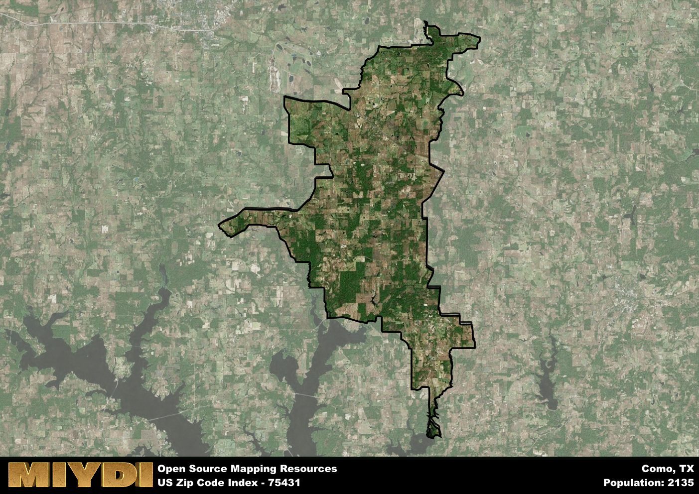

**Area Name:** Como

**Zip Code:** 75431

**State:** TX

Como is a part of the Sulphur Springs - TX Micro Area, and makes up  of the Metro's population.  

# Como: A Charming Community in Northeast Texas  

Located in Northeast Texas, the zip code area 75431 encompasses the small, tight-knit community of Como. Situated within the larger metropolitan context of the Dallas-Fort Worth metroplex, Como maintains its distinct identity while integrating with surrounding cities such as Sulphur Springs and Mount Pleasant. The area is characterized by rolling hills, lush greenery, and a peaceful atmosphere, making it a popular choice for those seeking a more rural lifestyle within proximity to urban conveniences.

Originally settled in the mid-19th century, Como was established as a trading post along the Texas and Pacific Railway. Over the years, the area experienced steady growth as agriculture and ranching became the primary economic activities. The community was officially incorporated in 1901 and named Como after the town in Italy. Today, Como retains its historic charm with well-preserved buildings and a strong sense of community pride rooted in its rich history.

Presently, Como is a thriving community with a mix of residential, commercial, and agricultural spaces. The area boasts a variety of local businesses, including family-owned shops and restaurants that contribute to its unique character. Residents and visitors alike can enjoy recreational activities at nearby parks and lakes, as well as explore historical sites such as the Como Civic Center. With its blend of rural tranquility and modern amenities, Como offers a welcoming environment for all who call it home.

# Como Demographics

The population of Como is 2135.  
Como has a population density of 30.88 per square mile.  
The area of Como is 69.14 square miles.  

## Como Income and Economic Data

These demographic numbers are sourced from IRS return data, providing comprehensive insights into the population dynamics and economic trends within Como.

**Breakdown of return types for Como**

The table offers insight into the composition of tax returns filed with the IRS, categorizing them into three main types. Single returns represent filings by individuals, joint returns by married couples, and head of household returns by individuals who qualify as heads of households, typically having dependents. This breakdown provides an understanding of the different filing statuses adopted by taxpayers when submitting their tax documentation.

| Return Types filed for Como                              | Percentage          |
|----------------------------------------------------------|---------------------|
| Single Returns                                            | 0.41 |
| Joint Returns                                             | 0.43 |
| Head Household Returns                                    | 0.15 |

The income and economic data presented here is sourced from the IRS income brackets, utilized for categorizing tax returns by income levels. This table displays income ranges for both single filers and married couples, along with the corresponding number of returns and the percentage within each bracket, providing valuable insight into the distribution of taxes across various income groups.

| Bracket Name       | Single Filer Income Range | Married Couple Range | Number of Returns | Percentage of Returns |
|--------------------|----------------------------|----------------------|-------------------|-----------------------|
| 10% Bracket        | Up to $10,275              | Up to $20,550        | 330 | 0.38% |
| 12% Bracket        | $10,276 - $41,775          | $20,551 - $83,550    | 280 | 0.32% |
| 22% Bracket        | $41,776 - $89,075          | $83,551 - $178,150   | 120 | 0.14% |
| 24% Bracket        | $89,076 - $170,050         | $178,151 - $340,100  | 60 | 0.07% |
| 32% Bracket        | $170,051 - $215,950        | $340,101 - $431,900  | 80 | 0.09% |
| 35% Bracket        | $215,951 - $539,900        | $431,901 - $647,850  | 0 | 0% |

### Exploring Taxpayer Diversity: A Breakdown of Different Types of Tax Returns in Como

The table offers insights into various types of tax returns filed, reflecting different aspects of taxpayer activities and demographics. Categories include charitable returns for donations, dependent returns for claimed dependents, educator population, elderly population, real estate returns, self-employment returns, student loan returns, and unemployment returns, providing valuable insights into taxpayer behavior and demographics.

| Como Filing Types                    | Count | Percentage |
|--------------------------------------|-------|------------|
| Charitable Donations                 | 0 | 0% |
| Dependents Claimed                   | 0 | 0% |
| Educator Residents                   | 20 | 0.023% |
| Elderly Population                   | 200 | 0.23% |
| Farming Population                   | 130 | 0.149% |
| Real Estate Transactions             | 0 | 0% |
| Self-Employed Individuals            | 130 | 0.149% |
| Student Loan Cases                   | 0 | 0% |
| Unemployment Benefit Filings         | 90 | 0.1% |

## Como AI and Census Variables

The values presented in this dataset for Como are AI-optimized, streamlined, and categorized into relevant buckets for enhanced utility in AI and mapping programs. These simplified values have been optimized to facilitate efficient analysis and integration into various technological applications, offering users accessible and actionable insights into demographics within the Como area.

| AI Variables for Como | Value |
|-------------|-------|
| Shape Area | 255344929.378906 |
| Shape Length | 132340.859159482 |
| CBSA Federal Processing Standard Code | 44860 |

## How to use this free AI optimized Geo-Spatial Data for Como, TX

This data is made freely available under the Creative Commons license, allowing for unrestricted use for any purpose. Users can access static resources directly from GitHub or leverage more advanced functionalities by utilizing the GeoJSON files. All datasets originate from official government or private sector sources and are meticulously compiled into relevant datasets within QGIS. However, the versatility of the data ensures compatibility with any mapping application.

## Data Accuracy Disclaimer
It's important to note that the data provided here may contain errors or discrepancies and should be considered as 'close enough' for business applications and AI rather than a definitive source of truth. This data is aggregated from multiple sources, some of which publish information on wildly different intervals, leading to potential inconsistencies. Additionally, certain data points may not be corrected for Covid-related changes, further impacting accuracy. Moreover, the assumption that demographic trends are consistent throughout a region may lead to discrepancies, as trends often concentrate in areas of highest population density. As a result, dense areas may be slightly underrepresented, while rural areas may be slightly overrepresented, resulting in a more conservative dataset. Furthermore, the focus primarily on areas within US Major and Minor Statistical areas means that approximately 40 million Americans living outside of these areas may not be fully represented. Lastly, the historical background and area descriptions generated using AI are susceptible to potential mistakes, so users should exercise caution when interpreting the information provided.
