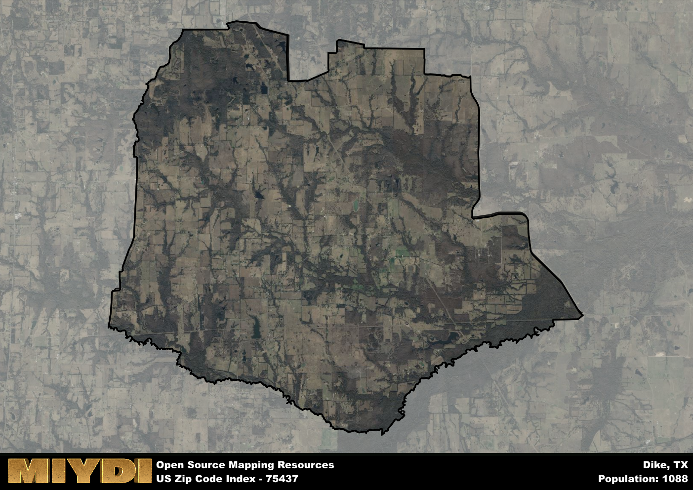

**Area Name:** Dike

**Zip Code:** 75437

**State:** TX

Dike is a part of the Sulphur Springs - TX Micro Area, and makes up  of the Metro's population.  

# Dike: A Charming Community in Northeast Texas  

Located in Northeast Texas, the zip code area 75437 encompasses the small, rural community of Dike. Surrounded by vast farmlands and rolling hills, Dike is situated within close proximity to larger cities such as Sulphur Springs and Paris. Despite its rural setting, Dike is well-connected to major highways, making it a convenient and peaceful retreat from the hustle and bustle of urban life.

Dike has a rich historical narrative dating back to its founding in the mid-19th century. Originally settled by pioneers drawn to the fertile land, Dike has maintained its agricultural roots to this day. The community was named after the abundance of dikes used to control water flow in the area, a nod to the region's early engineering feats. Over the years, Dike has evolved into a close-knit community with a strong sense of pride in its heritage.

Today, Dike is a thriving community with a mix of agricultural and residential properties. The area boasts a variety of local businesses, including family-owned farms, quaint shops, and cozy eateries. Residents and visitors alike can enjoy outdoor recreational activities such as fishing, hiking, and bird watching in the nearby parks and natural areas. Dike also has a few historic sites that offer glimpses into its past, adding to the community's unique charm and character.

# Dike Demographics

The population of Dike is 1088.  
Dike has a population density of 16.12 per square mile.  
The area of Dike is 67.48 square miles.  

## Dike Income and Economic Data

These demographic numbers are sourced from IRS return data, providing comprehensive insights into the population dynamics and economic trends within Dike.

**Breakdown of return types for Dike**

The table offers insight into the composition of tax returns filed with the IRS, categorizing them into three main types. Single returns represent filings by individuals, joint returns by married couples, and head of household returns by individuals who qualify as heads of households, typically having dependents. This breakdown provides an understanding of the different filing statuses adopted by taxpayers when submitting their tax documentation.

| Return Types filed for Dike                              | Percentage          |
|----------------------------------------------------------|---------------------|
| Single Returns                                            | 0.4 |
| Joint Returns                                             | 0.51 |
| Head Household Returns                                    | 0.09 |

The income and economic data presented here is sourced from the IRS income brackets, utilized for categorizing tax returns by income levels. This table displays income ranges for both single filers and married couples, along with the corresponding number of returns and the percentage within each bracket, providing valuable insight into the distribution of taxes across various income groups.

| Bracket Name       | Single Filer Income Range | Married Couple Range | Number of Returns | Percentage of Returns |
|--------------------|----------------------------|----------------------|-------------------|-----------------------|
| 10% Bracket        | Up to $10,275              | Up to $20,550        | 140 | 0.26% |
| 12% Bracket        | $10,276 - $41,775          | $20,551 - $83,550    | 140 | 0.26% |
| 22% Bracket        | $41,776 - $89,075          | $83,551 - $178,150   | 90 | 0.17% |
| 24% Bracket        | $89,076 - $170,050         | $178,151 - $340,100  | 70 | 0.13% |
| 32% Bracket        | $170,051 - $215,950        | $340,101 - $431,900  | 90 | 0.17% |
| 35% Bracket        | $215,951 - $539,900        | $431,901 - $647,850  | 0 | 0% |

### Exploring Taxpayer Diversity: A Breakdown of Different Types of Tax Returns in Dike

The table offers insights into various types of tax returns filed, reflecting different aspects of taxpayer activities and demographics. Categories include charitable returns for donations, dependent returns for claimed dependents, educator population, elderly population, real estate returns, self-employment returns, student loan returns, and unemployment returns, providing valuable insights into taxpayer behavior and demographics.

| Dike Filing Types                    | Count | Percentage |
|--------------------------------------|-------|------------|
| Charitable Donations                 | 0 | 0% |
| Dependents Claimed                   | 0 | 0% |
| Educator Residents                   | 0 | 0% |
| Elderly Population                   | 150 | 0.28% |
| Farming Population                   | 100 | 0.189% |
| Real Estate Transactions             | 0 | 0% |
| Self-Employed Individuals            | 60 | 0.113% |
| Student Loan Cases                   | 0 | 0% |
| Unemployment Benefit Filings         | 40 | 0.08% |

## Dike AI and Census Variables

The values presented in this dataset for Dike are AI-optimized, streamlined, and categorized into relevant buckets for enhanced utility in AI and mapping programs. These simplified values have been optimized to facilitate efficient analysis and integration into various technological applications, offering users accessible and actionable insights into demographics within the Dike area.

| AI Variables for Dike | Value |
|-------------|-------|
| Shape Area | 250627842.25 |
| Shape Length | 85183.1502987379 |
| CBSA Federal Processing Standard Code | 44860 |

## How to use this free AI optimized Geo-Spatial Data for Dike, TX

This data is made freely available under the Creative Commons license, allowing for unrestricted use for any purpose. Users can access static resources directly from GitHub or leverage more advanced functionalities by utilizing the GeoJSON files. All datasets originate from official government or private sector sources and are meticulously compiled into relevant datasets within QGIS. However, the versatility of the data ensures compatibility with any mapping application.

## Data Accuracy Disclaimer
It's important to note that the data provided here may contain errors or discrepancies and should be considered as 'close enough' for business applications and AI rather than a definitive source of truth. This data is aggregated from multiple sources, some of which publish information on wildly different intervals, leading to potential inconsistencies. Additionally, certain data points may not be corrected for Covid-related changes, further impacting accuracy. Moreover, the assumption that demographic trends are consistent throughout a region may lead to discrepancies, as trends often concentrate in areas of highest population density. As a result, dense areas may be slightly underrepresented, while rural areas may be slightly overrepresented, resulting in a more conservative dataset. Furthermore, the focus primarily on areas within US Major and Minor Statistical areas means that approximately 40 million Americans living outside of these areas may not be fully represented. Lastly, the historical background and area descriptions generated using AI are susceptible to potential mistakes, so users should exercise caution when interpreting the information provided.
