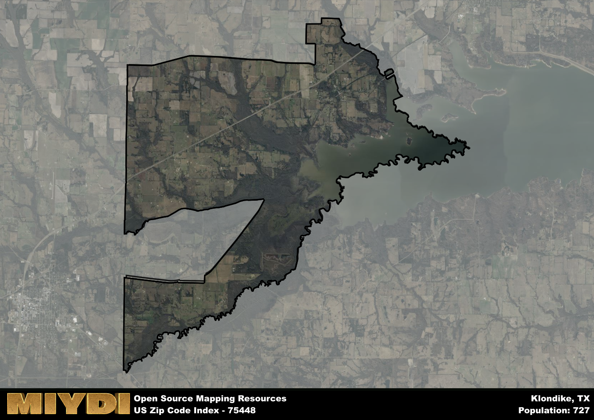

**Area Name:** Klondike

**Zip Code:** 75448

**State:** TX

Klondike is a part of the Dallas-Fort Worth-Arlington - TX Metro Area, and makes up  of the Metro's population.  

# Klondike: A Quaint Community in Northeast Texas

Located in Northeast Texas, the zip code 75448 encompasses the charming area of Klondike. Bordered by rural farmland and small communities, Klondike is situated within close proximity to larger cities such as Greenville and Sulphur Springs. Despite its rural setting, Klondike maintains a strong connection to the surrounding urban centers through its agricultural production and local businesses.

Originally settled in the late 19th century, Klondike was established as a farming community that flourished due to its fertile land and access to transportation routes. The area received its name from the Klondike gold rush in Alaska, reflecting the adventurous spirit of the early settlers. Over the years, Klondike has evolved into a close-knit community with a focus on agriculture and rural living, attracting residents seeking a slower pace of life away from the hustle and bustle of the city.

Today, Klondike remains a picturesque neighborhood with a thriving agricultural economy. Residents enjoy the tranquility of rural living while still having access to modern amenities and services. The area boasts a community center, local shops, and recreational facilities for outdoor activities. Additionally, Klondike is home to historic sites that showcase its rich heritage, making it a unique destination within the larger urban fabric of Northeast Texas.

# Klondike Demographics

The population of Klondike is 727.  
Klondike has a population density of 17.65 per square mile.  
The area of Klondike is 41.19 square miles.  

## Klondike Income and Economic Data

These demographic numbers are sourced from IRS return data, providing comprehensive insights into the population dynamics and economic trends within Klondike.

**Breakdown of return types for Klondike**

The table offers insight into the composition of tax returns filed with the IRS, categorizing them into three main types. Single returns represent filings by individuals, joint returns by married couples, and head of household returns by individuals who qualify as heads of households, typically having dependents. This breakdown provides an understanding of the different filing statuses adopted by taxpayers when submitting their tax documentation.

| Return Types filed for Klondike                              | Percentage          |
|----------------------------------------------------------|---------------------|
| Single Returns                                            | 0.41 |
| Joint Returns                                             | 0.48 |
| Head Household Returns                                    | 0.1 |

The income and economic data presented here is sourced from the IRS income brackets, utilized for categorizing tax returns by income levels. This table displays income ranges for both single filers and married couples, along with the corresponding number of returns and the percentage within each bracket, providing valuable insight into the distribution of taxes across various income groups.

| Bracket Name       | Single Filer Income Range | Married Couple Range | Number of Returns | Percentage of Returns |
|--------------------|----------------------------|----------------------|-------------------|-----------------------|
| 10% Bracket        | Up to $10,275              | Up to $20,550        | 110 | 0.38% |
| 12% Bracket        | $10,276 - $41,775          | $20,551 - $83,550    | 70 | 0.24% |
| 22% Bracket        | $41,776 - $89,075          | $83,551 - $178,150   | 50 | 0.17% |
| 24% Bracket        | $89,076 - $170,050         | $178,151 - $340,100  | 20 | 0.07% |
| 32% Bracket        | $170,051 - $215,950        | $340,101 - $431,900  | 40 | 0.14% |
| 35% Bracket        | $215,951 - $539,900        | $431,901 - $647,850  | 0 | 0% |

### Exploring Taxpayer Diversity: A Breakdown of Different Types of Tax Returns in Klondike

The table offers insights into various types of tax returns filed, reflecting different aspects of taxpayer activities and demographics. Categories include charitable returns for donations, dependent returns for claimed dependents, educator population, elderly population, real estate returns, self-employment returns, student loan returns, and unemployment returns, providing valuable insights into taxpayer behavior and demographics.

| Klondike Filing Types                    | Count | Percentage |
|--------------------------------------|-------|------------|
| Charitable Donations                 | 0 | 0% |
| Dependents Claimed                   | 0 | 0% |
| Educator Residents                   | 0 | 0% |
| Elderly Population                   | 80 | 0.28% |
| Farming Population                   | 50 | 0.172% |
| Real Estate Transactions             | 0 | 0% |
| Self-Employed Individuals            | 30 | 0.103% |
| Student Loan Cases                   | 0 | 0% |
| Unemployment Benefit Filings         | 30 | 0.1% |

## Klondike AI and Census Variables

The values presented in this dataset for Klondike are AI-optimized, streamlined, and categorized into relevant buckets for enhanced utility in AI and mapping programs. These simplified values have been optimized to facilitate efficient analysis and integration into various technological applications, offering users accessible and actionable insights into demographics within the Klondike area.

| AI Variables for Klondike | Value |
|-------------|-------|
| Shape Area | 153145512.523438 |
| Shape Length | 107305.373692352 |
| CBSA Federal Processing Standard Code | 19100 |

## How to use this free AI optimized Geo-Spatial Data for Klondike, TX

This data is made freely available under the Creative Commons license, allowing for unrestricted use for any purpose. Users can access static resources directly from GitHub or leverage more advanced functionalities by utilizing the GeoJSON files. All datasets originate from official government or private sector sources and are meticulously compiled into relevant datasets within QGIS. However, the versatility of the data ensures compatibility with any mapping application.

## Data Accuracy Disclaimer
It's important to note that the data provided here may contain errors or discrepancies and should be considered as 'close enough' for business applications and AI rather than a definitive source of truth. This data is aggregated from multiple sources, some of which publish information on wildly different intervals, leading to potential inconsistencies. Additionally, certain data points may not be corrected for Covid-related changes, further impacting accuracy. Moreover, the assumption that demographic trends are consistent throughout a region may lead to discrepancies, as trends often concentrate in areas of highest population density. As a result, dense areas may be slightly underrepresented, while rural areas may be slightly overrepresented, resulting in a more conservative dataset. Furthermore, the focus primarily on areas within US Major and Minor Statistical areas means that approximately 40 million Americans living outside of these areas may not be fully represented. Lastly, the historical background and area descriptions generated using AI are susceptible to potential mistakes, so users should exercise caution when interpreting the information provided.
