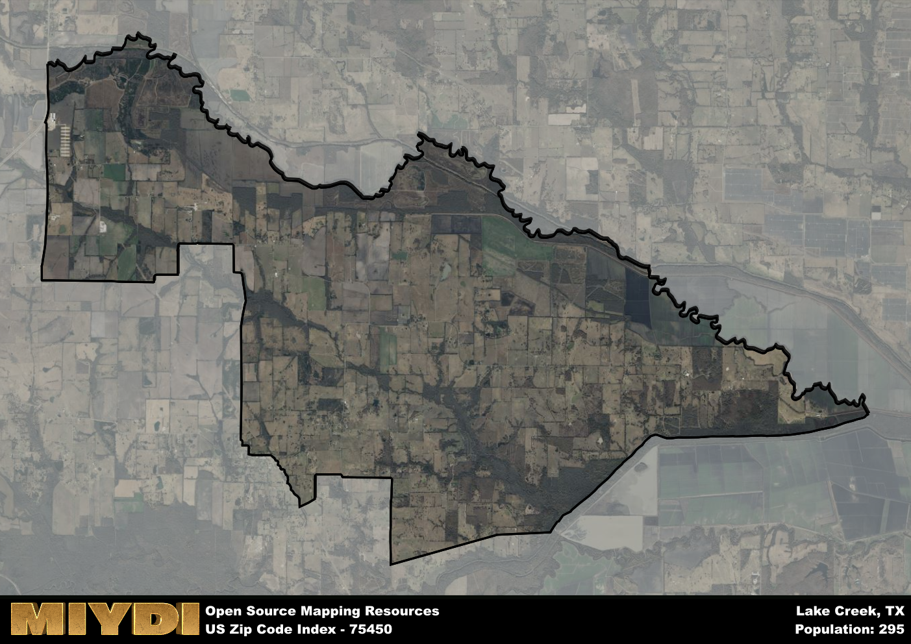

**Area Name:** Lake Creek

**Zip Code:** 75450

**State:** TX

Lake Creek is a part of the Paris - TX Micro Area, and makes up  of the Metro's population.  

# Lake Creek: A Charming Zip Code Area in Northeast Texas

Located in Northeast Texas, the zip code 75450 area corresponds to the neighborhood of Lake Creek. Bordered by the cities of Paris and Cooper, Lake Creek is a rural community that offers a peaceful escape from the hustle and bustle of larger urban centers. Despite its small size, Lake Creek is an integral part of the region, providing a close-knit community for its residents while being within driving distance of major population centers.

Lake Creek has a rich historical narrative, originating from early settlers who were drawn to the area for its fertile land and abundant natural resources. The neighborhood experienced gradual growth as farming and agriculture became the primary economic activities. Over time, Lake Creek evolved into a tight-knit community with a strong sense of heritage and pride. The name "Lake Creek" pays homage to the nearby bodies of water and streams that have played a crucial role in shaping the landscape and providing resources for its residents.

Currently, Lake Creek boasts a thriving agricultural sector, with many residents still engaged in farming and ranching activities. The neighborhood offers essential services such as schools, local shops, and community centers, fostering a strong sense of community among its residents. Additionally, Lake Creek is known for its picturesque landscapes and outdoor recreational opportunities, making it a popular destination for nature lovers and outdoor enthusiasts. Visitors can explore historic sites and cultural attractions that showcase the area's unique heritage, further enriching the vibrant tapestry of Lake Creek.

# Lake Creek Demographics

The population of Lake Creek is 295.  
Lake Creek has a population density of 7.33 per square mile.  
The area of Lake Creek is 40.22 square miles.  

## Lake Creek Income and Economic Data

These demographic numbers are sourced from IRS return data, providing comprehensive insights into the population dynamics and economic trends within Lake Creek.

**Breakdown of return types for Lake Creek**

The table offers insight into the composition of tax returns filed with the IRS, categorizing them into three main types. Single returns represent filings by individuals, joint returns by married couples, and head of household returns by individuals who qualify as heads of households, typically having dependents. This breakdown provides an understanding of the different filing statuses adopted by taxpayers when submitting their tax documentation.

| Return Types filed for Lake Creek                              | Percentage          |
|----------------------------------------------------------|---------------------|
| Single Returns                                            | 0.45 |
| Joint Returns                                             | 0.45 |
| Head Household Returns                                    | 0 |

The income and economic data presented here is sourced from the IRS income brackets, utilized for categorizing tax returns by income levels. This table displays income ranges for both single filers and married couples, along with the corresponding number of returns and the percentage within each bracket, providing valuable insight into the distribution of taxes across various income groups.

| Bracket Name       | Single Filer Income Range | Married Couple Range | Number of Returns | Percentage of Returns |
|--------------------|----------------------------|----------------------|-------------------|-----------------------|
| 10% Bracket        | Up to $10,275              | Up to $20,550        | 30 | 0.27% |
| 12% Bracket        | $10,276 - $41,775          | $20,551 - $83,550    | 20 | 0.18% |
| 22% Bracket        | $41,776 - $89,075          | $83,551 - $178,150   | 30 | 0.27% |
| 24% Bracket        | $89,076 - $170,050         | $178,151 - $340,100  | 30 | 0.27% |
| 32% Bracket        | $170,051 - $215,950        | $340,101 - $431,900  | 0 | 0% |
| 35% Bracket        | $215,951 - $539,900        | $431,901 - $647,850  | 0 | 0% |

### Exploring Taxpayer Diversity: A Breakdown of Different Types of Tax Returns in Lake Creek

The table offers insights into various types of tax returns filed, reflecting different aspects of taxpayer activities and demographics. Categories include charitable returns for donations, dependent returns for claimed dependents, educator population, elderly population, real estate returns, self-employment returns, student loan returns, and unemployment returns, providing valuable insights into taxpayer behavior and demographics.

| Lake Creek Filing Types                    | Count | Percentage |
|--------------------------------------|-------|------------|
| Charitable Donations                 | 0 | 0% |
| Dependents Claimed                   | 0 | 0% |
| Educator Residents                   | 0 | 0% |
| Elderly Population                   | 30 | 0.27% |
| Farming Population                   | 40 | 0.364% |
| Real Estate Transactions             | 0 | 0% |
| Self-Employed Individuals            | 0 | 0% |
| Student Loan Cases                   | 0 | 0% |
| Unemployment Benefit Filings         | 0 | 0% |

## Lake Creek AI and Census Variables

The values presented in this dataset for Lake Creek are AI-optimized, streamlined, and categorized into relevant buckets for enhanced utility in AI and mapping programs. These simplified values have been optimized to facilitate efficient analysis and integration into various technological applications, offering users accessible and actionable insights into demographics within the Lake Creek area.

| AI Variables for Lake Creek | Value |
|-------------|-------|
| Shape Area | 149901413.246094 |
| Shape Length | 86619.6765588198 |
| CBSA Federal Processing Standard Code | 37580 |

## How to use this free AI optimized Geo-Spatial Data for Lake Creek, TX

This data is made freely available under the Creative Commons license, allowing for unrestricted use for any purpose. Users can access static resources directly from GitHub or leverage more advanced functionalities by utilizing the GeoJSON files. All datasets originate from official government or private sector sources and are meticulously compiled into relevant datasets within QGIS. However, the versatility of the data ensures compatibility with any mapping application.

## Data Accuracy Disclaimer
It's important to note that the data provided here may contain errors or discrepancies and should be considered as 'close enough' for business applications and AI rather than a definitive source of truth. This data is aggregated from multiple sources, some of which publish information on wildly different intervals, leading to potential inconsistencies. Additionally, certain data points may not be corrected for Covid-related changes, further impacting accuracy. Moreover, the assumption that demographic trends are consistent throughout a region may lead to discrepancies, as trends often concentrate in areas of highest population density. As a result, dense areas may be slightly underrepresented, while rural areas may be slightly overrepresented, resulting in a more conservative dataset. Furthermore, the focus primarily on areas within US Major and Minor Statistical areas means that approximately 40 million Americans living outside of these areas may not be fully represented. Lastly, the historical background and area descriptions generated using AI are susceptible to potential mistakes, so users should exercise caution when interpreting the information provided.
