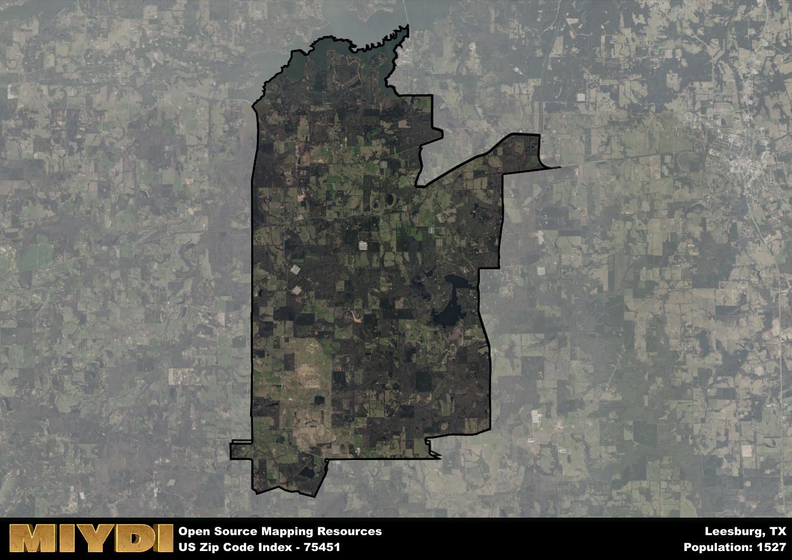

**Area Name:** Leesburg

**Zip Code:** 75451

**State:** TX

Leesburg is a part of the Mount Pleasant - TX Micro Area, and makes up  of the Metro's population.  

# Leesburg: A Charming Community in Northeast Texas

Leesburg, located within the 75451 zip code, is a picturesque rural community nestled in the heart of Northeast Texas. Bordered by the towns of Pittsburg and Winnsboro, Leesburg is part of the larger Franklin County and serves as a quaint residential area within the region. With its proximity to major highways, residents have easy access to neighboring cities like Tyler and Texarkana, making it a convenient location for those seeking a peaceful retreat while still being connected to urban amenities.

Founded in the mid-19th century, Leesburg has a rich history rooted in agriculture and farming. The area was named after General Robert E. Lee and has maintained its small-town charm over the years. As settlers moved in, the community grew around the fertile land, attracting families looking to establish homesteads and build a close-knit community. Today, Leesburg retains its historic character with well-preserved buildings and landmarks that pay homage to its early days.

Present-day Leesburg is a thriving community with a mix of residential and commercial establishments. The area boasts a range of local businesses, from family-owned shops to cozy cafes, creating a vibrant atmosphere for residents and visitors alike. Outdoor enthusiasts can enjoy the natural beauty of the surrounding countryside with parks, hiking trails, and fishing spots nearby. Additionally, Leesburg hosts annual events and festivals that celebrate its heritage, providing a glimpse into the area's cultural identity and sense of community.

# Leesburg Demographics

The population of Leesburg is 1527.  
Leesburg has a population density of 35.27 per square mile.  
The area of Leesburg is 43.29 square miles.  

## Leesburg Income and Economic Data

These demographic numbers are sourced from IRS return data, providing comprehensive insights into the population dynamics and economic trends within Leesburg.

**Breakdown of return types for Leesburg**

The table offers insight into the composition of tax returns filed with the IRS, categorizing them into three main types. Single returns represent filings by individuals, joint returns by married couples, and head of household returns by individuals who qualify as heads of households, typically having dependents. This breakdown provides an understanding of the different filing statuses adopted by taxpayers when submitting their tax documentation.

| Return Types filed for Leesburg                              | Percentage          |
|----------------------------------------------------------|---------------------|
| Single Returns                                            | 0.39 |
| Joint Returns                                             | 0.48 |
| Head Household Returns                                    | 0.15 |

The income and economic data presented here is sourced from the IRS income brackets, utilized for categorizing tax returns by income levels. This table displays income ranges for both single filers and married couples, along with the corresponding number of returns and the percentage within each bracket, providing valuable insight into the distribution of taxes across various income groups.

| Bracket Name       | Single Filer Income Range | Married Couple Range | Number of Returns | Percentage of Returns |
|--------------------|----------------------------|----------------------|-------------------|-----------------------|
| 10% Bracket        | Up to $10,275              | Up to $20,550        | 200 | 0.37% |
| 12% Bracket        | $10,276 - $41,775          | $20,551 - $83,550    | 140 | 0.26% |
| 22% Bracket        | $41,776 - $89,075          | $83,551 - $178,150   | 80 | 0.15% |
| 24% Bracket        | $89,076 - $170,050         | $178,151 - $340,100  | 50 | 0.09% |
| 32% Bracket        | $170,051 - $215,950        | $340,101 - $431,900  | 70 | 0.13% |
| 35% Bracket        | $215,951 - $539,900        | $431,901 - $647,850  | 0 | 0% |

### Exploring Taxpayer Diversity: A Breakdown of Different Types of Tax Returns in Leesburg

The table offers insights into various types of tax returns filed, reflecting different aspects of taxpayer activities and demographics. Categories include charitable returns for donations, dependent returns for claimed dependents, educator population, elderly population, real estate returns, self-employment returns, student loan returns, and unemployment returns, providing valuable insights into taxpayer behavior and demographics.

| Leesburg Filing Types                    | Count | Percentage |
|--------------------------------------|-------|------------|
| Charitable Donations                 | 0 | 0% |
| Dependents Claimed                   | 0 | 0% |
| Educator Residents                   | 0 | 0% |
| Elderly Population                   | 170 | 0.31% |
| Farming Population                   | 70 | 0.13% |
| Real Estate Transactions             | 0 | 0% |
| Self-Employed Individuals            | 70 | 0.13% |
| Student Loan Cases                   | 0 | 0% |
| Unemployment Benefit Filings         | 60 | 0.11% |

## Leesburg AI and Census Variables

The values presented in this dataset for Leesburg are AI-optimized, streamlined, and categorized into relevant buckets for enhanced utility in AI and mapping programs. These simplified values have been optimized to facilitate efficient analysis and integration into various technological applications, offering users accessible and actionable insights into demographics within the Leesburg area.

| AI Variables for Leesburg | Value |
|-------------|-------|
| Shape Area | 159699923.773438 |
| Shape Length | 77822.6122308785 |
| CBSA Federal Processing Standard Code | 34420 |

## How to use this free AI optimized Geo-Spatial Data for Leesburg, TX

This data is made freely available under the Creative Commons license, allowing for unrestricted use for any purpose. Users can access static resources directly from GitHub or leverage more advanced functionalities by utilizing the GeoJSON files. All datasets originate from official government or private sector sources and are meticulously compiled into relevant datasets within QGIS. However, the versatility of the data ensures compatibility with any mapping application.

## Data Accuracy Disclaimer
It's important to note that the data provided here may contain errors or discrepancies and should be considered as 'close enough' for business applications and AI rather than a definitive source of truth. This data is aggregated from multiple sources, some of which publish information on wildly different intervals, leading to potential inconsistencies. Additionally, certain data points may not be corrected for Covid-related changes, further impacting accuracy. Moreover, the assumption that demographic trends are consistent throughout a region may lead to discrepancies, as trends often concentrate in areas of highest population density. As a result, dense areas may be slightly underrepresented, while rural areas may be slightly overrepresented, resulting in a more conservative dataset. Furthermore, the focus primarily on areas within US Major and Minor Statistical areas means that approximately 40 million Americans living outside of these areas may not be fully represented. Lastly, the historical background and area descriptions generated using AI are susceptible to potential mistakes, so users should exercise caution when interpreting the information provided.
