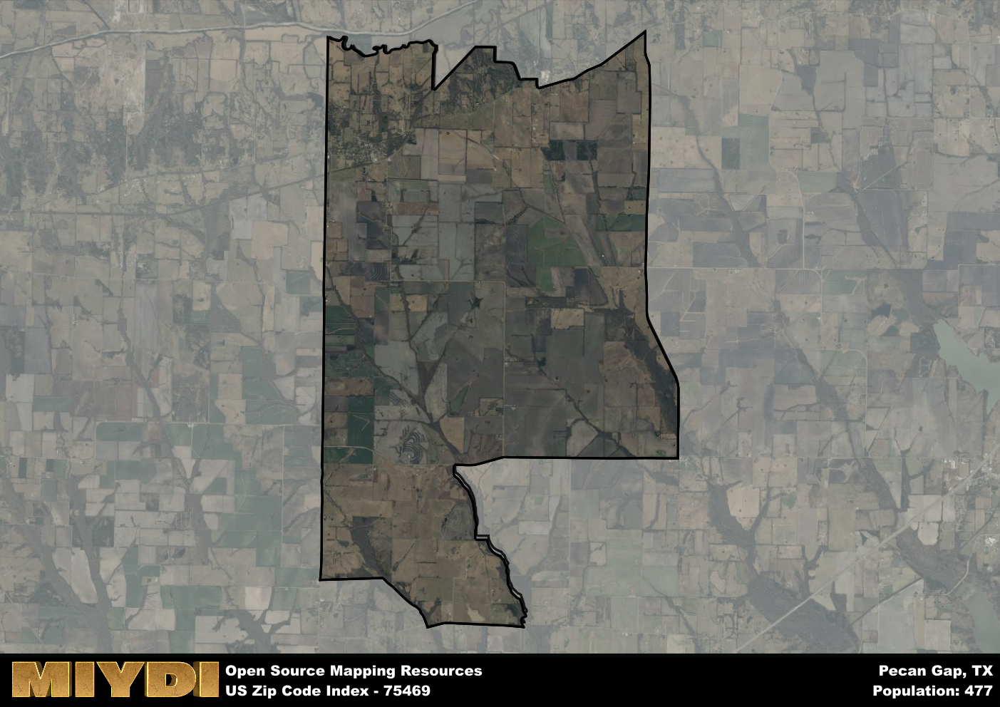

**Area Name:** Pecan Gap

**Zip Code:** 75469

**State:** TX

Pecan Gap is a part of the Paris - TX Micro Area, and makes up  of the Metro's population.  

# Pecan Gap: A Charming Community in Northeast Texas  

Located in the northeastern part of Texas, zip code 75469 is home to the quaint town of Pecan Gap. This area is surrounded by the cities of Cooper, Ladonia, and Honey Grove, and is situated within close proximity to larger population centers such as Paris and Greenville. Pecan Gap seamlessly integrates with the rural landscape of Northeast Texas, offering residents a peaceful and serene environment to call home.

Pecan Gap has a rich historical narrative, dating back to its establishment in the 19th century. The town was named for the abundance of pecan trees in the area and was initially settled by pioneers seeking fertile land for farming and ranching. Over the years, Pecan Gap has grown into a close-knit community with a strong sense of history and tradition, evident in its well-preserved downtown area and historic buildings.

Today, Pecan Gap remains a vibrant community with a mix of agricultural and small businesses driving its economy. Residents enjoy a range of neighborhood-specific services, including local shops, restaurants, and schools. The town also boasts recreational amenities such as parks and outdoor spaces, making it an ideal place for outdoor enthusiasts. Visitors can explore the town's historic sites and immerse themselves in the unique culture of Pecan Gap, making it a hidden gem within the larger Northeast Texas region.

# Pecan Gap Demographics

The population of Pecan Gap is 477.  
Pecan Gap has a population density of 16.2 per square mile.  
The area of Pecan Gap is 29.44 square miles.  

## Pecan Gap Income and Economic Data

These demographic numbers are sourced from IRS return data, providing comprehensive insights into the population dynamics and economic trends within Pecan Gap.

**Breakdown of return types for Pecan Gap**

The table offers insight into the composition of tax returns filed with the IRS, categorizing them into three main types. Single returns represent filings by individuals, joint returns by married couples, and head of household returns by individuals who qualify as heads of households, typically having dependents. This breakdown provides an understanding of the different filing statuses adopted by taxpayers when submitting their tax documentation.

| Return Types filed for Pecan Gap                              | Percentage          |
|----------------------------------------------------------|---------------------|
| Single Returns                                            | 0.44 |
| Joint Returns                                             | 0.5 |
| Head Household Returns                                    | 0 |

The income and economic data presented here is sourced from the IRS income brackets, utilized for categorizing tax returns by income levels. This table displays income ranges for both single filers and married couples, along with the corresponding number of returns and the percentage within each bracket, providing valuable insight into the distribution of taxes across various income groups.

| Bracket Name       | Single Filer Income Range | Married Couple Range | Number of Returns | Percentage of Returns |
|--------------------|----------------------------|----------------------|-------------------|-----------------------|
| 10% Bracket        | Up to $10,275              | Up to $20,550        | 60 | 0.38% |
| 12% Bracket        | $10,276 - $41,775          | $20,551 - $83,550    | 40 | 0.25% |
| 22% Bracket        | $41,776 - $89,075          | $83,551 - $178,150   | 30 | 0.19% |
| 24% Bracket        | $89,076 - $170,050         | $178,151 - $340,100  | 0 | 0% |
| 32% Bracket        | $170,051 - $215,950        | $340,101 - $431,900  | 30 | 0.19% |
| 35% Bracket        | $215,951 - $539,900        | $431,901 - $647,850  | 0 | 0% |

### Exploring Taxpayer Diversity: A Breakdown of Different Types of Tax Returns in Pecan Gap

The table offers insights into various types of tax returns filed, reflecting different aspects of taxpayer activities and demographics. Categories include charitable returns for donations, dependent returns for claimed dependents, educator population, elderly population, real estate returns, self-employment returns, student loan returns, and unemployment returns, providing valuable insights into taxpayer behavior and demographics.

| Pecan Gap Filing Types                    | Count | Percentage |
|--------------------------------------|-------|------------|
| Charitable Donations                 | 0 | 0% |
| Dependents Claimed                   | 0 | 0% |
| Educator Residents                   | 0 | 0% |
| Elderly Population                   | 60 | 0.38% |
| Farming Population                   | 20 | 0.125% |
| Real Estate Transactions             | 0 | 0% |
| Self-Employed Individuals            | 0 | 0% |
| Student Loan Cases                   | 0 | 0% |
| Unemployment Benefit Filings         | 0 | 0% |

## Pecan Gap AI and Census Variables

The values presented in this dataset for Pecan Gap are AI-optimized, streamlined, and categorized into relevant buckets for enhanced utility in AI and mapping programs. These simplified values have been optimized to facilitate efficient analysis and integration into various technological applications, offering users accessible and actionable insights into demographics within the Pecan Gap area.

| AI Variables for Pecan Gap | Value |
|-------------|-------|
| Shape Area | 109694886.179688 |
| Shape Length | 56002.0717929195 |
| CBSA Federal Processing Standard Code | 37580 |

## How to use this free AI optimized Geo-Spatial Data for Pecan Gap, TX

This data is made freely available under the Creative Commons license, allowing for unrestricted use for any purpose. Users can access static resources directly from GitHub or leverage more advanced functionalities by utilizing the GeoJSON files. All datasets originate from official government or private sector sources and are meticulously compiled into relevant datasets within QGIS. However, the versatility of the data ensures compatibility with any mapping application.

## Data Accuracy Disclaimer
It's important to note that the data provided here may contain errors or discrepancies and should be considered as 'close enough' for business applications and AI rather than a definitive source of truth. This data is aggregated from multiple sources, some of which publish information on wildly different intervals, leading to potential inconsistencies. Additionally, certain data points may not be corrected for Covid-related changes, further impacting accuracy. Moreover, the assumption that demographic trends are consistent throughout a region may lead to discrepancies, as trends often concentrate in areas of highest population density. As a result, dense areas may be slightly underrepresented, while rural areas may be slightly overrepresented, resulting in a more conservative dataset. Furthermore, the focus primarily on areas within US Major and Minor Statistical areas means that approximately 40 million Americans living outside of these areas may not be fully represented. Lastly, the historical background and area descriptions generated using AI are susceptible to potential mistakes, so users should exercise caution when interpreting the information provided.
