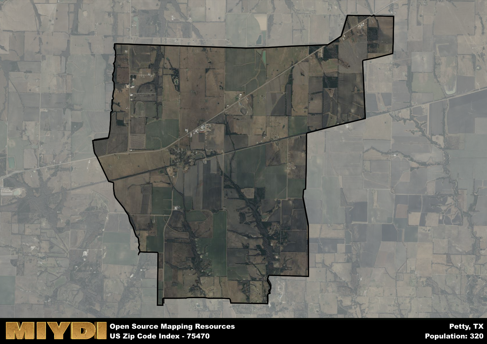

**Area Name:** Petty

**Zip Code:** 75470

**State:** TX

Petty is a part of the Paris - TX Micro Area, and makes up  of the Metro's population.  

# The Charming Neighborhood of Petty, Texas (Zip Code: 75470)

Located in northeast Texas, the zip code area of 75470 encompasses the quaint neighborhood of Petty. Situated within Lamar County, Petty is surrounded by the cities of Paris to the south and Reno to the east. This close proximity allows residents easy access to urban amenities while enjoying the peaceful atmosphere of a smaller community. Petty also benefits from its location near major highways, making it a convenient stop for travelers passing through the region.

Petty has a rich historical narrative, dating back to its establishment in the late 19th century. Originally known for its fertile farmland, the area quickly grew as settlers arrived to take advantage of the agricultural opportunities. The neighborhood was officially named Petty in honor of an early pioneer family. Over the years, Petty has maintained its small-town charm, with a strong sense of community and pride in its heritage.

Today, Petty remains a close-knit community with a focus on agriculture and small businesses. Residents enjoy local shops and restaurants, as well as access to outdoor recreational activities such as fishing and hiking. The area is also home to several historic sites, including the Petty Methodist Church, which serves as a reminder of the neighborhood's past. With its blend of history and modern conveniences, Petty continues to be a charming destination for both residents and visitors alike.

# Petty Demographics

The population of Petty is 320.  
Petty has a population density of 20.9 per square mile.  
The area of Petty is 15.31 square miles.  

## Petty AI and Census Variables

The values presented in this dataset for Petty are AI-optimized, streamlined, and categorized into relevant buckets for enhanced utility in AI and mapping programs. These simplified values have been optimized to facilitate efficient analysis and integration into various technological applications, offering users accessible and actionable insights into demographics within the Petty area.

| AI Variables for Petty | Value |
|-------------|-------|
| Shape Area | 57317469.5390625 |
| Shape Length | 37771.0307157393 |
| CBSA Federal Processing Standard Code | 37580 |

## How to use this free AI optimized Geo-Spatial Data for Petty, TX

This data is made freely available under the Creative Commons license, allowing for unrestricted use for any purpose. Users can access static resources directly from GitHub or leverage more advanced functionalities by utilizing the GeoJSON files. All datasets originate from official government or private sector sources and are meticulously compiled into relevant datasets within QGIS. However, the versatility of the data ensures compatibility with any mapping application.

## Data Accuracy Disclaimer
It's important to note that the data provided here may contain errors or discrepancies and should be considered as 'close enough' for business applications and AI rather than a definitive source of truth. This data is aggregated from multiple sources, some of which publish information on wildly different intervals, leading to potential inconsistencies. Additionally, certain data points may not be corrected for Covid-related changes, further impacting accuracy. Moreover, the assumption that demographic trends are consistent throughout a region may lead to discrepancies, as trends often concentrate in areas of highest population density. As a result, dense areas may be slightly underrepresented, while rural areas may be slightly overrepresented, resulting in a more conservative dataset. Furthermore, the focus primarily on areas within US Major and Minor Statistical areas means that approximately 40 million Americans living outside of these areas may not be fully represented. Lastly, the historical background and area descriptions generated using AI are susceptible to potential mistakes, so users should exercise caution when interpreting the information provided.
