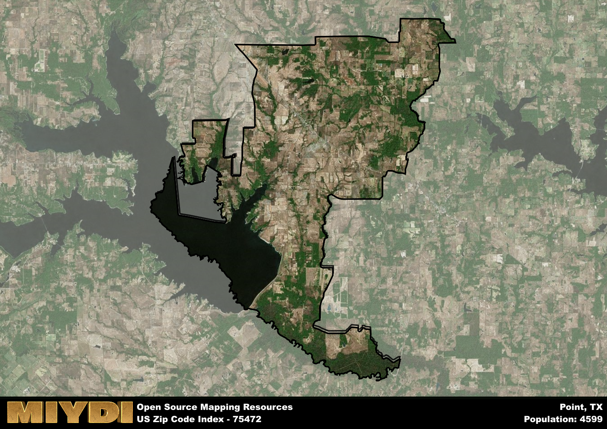

**Area Name:** Point

**Zip Code:** 75472

**State:** TX

Point is a part of the Sulphur Springs - TX Micro Area, and makes up  of the Metro's population.  

# Point, Texas 75472: A Historic and Vibrant Neighborhood in Northeast Texas  

Located in the northeastern region of Texas, the zip code area 75472 corresponds to the charming neighborhood of Point. Situated within Rains County, Point is surrounded by the towns of Emory, East Tawakoni, and Quinlan. It is a part of the larger Dallas-Fort Worth metropolitan area, providing residents with access to urban amenities while maintaining a small-town atmosphere. 

Point has a rich historical narrative that dates back to its establishment in the mid-19th century. Originally known as Bois d'Arc, the town was renamed Point in the early 1900s due to its location at a railroad junction. The area experienced growth with the arrival of the railroad, attracting settlers and businesses to the bustling town. Throughout the years, Point has retained its small-town charm while adapting to modern developments.

Today, Point offers a blend of rural tranquility and modern conveniences to its residents. The area is known for its agricultural activities, with farms and ranches dotting the landscape. Residents can enjoy recreational activities at nearby Lake Tawakoni State Park or explore the historic downtown area. Point also boasts a close-knit community with locally-owned businesses, schools, and churches that contribute to its unique character within the Dallas-Fort Worth metropolitan area.

# Point Demographics

The population of Point is 4599.  
Point has a population density of 47.93 per square mile.  
The area of Point is 95.96 square miles.  

## Point Income and Economic Data

These demographic numbers are sourced from IRS return data, providing comprehensive insights into the population dynamics and economic trends within Point.

**Breakdown of return types for Point**

The table offers insight into the composition of tax returns filed with the IRS, categorizing them into three main types. Single returns represent filings by individuals, joint returns by married couples, and head of household returns by individuals who qualify as heads of households, typically having dependents. This breakdown provides an understanding of the different filing statuses adopted by taxpayers when submitting their tax documentation.

| Return Types filed for Point                              | Percentage          |
|----------------------------------------------------------|---------------------|
| Single Returns                                            | 0.44 |
| Joint Returns                                             | 0.43 |
| Head Household Returns                                    | 0.12 |

The income and economic data presented here is sourced from the IRS income brackets, utilized for categorizing tax returns by income levels. This table displays income ranges for both single filers and married couples, along with the corresponding number of returns and the percentage within each bracket, providing valuable insight into the distribution of taxes across various income groups.

| Bracket Name       | Single Filer Income Range | Married Couple Range | Number of Returns | Percentage of Returns |
|--------------------|----------------------------|----------------------|-------------------|-----------------------|
| 10% Bracket        | Up to $10,275              | Up to $20,550        | 650 | 0.38% |
| 12% Bracket        | $10,276 - $41,775          | $20,551 - $83,550    | 420 | 0.25% |
| 22% Bracket        | $41,776 - $89,075          | $83,551 - $178,150   | 280 | 0.16% |
| 24% Bracket        | $89,076 - $170,050         | $178,151 - $340,100  | 140 | 0.08% |
| 32% Bracket        | $170,051 - $215,950        | $340,101 - $431,900  | 190 | 0.11% |
| 35% Bracket        | $215,951 - $539,900        | $431,901 - $647,850  | 30 | 0.02% |

### Exploring Taxpayer Diversity: A Breakdown of Different Types of Tax Returns in Point

The table offers insights into various types of tax returns filed, reflecting different aspects of taxpayer activities and demographics. Categories include charitable returns for donations, dependent returns for claimed dependents, educator population, elderly population, real estate returns, self-employment returns, student loan returns, and unemployment returns, providing valuable insights into taxpayer behavior and demographics.

| Point Filing Types                    | Count | Percentage |
|--------------------------------------|-------|------------|
| Charitable Donations                 | 50 | 0.029% |
| Dependents Claimed                   | 30 | 0.018% |
| Educator Residents                   | 30 | 0.018% |
| Elderly Population                   | 520 | 0.3% |
| Farming Population                   | 130 | 0.076% |
| Real Estate Transactions             | 50 | 0.029% |
| Self-Employed Individuals            | 210 | 0.123% |
| Student Loan Cases                   | 70 | 0.041% |
| Unemployment Benefit Filings         | 220 | 0.13% |

## Point AI and Census Variables

The values presented in this dataset for Point are AI-optimized, streamlined, and categorized into relevant buckets for enhanced utility in AI and mapping programs. These simplified values have been optimized to facilitate efficient analysis and integration into various technological applications, offering users accessible and actionable insights into demographics within the Point area.

| AI Variables for Point | Value |
|-------------|-------|
| Shape Area | 353507397.539063 |
| Shape Length | 181632.360291444 |
| CBSA Federal Processing Standard Code | 44860 |

## How to use this free AI optimized Geo-Spatial Data for Point, TX

This data is made freely available under the Creative Commons license, allowing for unrestricted use for any purpose. Users can access static resources directly from GitHub or leverage more advanced functionalities by utilizing the GeoJSON files. All datasets originate from official government or private sector sources and are meticulously compiled into relevant datasets within QGIS. However, the versatility of the data ensures compatibility with any mapping application.

## Data Accuracy Disclaimer
It's important to note that the data provided here may contain errors or discrepancies and should be considered as 'close enough' for business applications and AI rather than a definitive source of truth. This data is aggregated from multiple sources, some of which publish information on wildly different intervals, leading to potential inconsistencies. Additionally, certain data points may not be corrected for Covid-related changes, further impacting accuracy. Moreover, the assumption that demographic trends are consistent throughout a region may lead to discrepancies, as trends often concentrate in areas of highest population density. As a result, dense areas may be slightly underrepresented, while rural areas may be slightly overrepresented, resulting in a more conservative dataset. Furthermore, the focus primarily on areas within US Major and Minor Statistical areas means that approximately 40 million Americans living outside of these areas may not be fully represented. Lastly, the historical background and area descriptions generated using AI are susceptible to potential mistakes, so users should exercise caution when interpreting the information provided.
