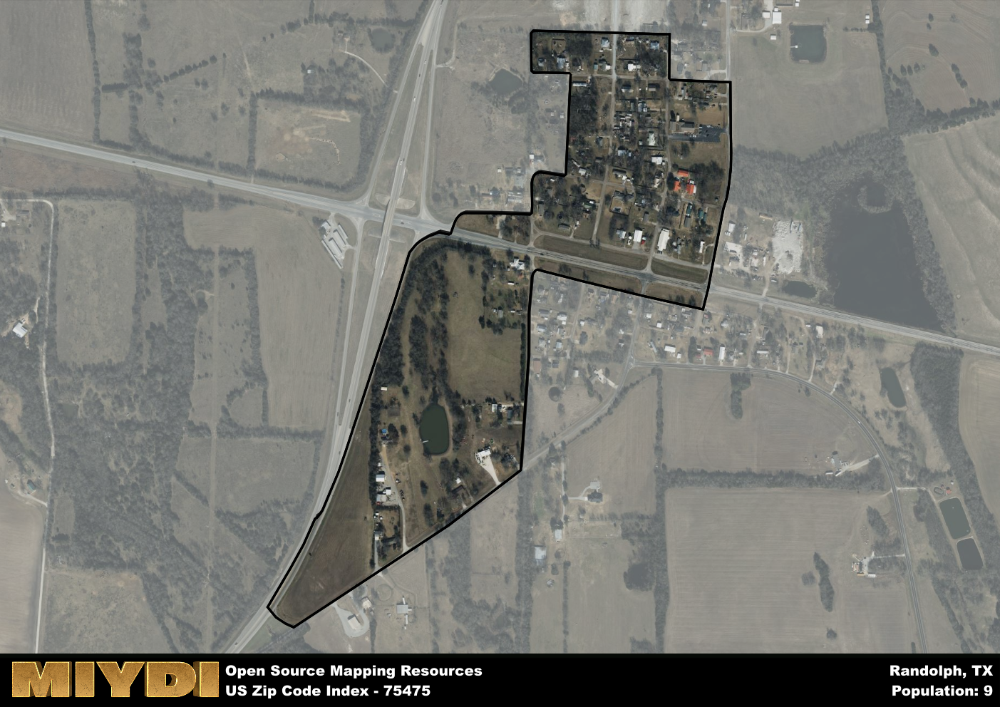

**Area Name:** Randolph

**Zip Code:** 75475

**State:** TX

Randolph is a part of the Bonham - TX Micro Area, and makes up  of the Metro's population.  

# Randolph: A Charming Neighborhood in Northeast Texas

Randolph, corresponding to the zip code 75475, is a picturesque neighborhood located in northeast Texas. Bordered by the city of Whitewright to the south and Bonham to the north, Randolph seamlessly integrates with the surrounding rural landscape while maintaining its own unique identity. Situated within Fannin County, this area serves as a tranquil retreat from the hustle and bustle of nearby urban centers.

Originally settled in the mid-19th century, Randolph has a rich historical narrative that traces back to the early pioneers who established farms and homesteads in the region. Over the years, the area experienced steady growth due to its fertile soil and access to transportation routes. The community was named after John Randolph, a prominent figure in Texas history, further solidifying its place in the state's heritage.

Today, Randolph is a thriving community known for its agricultural heritage and friendly atmosphere. The area boasts a mix of small businesses, family-owned farms, and community events that celebrate its rich history. Residents and visitors alike can enjoy local produce markets, charming bed and breakfasts, and outdoor recreational opportunities that highlight the natural beauty of northeast Texas. With a strong sense of community pride and a dedication to preserving its historic charm, Randolph continues to be a hidden gem in the Lone Star State.

# Randolph Demographics

The population of Randolph is 9.  
Randolph has a population density of 69.23 per square mile.  
The area of Randolph is 0.13 square miles.  

## Randolph AI and Census Variables

The values presented in this dataset for Randolph are AI-optimized, streamlined, and categorized into relevant buckets for enhanced utility in AI and mapping programs. These simplified values have been optimized to facilitate efficient analysis and integration into various technological applications, offering users accessible and actionable insights into demographics within the Randolph area.

| AI Variables for Randolph | Value |
|-------------|-------|
| Shape Area | 472212.9453125 |
| Shape Length | 4242.81057615371 |
| CBSA Federal Processing Standard Code | 14300 |

## How to use this free AI optimized Geo-Spatial Data for Randolph, TX

This data is made freely available under the Creative Commons license, allowing for unrestricted use for any purpose. Users can access static resources directly from GitHub or leverage more advanced functionalities by utilizing the GeoJSON files. All datasets originate from official government or private sector sources and are meticulously compiled into relevant datasets within QGIS. However, the versatility of the data ensures compatibility with any mapping application.

## Data Accuracy Disclaimer
It's important to note that the data provided here may contain errors or discrepancies and should be considered as 'close enough' for business applications and AI rather than a definitive source of truth. This data is aggregated from multiple sources, some of which publish information on wildly different intervals, leading to potential inconsistencies. Additionally, certain data points may not be corrected for Covid-related changes, further impacting accuracy. Moreover, the assumption that demographic trends are consistent throughout a region may lead to discrepancies, as trends often concentrate in areas of highest population density. As a result, dense areas may be slightly underrepresented, while rural areas may be slightly overrepresented, resulting in a more conservative dataset. Furthermore, the focus primarily on areas within US Major and Minor Statistical areas means that approximately 40 million Americans living outside of these areas may not be fully represented. Lastly, the historical background and area descriptions generated using AI are susceptible to potential mistakes, so users should exercise caution when interpreting the information provided.
