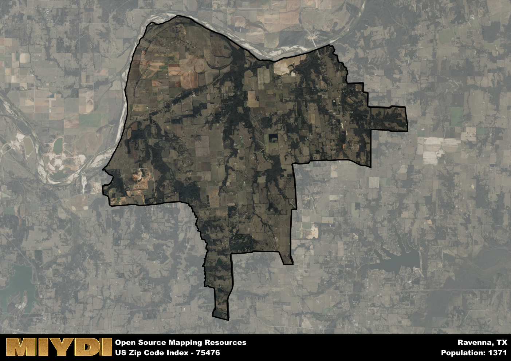

**Area Name:** Ravenna

**Zip Code:** 75476

**State:** TX

Ravenna is a part of the Bonham - TX Micro Area, and makes up  of the Metro's population.  

# Ravenna: A Historic and Vibrant Community in Northeast Texas  

Located in Fannin County, the zip code area 75476 encompasses the charming neighborhood of Ravenna. Situated in northeast Texas, Ravenna is surrounded by the cities of Bonham to the northeast and Honey Grove to the southwest. This small yet bustling community plays an integral role in the larger urban fabric of Fannin County, offering a blend of rural tranquility and urban convenience to its residents.

Ravenna has a rich historical narrative, dating back to its founding in the mid-1800s. Originally settled by European immigrants seeking fertile land for agriculture, the area quickly grew into a thriving agricultural hub. Ravenna was officially incorporated in 1883, named after the Italian city known for its cultural heritage and artistic significance. Over the years, Ravenna has maintained its small-town charm while adapting to modern developments, making it a sought-after destination for those seeking a close-knit community.

Today, Ravenna boasts a diverse economy supported by agriculture, small businesses, and local services. Residents and visitors alike can enjoy a variety of recreational amenities, including parks, community centers, and cultural events that showcase the area's unique heritage. Additionally, Ravenna is home to historic sites that offer a glimpse into its past, preserving the legacy of the early settlers who shaped the neighborhood into what it is today. With its blend of history, economic vitality, and community spirit, Ravenna continues to thrive as a vibrant and welcoming neighborhood in northeast Texas.

# Ravenna Demographics

The population of Ravenna is 1371.  
Ravenna has a population density of 28.14 per square mile.  
The area of Ravenna is 48.72 square miles.  

## Ravenna Income and Economic Data

These demographic numbers are sourced from IRS return data, providing comprehensive insights into the population dynamics and economic trends within Ravenna.

**Breakdown of return types for Ravenna**

The table offers insight into the composition of tax returns filed with the IRS, categorizing them into three main types. Single returns represent filings by individuals, joint returns by married couples, and head of household returns by individuals who qualify as heads of households, typically having dependents. This breakdown provides an understanding of the different filing statuses adopted by taxpayers when submitting their tax documentation.

| Return Types filed for Ravenna                              | Percentage          |
|----------------------------------------------------------|---------------------|
| Single Returns                                            | 0.4 |
| Joint Returns                                             | 0.46 |
| Head Household Returns                                    | 0.11 |

The income and economic data presented here is sourced from the IRS income brackets, utilized for categorizing tax returns by income levels. This table displays income ranges for both single filers and married couples, along with the corresponding number of returns and the percentage within each bracket, providing valuable insight into the distribution of taxes across various income groups.

| Bracket Name       | Single Filer Income Range | Married Couple Range | Number of Returns | Percentage of Returns |
|--------------------|----------------------------|----------------------|-------------------|-----------------------|
| 10% Bracket        | Up to $10,275              | Up to $20,550        | 180 | 0.32% |
| 12% Bracket        | $10,276 - $41,775          | $20,551 - $83,550    | 150 | 0.26% |
| 22% Bracket        | $41,776 - $89,075          | $83,551 - $178,150   | 80 | 0.14% |
| 24% Bracket        | $89,076 - $170,050         | $178,151 - $340,100  | 60 | 0.11% |
| 32% Bracket        | $170,051 - $215,950        | $340,101 - $431,900  | 100 | 0.18% |
| 35% Bracket        | $215,951 - $539,900        | $431,901 - $647,850  | 0 | 0% |

### Exploring Taxpayer Diversity: A Breakdown of Different Types of Tax Returns in Ravenna

The table offers insights into various types of tax returns filed, reflecting different aspects of taxpayer activities and demographics. Categories include charitable returns for donations, dependent returns for claimed dependents, educator population, elderly population, real estate returns, self-employment returns, student loan returns, and unemployment returns, providing valuable insights into taxpayer behavior and demographics.

| Ravenna Filing Types                    | Count | Percentage |
|--------------------------------------|-------|------------|
| Charitable Donations                 | 0 | 0% |
| Dependents Claimed                   | 0 | 0% |
| Educator Residents                   | 0 | 0% |
| Elderly Population                   | 180 | 0.32% |
| Farming Population                   | 90 | 0.158% |
| Real Estate Transactions             | 20 | 0.035% |
| Self-Employed Individuals            | 80 | 0.14% |
| Student Loan Cases                   | 0 | 0% |
| Unemployment Benefit Filings         | 50 | 0.09% |

## Ravenna AI and Census Variables

The values presented in this dataset for Ravenna are AI-optimized, streamlined, and categorized into relevant buckets for enhanced utility in AI and mapping programs. These simplified values have been optimized to facilitate efficient analysis and integration into various technological applications, offering users accessible and actionable insights into demographics within the Ravenna area.

| AI Variables for Ravenna | Value |
|-------------|-------|
| Shape Area | 182807824.507813 |
| Shape Length | 79359.3094366331 |
| CBSA Federal Processing Standard Code | 14300 |

## How to use this free AI optimized Geo-Spatial Data for Ravenna, TX

This data is made freely available under the Creative Commons license, allowing for unrestricted use for any purpose. Users can access static resources directly from GitHub or leverage more advanced functionalities by utilizing the GeoJSON files. All datasets originate from official government or private sector sources and are meticulously compiled into relevant datasets within QGIS. However, the versatility of the data ensures compatibility with any mapping application.

## Data Accuracy Disclaimer
It's important to note that the data provided here may contain errors or discrepancies and should be considered as 'close enough' for business applications and AI rather than a definitive source of truth. This data is aggregated from multiple sources, some of which publish information on wildly different intervals, leading to potential inconsistencies. Additionally, certain data points may not be corrected for Covid-related changes, further impacting accuracy. Moreover, the assumption that demographic trends are consistent throughout a region may lead to discrepancies, as trends often concentrate in areas of highest population density. As a result, dense areas may be slightly underrepresented, while rural areas may be slightly overrepresented, resulting in a more conservative dataset. Furthermore, the focus primarily on areas within US Major and Minor Statistical areas means that approximately 40 million Americans living outside of these areas may not be fully represented. Lastly, the historical background and area descriptions generated using AI are susceptible to potential mistakes, so users should exercise caution when interpreting the information provided.
