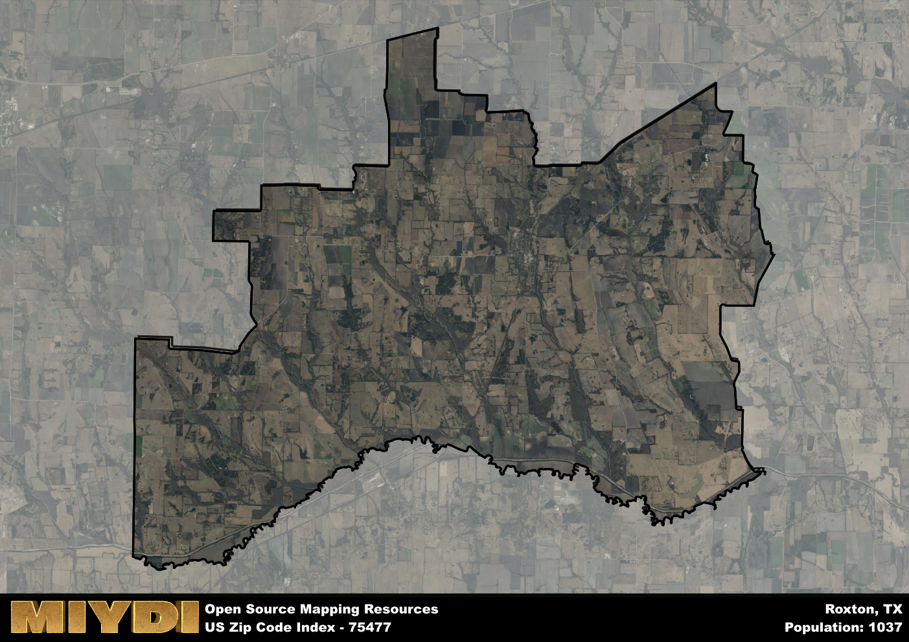

**Area Name:** Roxton

**Zip Code:** 75477

**State:** TX

Roxton is a part of the Paris - TX Micro Area, and makes up  of the Metro's population.  

# Roxton: A Quaint Neighborhood in Northeast Texas  

Roxton, located within the 75477 zip code, is a charming small town nestled in the northeast region of Texas. Situated in Lamar County, Roxton is surrounded by the cities of Paris to the south and Clarksville to the northeast. This close proximity allows residents to easily access the amenities and services of larger urban centers while enjoying the peaceful ambiance of a smaller community.

The history of Roxton dates back to the early 19th century when it was founded as a trading post along the Chisum Trail. Over the years, the town grew as a hub for agriculture and commerce, attracting settlers and businesses to the area. Roxton played a significant role in the development of the region, contributing to the economic vitality of Lamar County and becoming a well-established community known for its friendly residents and strong sense of community.

Today, Roxton maintains its agricultural roots while also embracing modern amenities and services. The town boasts a mix of locally-owned businesses, including shops, restaurants, and services that cater to the needs of residents. Outdoor enthusiasts can explore the nearby parks and recreational areas, while history buffs can visit the local museum to learn more about the town's past. With its blend of historic charm and contemporary conveniences, Roxton offers a unique living experience in the heart of northeast Texas.

# Roxton Demographics

The population of Roxton is 1037.  
Roxton has a population density of 13.65 per square mile.  
The area of Roxton is 75.97 square miles.  

## Roxton Income and Economic Data

These demographic numbers are sourced from IRS return data, providing comprehensive insights into the population dynamics and economic trends within Roxton.

**Breakdown of return types for Roxton**

The table offers insight into the composition of tax returns filed with the IRS, categorizing them into three main types. Single returns represent filings by individuals, joint returns by married couples, and head of household returns by individuals who qualify as heads of households, typically having dependents. This breakdown provides an understanding of the different filing statuses adopted by taxpayers when submitting their tax documentation.

| Return Types filed for Roxton                              | Percentage          |
|----------------------------------------------------------|---------------------|
| Single Returns                                            | 0.42 |
| Joint Returns                                             | 0.39 |
| Head Household Returns                                    | 0.13 |

The income and economic data presented here is sourced from the IRS income brackets, utilized for categorizing tax returns by income levels. This table displays income ranges for both single filers and married couples, along with the corresponding number of returns and the percentage within each bracket, providing valuable insight into the distribution of taxes across various income groups.

| Bracket Name       | Single Filer Income Range | Married Couple Range | Number of Returns | Percentage of Returns |
|--------------------|----------------------------|----------------------|-------------------|-----------------------|
| 10% Bracket        | Up to $10,275              | Up to $20,550        | 150 | 0.39% |
| 12% Bracket        | $10,276 - $41,775          | $20,551 - $83,550    | 110 | 0.29% |
| 22% Bracket        | $41,776 - $89,075          | $83,551 - $178,150   | 50 | 0.13% |
| 24% Bracket        | $89,076 - $170,050         | $178,151 - $340,100  | 30 | 0.08% |
| 32% Bracket        | $170,051 - $215,950        | $340,101 - $431,900  | 40 | 0.11% |
| 35% Bracket        | $215,951 - $539,900        | $431,901 - $647,850  | 0 | 0% |

### Exploring Taxpayer Diversity: A Breakdown of Different Types of Tax Returns in Roxton

The table offers insights into various types of tax returns filed, reflecting different aspects of taxpayer activities and demographics. Categories include charitable returns for donations, dependent returns for claimed dependents, educator population, elderly population, real estate returns, self-employment returns, student loan returns, and unemployment returns, providing valuable insights into taxpayer behavior and demographics.

| Roxton Filing Types                    | Count | Percentage |
|--------------------------------------|-------|------------|
| Charitable Donations                 | 0 | 0% |
| Dependents Claimed                   | 0 | 0% |
| Educator Residents                   | 0 | 0% |
| Elderly Population                   | 110 | 0.29% |
| Farming Population                   | 50 | 0.132% |
| Real Estate Transactions             | 0 | 0% |
| Self-Employed Individuals            | 50 | 0.132% |
| Student Loan Cases                   | 0 | 0% |
| Unemployment Benefit Filings         | 50 | 0.13% |

## Roxton AI and Census Variables

The values presented in this dataset for Roxton are AI-optimized, streamlined, and categorized into relevant buckets for enhanced utility in AI and mapping programs. These simplified values have been optimized to facilitate efficient analysis and integration into various technological applications, offering users accessible and actionable insights into demographics within the Roxton area.

| AI Variables for Roxton | Value |
|-------------|-------|
| Shape Area | 283873956.335938 |
| Shape Length | 116723.31673468 |
| CBSA Federal Processing Standard Code | 37580 |

## How to use this free AI optimized Geo-Spatial Data for Roxton, TX

This data is made freely available under the Creative Commons license, allowing for unrestricted use for any purpose. Users can access static resources directly from GitHub or leverage more advanced functionalities by utilizing the GeoJSON files. All datasets originate from official government or private sector sources and are meticulously compiled into relevant datasets within QGIS. However, the versatility of the data ensures compatibility with any mapping application.

## Data Accuracy Disclaimer
It's important to note that the data provided here may contain errors or discrepancies and should be considered as 'close enough' for business applications and AI rather than a definitive source of truth. This data is aggregated from multiple sources, some of which publish information on wildly different intervals, leading to potential inconsistencies. Additionally, certain data points may not be corrected for Covid-related changes, further impacting accuracy. Moreover, the assumption that demographic trends are consistent throughout a region may lead to discrepancies, as trends often concentrate in areas of highest population density. As a result, dense areas may be slightly underrepresented, while rural areas may be slightly overrepresented, resulting in a more conservative dataset. Furthermore, the focus primarily on areas within US Major and Minor Statistical areas means that approximately 40 million Americans living outside of these areas may not be fully represented. Lastly, the historical background and area descriptions generated using AI are susceptible to potential mistakes, so users should exercise caution when interpreting the information provided.
