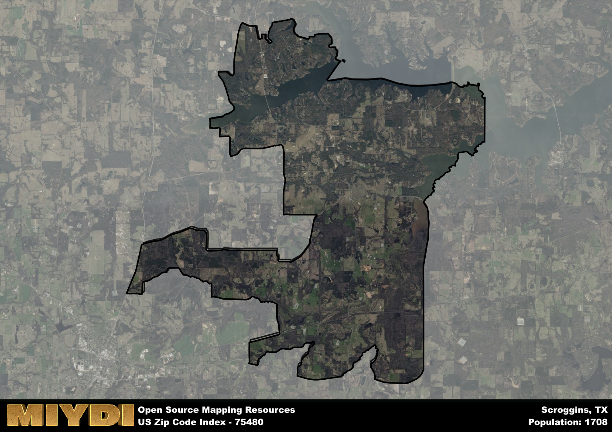

**Area Name:** Scroggins

**Zip Code:** 75480

**State:** TX

Scroggins is a part of the Mount Pleasant - TX Micro Area, and makes up  of the Metro's population.  

# Scroggins: A Quaint Community in Northeast Texas

Located in the northeastern region of Texas, the zip code area 75480 encompasses the charming community of Scroggins. Bordered by the town of Winnsboro to the east and the city of Mount Vernon to the west, Scroggins is nestled amidst the picturesque landscape of woodlands and lakes that define this part of the state. Despite its rural setting, Scroggins is conveniently situated within a short drive to major urban centers such as Dallas and Tyler, making it an ideal retreat for those seeking a peaceful escape from city life.

Originally settled in the mid-19th century, Scroggins was named after one of its early pioneer families and gradually grew into a tight-knit community centered around agriculture and forestry. The area experienced a boost in development with the arrival of the railroad in the late 1800s, facilitating the transport of timber and other goods to nearby markets. Over the years, Scroggins has retained its small-town charm while adapting to modern times, becoming a popular destination for outdoor enthusiasts and those looking to enjoy a slower pace of life in the Texas countryside.

Presently, Scroggins offers a mix of residential homes, vacation rentals, and recreational facilities along the shores of Lake Cypress Springs and Lake Bob Sandlin. The area is known for its fishing and boating opportunities, attracting visitors from across the state. Local businesses cater to the needs of residents and tourists, providing essential services and dining options. Scroggins also boasts a rich natural environment, with hiking trails, camping grounds, and wildlife viewing areas that showcase the beauty of East Texas. With its blend of history, nature, and community spirit, Scroggins remains a hidden gem in the Lone Star State.

# Scroggins Demographics

The population of Scroggins is 1708.  
Scroggins has a population density of 44.72 per square mile.  
The area of Scroggins is 38.19 square miles.  

## Scroggins Income and Economic Data

These demographic numbers are sourced from IRS return data, providing comprehensive insights into the population dynamics and economic trends within Scroggins.

**Breakdown of return types for Scroggins**

The table offers insight into the composition of tax returns filed with the IRS, categorizing them into three main types. Single returns represent filings by individuals, joint returns by married couples, and head of household returns by individuals who qualify as heads of households, typically having dependents. This breakdown provides an understanding of the different filing statuses adopted by taxpayers when submitting their tax documentation.

| Return Types filed for Scroggins                              | Percentage          |
|----------------------------------------------------------|---------------------|
| Single Returns                                            | 0.38 |
| Joint Returns                                             | 0.54 |
| Head Household Returns                                    | 0.07 |

The income and economic data presented here is sourced from the IRS income brackets, utilized for categorizing tax returns by income levels. This table displays income ranges for both single filers and married couples, along with the corresponding number of returns and the percentage within each bracket, providing valuable insight into the distribution of taxes across various income groups.

| Bracket Name       | Single Filer Income Range | Married Couple Range | Number of Returns | Percentage of Returns |
|--------------------|----------------------------|----------------------|-------------------|-----------------------|
| 10% Bracket        | Up to $10,275              | Up to $20,550        | 220 | 0.32% |
| 12% Bracket        | $10,276 - $41,775          | $20,551 - $83,550    | 160 | 0.23% |
| 22% Bracket        | $41,776 - $89,075          | $83,551 - $178,150   | 90 | 0.13% |
| 24% Bracket        | $89,076 - $170,050         | $178,151 - $340,100  | 70 | 0.1% |
| 32% Bracket        | $170,051 - $215,950        | $340,101 - $431,900  | 110 | 0.16% |
| 35% Bracket        | $215,951 - $539,900        | $431,901 - $647,850  | 40 | 0.06% |

### Exploring Taxpayer Diversity: A Breakdown of Different Types of Tax Returns in Scroggins

The table offers insights into various types of tax returns filed, reflecting different aspects of taxpayer activities and demographics. Categories include charitable returns for donations, dependent returns for claimed dependents, educator population, elderly population, real estate returns, self-employment returns, student loan returns, and unemployment returns, providing valuable insights into taxpayer behavior and demographics.

| Scroggins Filing Types                    | Count | Percentage |
|--------------------------------------|-------|------------|
| Charitable Donations                 | 50 | 0.072% |
| Dependents Claimed                   | 0 | 0% |
| Educator Residents                   | 0 | 0% |
| Elderly Population                   | 280 | 0.41% |
| Farming Population                   | 40 | 0.058% |
| Real Estate Transactions             | 50 | 0.072% |
| Self-Employed Individuals            | 90 | 0.13% |
| Student Loan Cases                   | 30 | 0.043% |
| Unemployment Benefit Filings         | 70 | 0.1% |

## Scroggins AI and Census Variables

The values presented in this dataset for Scroggins are AI-optimized, streamlined, and categorized into relevant buckets for enhanced utility in AI and mapping programs. These simplified values have been optimized to facilitate efficient analysis and integration into various technological applications, offering users accessible and actionable insights into demographics within the Scroggins area.

| AI Variables for Scroggins | Value |
|-------------|-------|
| Shape Area | 141060419.335938 |
| Shape Length | 94912.2682071644 |
| CBSA Federal Processing Standard Code | 34420 |

## How to use this free AI optimized Geo-Spatial Data for Scroggins, TX

This data is made freely available under the Creative Commons license, allowing for unrestricted use for any purpose. Users can access static resources directly from GitHub or leverage more advanced functionalities by utilizing the GeoJSON files. All datasets originate from official government or private sector sources and are meticulously compiled into relevant datasets within QGIS. However, the versatility of the data ensures compatibility with any mapping application.

## Data Accuracy Disclaimer
It's important to note that the data provided here may contain errors or discrepancies and should be considered as 'close enough' for business applications and AI rather than a definitive source of truth. This data is aggregated from multiple sources, some of which publish information on wildly different intervals, leading to potential inconsistencies. Additionally, certain data points may not be corrected for Covid-related changes, further impacting accuracy. Moreover, the assumption that demographic trends are consistent throughout a region may lead to discrepancies, as trends often concentrate in areas of highest population density. As a result, dense areas may be slightly underrepresented, while rural areas may be slightly overrepresented, resulting in a more conservative dataset. Furthermore, the focus primarily on areas within US Major and Minor Statistical areas means that approximately 40 million Americans living outside of these areas may not be fully represented. Lastly, the historical background and area descriptions generated using AI are susceptible to potential mistakes, so users should exercise caution when interpreting the information provided.
