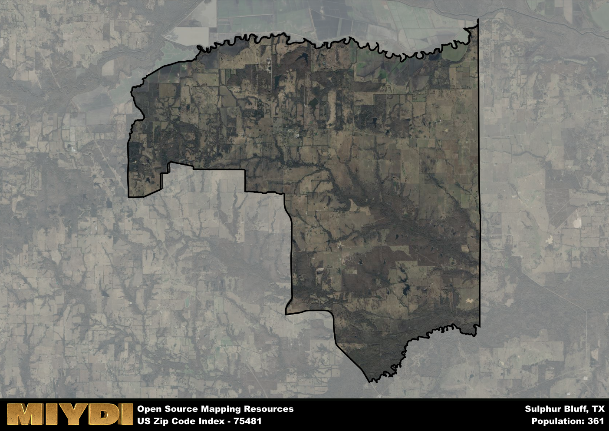

**Area Name:** Sulphur Bluff

**Zip Code:** 75481

**State:** TX

Sulphur Bluff is a part of the Sulphur Springs - TX Micro Area, and makes up  of the Metro's population.  

# Sulphur Bluff: A Historic and Vibrant Community in Northeast Texas

Located in the northeastern part of Texas, the zip code area 75481 encompasses the charming community of Sulphur Bluff. Surrounded by rolling hills and picturesque landscapes, Sulphur Bluff seamlessly integrates with the larger metropolitan area of Paris, offering residents a peaceful retreat from the bustling city life. The zip code area is bordered by Cooper to the east and Dike to the west, providing easy access to neighboring towns and cities.

Sulphur Bluff has a rich historical narrative, dating back to the mid-1800s when settlers began to establish homesteads in the area. The community grew steadily over the years, with the establishment of schools, churches, and businesses contributing to its development. The name "Sulphur Bluff" is derived from the nearby Sulphur River and the distinctive bluffs that overlook the landscape, adding to the area's unique identity and character.

Today, Sulphur Bluff remains a close-knit community with a strong agricultural heritage. The area is known for its thriving farming and ranching industry, with many residents actively involved in these economic activities. In addition to its agricultural pursuits, Sulphur Bluff offers a range of neighborhood-specific services, including local shops, restaurants, and community centers. Outdoor enthusiasts can enjoy recreational amenities such as parks, hiking trails, and fishing spots, while history buffs can explore the area's historic sites and landmarks, providing a diverse range of activities for residents and visitors alike.

# Sulphur Bluff Demographics

The population of Sulphur Bluff is 361.  
Sulphur Bluff has a population density of 6.41 per square mile.  
The area of Sulphur Bluff is 56.35 square miles.  

## Sulphur Bluff Income and Economic Data

These demographic numbers are sourced from IRS return data, providing comprehensive insights into the population dynamics and economic trends within Sulphur Bluff.

**Breakdown of return types for Sulphur Bluff**

The table offers insight into the composition of tax returns filed with the IRS, categorizing them into three main types. Single returns represent filings by individuals, joint returns by married couples, and head of household returns by individuals who qualify as heads of households, typically having dependents. This breakdown provides an understanding of the different filing statuses adopted by taxpayers when submitting their tax documentation.

| Return Types filed for Sulphur Bluff                              | Percentage          |
|----------------------------------------------------------|---------------------|
| Single Returns                                            | 0.4 |
| Joint Returns                                             | 0.53 |
| Head Household Returns                                    | 0 |

The income and economic data presented here is sourced from the IRS income brackets, utilized for categorizing tax returns by income levels. This table displays income ranges for both single filers and married couples, along with the corresponding number of returns and the percentage within each bracket, providing valuable insight into the distribution of taxes across various income groups.

| Bracket Name       | Single Filer Income Range | Married Couple Range | Number of Returns | Percentage of Returns |
|--------------------|----------------------------|----------------------|-------------------|-----------------------|
| 10% Bracket        | Up to $10,275              | Up to $20,550        | 50 | 0.33% |
| 12% Bracket        | $10,276 - $41,775          | $20,551 - $83,550    | 40 | 0.27% |
| 22% Bracket        | $41,776 - $89,075          | $83,551 - $178,150   | 40 | 0.27% |
| 24% Bracket        | $89,076 - $170,050         | $178,151 - $340,100  | 0 | 0% |
| 32% Bracket        | $170,051 - $215,950        | $340,101 - $431,900  | 20 | 0.13% |
| 35% Bracket        | $215,951 - $539,900        | $431,901 - $647,850  | 0 | 0% |

### Exploring Taxpayer Diversity: A Breakdown of Different Types of Tax Returns in Sulphur Bluff

The table offers insights into various types of tax returns filed, reflecting different aspects of taxpayer activities and demographics. Categories include charitable returns for donations, dependent returns for claimed dependents, educator population, elderly population, real estate returns, self-employment returns, student loan returns, and unemployment returns, providing valuable insights into taxpayer behavior and demographics.

| Sulphur Bluff Filing Types                    | Count | Percentage |
|--------------------------------------|-------|------------|
| Charitable Donations                 | 0 | 0% |
| Dependents Claimed                   | 0 | 0% |
| Educator Residents                   | 0 | 0% |
| Elderly Population                   | 40 | 0.27% |
| Farming Population                   | 30 | 0.2% |
| Real Estate Transactions             | 0 | 0% |
| Self-Employed Individuals            | 0 | 0% |
| Student Loan Cases                   | 0 | 0% |
| Unemployment Benefit Filings         | 0 | 0% |

## Sulphur Bluff AI and Census Variables

The values presented in this dataset for Sulphur Bluff are AI-optimized, streamlined, and categorized into relevant buckets for enhanced utility in AI and mapping programs. These simplified values have been optimized to facilitate efficient analysis and integration into various technological applications, offering users accessible and actionable insights into demographics within the Sulphur Bluff area.

| AI Variables for Sulphur Bluff | Value |
|-------------|-------|
| Shape Area | 209571688.808594 |
| Shape Length | 93924.732997076 |
| CBSA Federal Processing Standard Code | 44860 |

## How to use this free AI optimized Geo-Spatial Data for Sulphur Bluff, TX

This data is made freely available under the Creative Commons license, allowing for unrestricted use for any purpose. Users can access static resources directly from GitHub or leverage more advanced functionalities by utilizing the GeoJSON files. All datasets originate from official government or private sector sources and are meticulously compiled into relevant datasets within QGIS. However, the versatility of the data ensures compatibility with any mapping application.

## Data Accuracy Disclaimer
It's important to note that the data provided here may contain errors or discrepancies and should be considered as 'close enough' for business applications and AI rather than a definitive source of truth. This data is aggregated from multiple sources, some of which publish information on wildly different intervals, leading to potential inconsistencies. Additionally, certain data points may not be corrected for Covid-related changes, further impacting accuracy. Moreover, the assumption that demographic trends are consistent throughout a region may lead to discrepancies, as trends often concentrate in areas of highest population density. As a result, dense areas may be slightly underrepresented, while rural areas may be slightly overrepresented, resulting in a more conservative dataset. Furthermore, the focus primarily on areas within US Major and Minor Statistical areas means that approximately 40 million Americans living outside of these areas may not be fully represented. Lastly, the historical background and area descriptions generated using AI are susceptible to potential mistakes, so users should exercise caution when interpreting the information provided.
