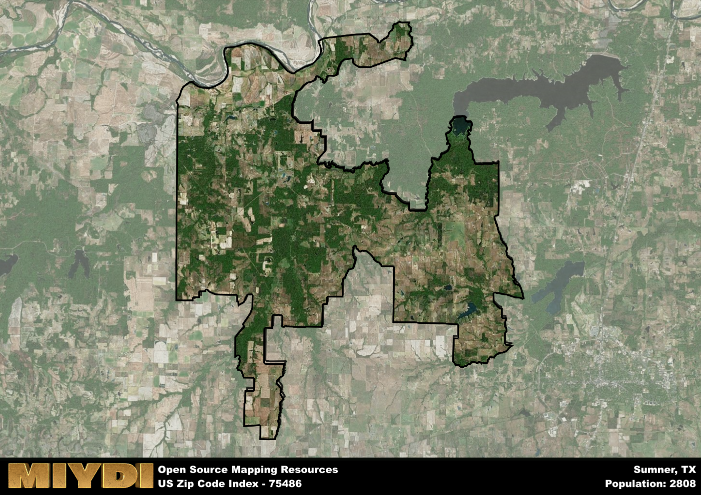

**Area Name:** Sumner

**Zip Code:** 75486

**State:** TX

Sumner is a part of the Paris - TX Micro Area, and makes up  of the Metro's population.  

# Sumner: A Quaint Community in Northeast Texas  

Located in Northeast Texas, the zip code 75486 corresponds to the charming community of Sumner. Situated in Lamar County, Sumner is bordered by the towns of Paris to the west and Detroit to the east. This zip code area is an integral part of the greater Paris metropolitan area, contributing to the region's economic and cultural landscape. Sumner's proximity to major transportation routes ensures easy access to neighboring cities and towns, making it a convenient and attractive place to live.  

Sumner has a rich historical heritage that dates back to the mid-19th century. The area was originally settled by pioneers seeking land for farming and ranching. Over the years, Sumner developed into a thriving agricultural community, known for its fertile soil and abundant natural resources. The town was officially incorporated in 1876 and has since maintained its small-town charm while adapting to modern developments. The name "Sumner" is believed to have been inspired by either a local family or a prominent figure in the area's early history.  

Today, Sumner is a close-knit community that offers a mix of residential, commercial, and recreational opportunities. The town's economy is primarily driven by agriculture, with farms and ranches dotting the surrounding landscape. Residents and visitors alike can enjoy a variety of outdoor activities, including fishing, hunting, and hiking in the picturesque countryside. Sumner also boasts a few local businesses, such as shops, restaurants, and services, that cater to the needs of its residents. For those interested in history, the area features historic sites and landmarks that reflect its past and add to its unique character.

# Sumner Demographics

The population of Sumner is 2808.  
Sumner has a population density of 24.98 per square mile.  
The area of Sumner is 112.43 square miles.  

## Sumner Income and Economic Data

These demographic numbers are sourced from IRS return data, providing comprehensive insights into the population dynamics and economic trends within Sumner.

**Breakdown of return types for Sumner**

The table offers insight into the composition of tax returns filed with the IRS, categorizing them into three main types. Single returns represent filings by individuals, joint returns by married couples, and head of household returns by individuals who qualify as heads of households, typically having dependents. This breakdown provides an understanding of the different filing statuses adopted by taxpayers when submitting their tax documentation.

| Return Types filed for Sumner                              | Percentage          |
|----------------------------------------------------------|---------------------|
| Single Returns                                            | 0.37 |
| Joint Returns                                             | 0.54 |
| Head Household Returns                                    | 0.09 |

The income and economic data presented here is sourced from the IRS income brackets, utilized for categorizing tax returns by income levels. This table displays income ranges for both single filers and married couples, along with the corresponding number of returns and the percentage within each bracket, providing valuable insight into the distribution of taxes across various income groups.

| Bracket Name       | Single Filer Income Range | Married Couple Range | Number of Returns | Percentage of Returns |
|--------------------|----------------------------|----------------------|-------------------|-----------------------|
| 10% Bracket        | Up to $10,275              | Up to $20,550        | 360 | 0.32% |
| 12% Bracket        | $10,276 - $41,775          | $20,551 - $83,550    | 300 | 0.27% |
| 22% Bracket        | $41,776 - $89,075          | $83,551 - $178,150   | 170 | 0.15% |
| 24% Bracket        | $89,076 - $170,050         | $178,151 - $340,100  | 120 | 0.11% |
| 32% Bracket        | $170,051 - $215,950        | $340,101 - $431,900  | 130 | 0.12% |
| 35% Bracket        | $215,951 - $539,900        | $431,901 - $647,850  | 30 | 0.03% |

### Exploring Taxpayer Diversity: A Breakdown of Different Types of Tax Returns in Sumner

The table offers insights into various types of tax returns filed, reflecting different aspects of taxpayer activities and demographics. Categories include charitable returns for donations, dependent returns for claimed dependents, educator population, elderly population, real estate returns, self-employment returns, student loan returns, and unemployment returns, providing valuable insights into taxpayer behavior and demographics.

| Sumner Filing Types                    | Count | Percentage |
|--------------------------------------|-------|------------|
| Charitable Donations                 | 30 | 0.027% |
| Dependents Claimed                   | 20 | 0.018% |
| Educator Residents                   | 30 | 0.027% |
| Elderly Population                   | 310 | 0.28% |
| Farming Population                   | 220 | 0.198% |
| Real Estate Transactions             | 30 | 0.027% |
| Self-Employed Individuals            | 200 | 0.18% |
| Student Loan Cases                   | 0 | 0% |
| Unemployment Benefit Filings         | 110 | 0.1% |

## Sumner AI and Census Variables

The values presented in this dataset for Sumner are AI-optimized, streamlined, and categorized into relevant buckets for enhanced utility in AI and mapping programs. These simplified values have been optimized to facilitate efficient analysis and integration into various technological applications, offering users accessible and actionable insights into demographics within the Sumner area.

| AI Variables for Sumner | Value |
|-------------|-------|
| Shape Area | 422369616.074219 |
| Shape Length | 197867.921117577 |
| CBSA Federal Processing Standard Code | 37580 |

## How to use this free AI optimized Geo-Spatial Data for Sumner, TX

This data is made freely available under the Creative Commons license, allowing for unrestricted use for any purpose. Users can access static resources directly from GitHub or leverage more advanced functionalities by utilizing the GeoJSON files. All datasets originate from official government or private sector sources and are meticulously compiled into relevant datasets within QGIS. However, the versatility of the data ensures compatibility with any mapping application.

## Data Accuracy Disclaimer
It's important to note that the data provided here may contain errors or discrepancies and should be considered as 'close enough' for business applications and AI rather than a definitive source of truth. This data is aggregated from multiple sources, some of which publish information on wildly different intervals, leading to potential inconsistencies. Additionally, certain data points may not be corrected for Covid-related changes, further impacting accuracy. Moreover, the assumption that demographic trends are consistent throughout a region may lead to discrepancies, as trends often concentrate in areas of highest population density. As a result, dense areas may be slightly underrepresented, while rural areas may be slightly overrepresented, resulting in a more conservative dataset. Furthermore, the focus primarily on areas within US Major and Minor Statistical areas means that approximately 40 million Americans living outside of these areas may not be fully represented. Lastly, the historical background and area descriptions generated using AI are susceptible to potential mistakes, so users should exercise caution when interpreting the information provided.
