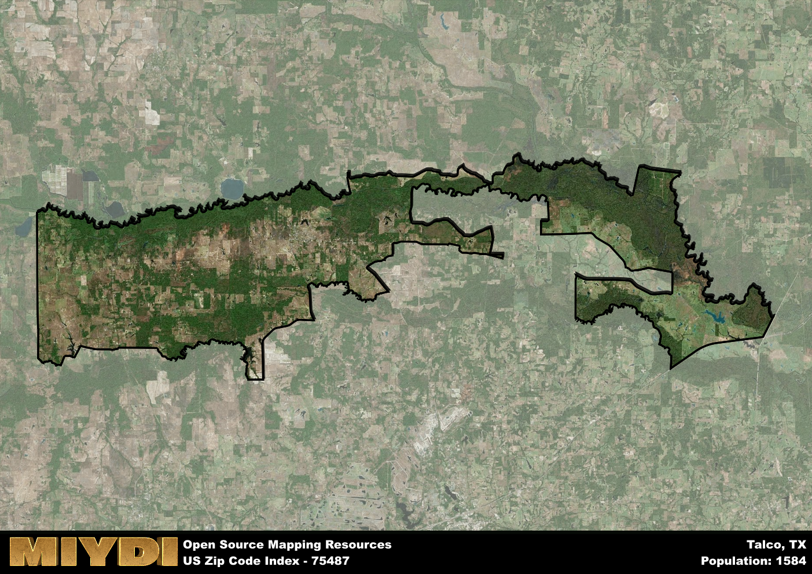

**Area Name:** Talco

**Zip Code:** 75487

**State:** TX

Talco is a part of the Mount Pleasant - TX Micro Area, and makes up  of the Metro's population.  

# Talco: A Quaint Community in Northeast Texas

Located in the northeastern region of Texas, Talco is a small community with the zip code 75487. Bordered by the towns of Bogata to the north and Mount Pleasant to the south, Talco is nestled among the rolling hills and lush forests of the area. It is roughly an hour's drive from the bustling city of Texarkana and two hours from the metropolitan area of Dallas-Fort Worth. Despite its proximity to larger urban centers, Talco maintains its rural charm and tight-knit community feel.

Talco was established in the late 19th century as a stop along the Texas and Pacific Railway. The town grew steadily as agricultural activities thrived in the surrounding countryside. The name "Talco" is derived from the word "talc," as the area was known for its deposits of the mineral. Over the years, Talco has developed into a peaceful residential area with a mix of historic homes and modern developments. The town's rich history is evident in its well-preserved architecture and local traditions.

Today, Talco is a vibrant community with a strong sense of pride in its heritage. The town's economy is primarily driven by agriculture, with many residents working in farming and ranching. Talco offers essential services such as schools, churches, and small businesses to meet the needs of its residents. Outdoor enthusiasts can enjoy the nearby Sulphur River for fishing and boating, while history buffs can explore the Talco Depot Museum, which showcases the town's railroad past. Talco's friendly atmosphere and picturesque surroundings make it a hidden gem in Northeast Texas.

# Talco Demographics

The population of Talco is 1584.  
Talco has a population density of 10.35 per square mile.  
The area of Talco is 153.03 square miles.  

## Talco Income and Economic Data

These demographic numbers are sourced from IRS return data, providing comprehensive insights into the population dynamics and economic trends within Talco.

**Breakdown of return types for Talco**

The table offers insight into the composition of tax returns filed with the IRS, categorizing them into three main types. Single returns represent filings by individuals, joint returns by married couples, and head of household returns by individuals who qualify as heads of households, typically having dependents. This breakdown provides an understanding of the different filing statuses adopted by taxpayers when submitting their tax documentation.

| Return Types filed for Talco                              | Percentage          |
|----------------------------------------------------------|---------------------|
| Single Returns                                            | 0.43 |
| Joint Returns                                             | 0.38 |
| Head Household Returns                                    | 0.2 |

The income and economic data presented here is sourced from the IRS income brackets, utilized for categorizing tax returns by income levels. This table displays income ranges for both single filers and married couples, along with the corresponding number of returns and the percentage within each bracket, providing valuable insight into the distribution of taxes across various income groups.

| Bracket Name       | Single Filer Income Range | Married Couple Range | Number of Returns | Percentage of Returns |
|--------------------|----------------------------|----------------------|-------------------|-----------------------|
| 10% Bracket        | Up to $10,275              | Up to $20,550        | 230 | 0.38% |
| 12% Bracket        | $10,276 - $41,775          | $20,551 - $83,550    | 170 | 0.28% |
| 22% Bracket        | $41,776 - $89,075          | $83,551 - $178,150   | 90 | 0.15% |
| 24% Bracket        | $89,076 - $170,050         | $178,151 - $340,100  | 60 | 0.1% |
| 32% Bracket        | $170,051 - $215,950        | $340,101 - $431,900  | 60 | 0.1% |
| 35% Bracket        | $215,951 - $539,900        | $431,901 - $647,850  | 0 | 0% |

### Exploring Taxpayer Diversity: A Breakdown of Different Types of Tax Returns in Talco

The table offers insights into various types of tax returns filed, reflecting different aspects of taxpayer activities and demographics. Categories include charitable returns for donations, dependent returns for claimed dependents, educator population, elderly population, real estate returns, self-employment returns, student loan returns, and unemployment returns, providing valuable insights into taxpayer behavior and demographics.

| Talco Filing Types                    | Count | Percentage |
|--------------------------------------|-------|------------|
| Charitable Donations                 | 0 | 0% |
| Dependents Claimed                   | 0 | 0% |
| Educator Residents                   | 0 | 0% |
| Elderly Population                   | 160 | 0.26% |
| Farming Population                   | 50 | 0.082% |
| Real Estate Transactions             | 0 | 0% |
| Self-Employed Individuals            | 60 | 0.098% |
| Student Loan Cases                   | 0 | 0% |
| Unemployment Benefit Filings         | 90 | 0.15% |

## Talco AI and Census Variables

The values presented in this dataset for Talco are AI-optimized, streamlined, and categorized into relevant buckets for enhanced utility in AI and mapping programs. These simplified values have been optimized to facilitate efficient analysis and integration into various technological applications, offering users accessible and actionable insights into demographics within the Talco area.

| AI Variables for Talco | Value |
|-------------|-------|
| Shape Area | 569464216.382813 |
| Shape Length | 322721.924134669 |
| CBSA Federal Processing Standard Code | 34420 |

## How to use this free AI optimized Geo-Spatial Data for Talco, TX

This data is made freely available under the Creative Commons license, allowing for unrestricted use for any purpose. Users can access static resources directly from GitHub or leverage more advanced functionalities by utilizing the GeoJSON files. All datasets originate from official government or private sector sources and are meticulously compiled into relevant datasets within QGIS. However, the versatility of the data ensures compatibility with any mapping application.

## Data Accuracy Disclaimer
It's important to note that the data provided here may contain errors or discrepancies and should be considered as 'close enough' for business applications and AI rather than a definitive source of truth. This data is aggregated from multiple sources, some of which publish information on wildly different intervals, leading to potential inconsistencies. Additionally, certain data points may not be corrected for Covid-related changes, further impacting accuracy. Moreover, the assumption that demographic trends are consistent throughout a region may lead to discrepancies, as trends often concentrate in areas of highest population density. As a result, dense areas may be slightly underrepresented, while rural areas may be slightly overrepresented, resulting in a more conservative dataset. Furthermore, the focus primarily on areas within US Major and Minor Statistical areas means that approximately 40 million Americans living outside of these areas may not be fully represented. Lastly, the historical background and area descriptions generated using AI are susceptible to potential mistakes, so users should exercise caution when interpreting the information provided.
