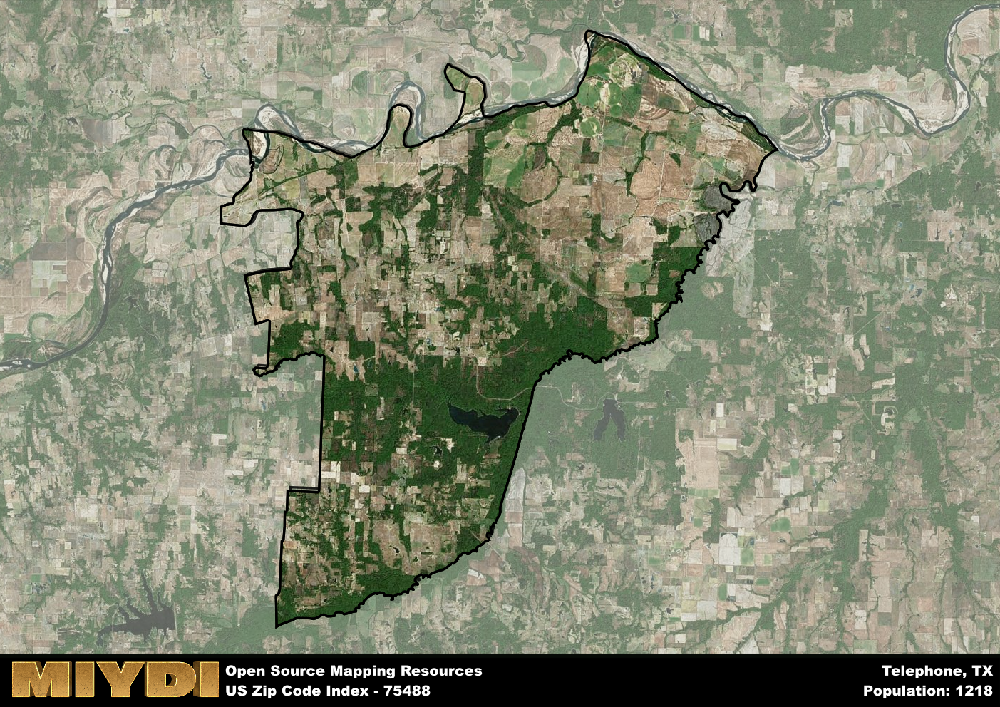

**Area Name:** Telephone

**Zip Code:** 75488

**State:** TX

Telephone is a part of the Bonham - TX Micro Area, and makes up  of the Metro's population.  

# Telephone, Texas (Zip Code 75488): A Historic and Vibrant Community  

Located in the northeastern part of Texas, the zip code 75488 area corresponds to the quaint town of Telephone. Surrounded by rolling hills and lush greenery, Telephone is situated within Fannin County and is approximately an hour's drive away from the bustling city of Dallas. The town is known for its peaceful atmosphere and close-knit community, making it a popular residential area for those looking to escape the city life while still being within reach of urban conveniences.

Telephone has a rich history dating back to the late 19th century when it was established as a farming community. The town earned its unique name from the first telephone line that was installed in the area, symbolizing its connection to the outside world. Over the years, Telephone has grown into a charming town with a mix of historic buildings and modern developments, all while maintaining its rural charm. The town takes pride in its heritage, hosting annual events and festivals that celebrate its agricultural roots and community spirit.

Today, Telephone remains a vibrant community with a range of economic activities, including agriculture, small businesses, and tourism. Residents and visitors alike can enjoy the town's local shops, restaurants, and recreational amenities, such as parks and hiking trails. Historical sites like the Telephone Historical Museum offer a glimpse into the town's past, while community events and gatherings bring residents together. With its blend of history, culture, and natural beauty, Telephone continues to thrive as a hidden gem in the heart of Texas.

# Telephone Demographics

The population of Telephone is 1218.  
Telephone has a population density of 9.77 per square mile.  
The area of Telephone is 124.72 square miles.  

## Telephone Income and Economic Data

These demographic numbers are sourced from IRS return data, providing comprehensive insights into the population dynamics and economic trends within Telephone.

**Breakdown of return types for Telephone**

The table offers insight into the composition of tax returns filed with the IRS, categorizing them into three main types. Single returns represent filings by individuals, joint returns by married couples, and head of household returns by individuals who qualify as heads of households, typically having dependents. This breakdown provides an understanding of the different filing statuses adopted by taxpayers when submitting their tax documentation.

| Return Types filed for Telephone                              | Percentage          |
|----------------------------------------------------------|---------------------|
| Single Returns                                            | 0.42 |
| Joint Returns                                             | 0.47 |
| Head Household Returns                                    | 0.11 |

The income and economic data presented here is sourced from the IRS income brackets, utilized for categorizing tax returns by income levels. This table displays income ranges for both single filers and married couples, along with the corresponding number of returns and the percentage within each bracket, providing valuable insight into the distribution of taxes across various income groups.

| Bracket Name       | Single Filer Income Range | Married Couple Range | Number of Returns | Percentage of Returns |
|--------------------|----------------------------|----------------------|-------------------|-----------------------|
| 10% Bracket        | Up to $10,275              | Up to $20,550        | 160 | 0.3% |
| 12% Bracket        | $10,276 - $41,775          | $20,551 - $83,550    | 170 | 0.32% |
| 22% Bracket        | $41,776 - $89,075          | $83,551 - $178,150   | 70 | 0.13% |
| 24% Bracket        | $89,076 - $170,050         | $178,151 - $340,100  | 50 | 0.09% |
| 32% Bracket        | $170,051 - $215,950        | $340,101 - $431,900  | 80 | 0.15% |
| 35% Bracket        | $215,951 - $539,900        | $431,901 - $647,850  | 0 | 0% |

### Exploring Taxpayer Diversity: A Breakdown of Different Types of Tax Returns in Telephone

The table offers insights into various types of tax returns filed, reflecting different aspects of taxpayer activities and demographics. Categories include charitable returns for donations, dependent returns for claimed dependents, educator population, elderly population, real estate returns, self-employment returns, student loan returns, and unemployment returns, providing valuable insights into taxpayer behavior and demographics.

| Telephone Filing Types                    | Count | Percentage |
|--------------------------------------|-------|------------|
| Charitable Donations                 | 0 | 0% |
| Dependents Claimed                   | 0 | 0% |
| Educator Residents                   | 0 | 0% |
| Elderly Population                   | 150 | 0.28% |
| Farming Population                   | 110 | 0.208% |
| Real Estate Transactions             | 0 | 0% |
| Self-Employed Individuals            | 70 | 0.132% |
| Student Loan Cases                   | 0 | 0% |
| Unemployment Benefit Filings         | 50 | 0.09% |

## Telephone AI and Census Variables

The values presented in this dataset for Telephone are AI-optimized, streamlined, and categorized into relevant buckets for enhanced utility in AI and mapping programs. These simplified values have been optimized to facilitate efficient analysis and integration into various technological applications, offering users accessible and actionable insights into demographics within the Telephone area.

| AI Variables for Telephone | Value |
|-------------|-------|
| Shape Area | 468778605.25 |
| Shape Length | 148659.564013783 |
| CBSA Federal Processing Standard Code | 14300 |

## How to use this free AI optimized Geo-Spatial Data for Telephone, TX

This data is made freely available under the Creative Commons license, allowing for unrestricted use for any purpose. Users can access static resources directly from GitHub or leverage more advanced functionalities by utilizing the GeoJSON files. All datasets originate from official government or private sector sources and are meticulously compiled into relevant datasets within QGIS. However, the versatility of the data ensures compatibility with any mapping application.

## Data Accuracy Disclaimer
It's important to note that the data provided here may contain errors or discrepancies and should be considered as 'close enough' for business applications and AI rather than a definitive source of truth. This data is aggregated from multiple sources, some of which publish information on wildly different intervals, leading to potential inconsistencies. Additionally, certain data points may not be corrected for Covid-related changes, further impacting accuracy. Moreover, the assumption that demographic trends are consistent throughout a region may lead to discrepancies, as trends often concentrate in areas of highest population density. As a result, dense areas may be slightly underrepresented, while rural areas may be slightly overrepresented, resulting in a more conservative dataset. Furthermore, the focus primarily on areas within US Major and Minor Statistical areas means that approximately 40 million Americans living outside of these areas may not be fully represented. Lastly, the historical background and area descriptions generated using AI are susceptible to potential mistakes, so users should exercise caution when interpreting the information provided.
