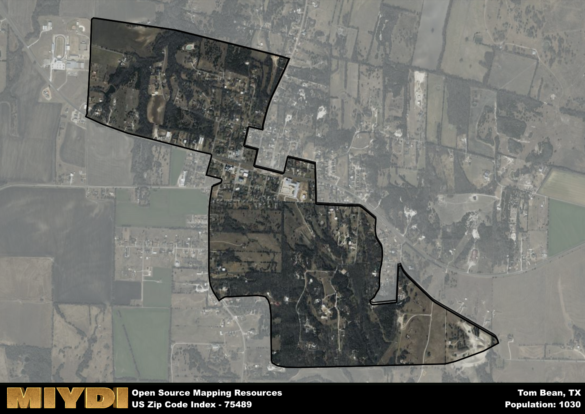

**Area Name:** Tom Bean

**Zip Code:** 75489

**State:** TX

Tom Bean is a part of the Sherman-Denison - TX Metro Area, and makes up 1.65% of the Metro's population.  

# Tom Bean: A Quaint Neighborhood in North Texas  
Tom Bean, located in zip code 75489, is a charming neighborhood situated in the northeastern part of Grayson County in North Texas. Bordered by the cities of Sherman to the west and Whitewright to the east, Tom Bean is a small but integral part of the Texoma region. The area is characterized by its rural landscape, dotted with farms and ranches, while still maintaining close proximity to major population centers like Dallas and Fort Worth.

Originally settled in the late 19th century, Tom Bean was named after a well-respected local landowner. The town experienced steady growth with the arrival of the railroad in the early 1900s, facilitating trade and commerce in the area. Over the years, Tom Bean has preserved its small-town feel, with a strong sense of community and pride in its heritage. The town's historical significance is evident in its well-preserved buildings and landmarks, serving as a testament to its past.

Today, Tom Bean is a thriving community with a mix of residential and agricultural activities. The town boasts a variety of local businesses, including family-owned shops and restaurants that cater to both residents and visitors. Outdoor enthusiasts can enjoy the nearby Lake Texoma for fishing and boating, while history buffs can explore the Tom Bean Museum and other cultural sites. With its blend of history, natural beauty, and modern amenities, Tom Bean continues to be a unique destination in the North Texas region.

# Tom Bean Demographics

The population of Tom Bean is 1030.  
Tom Bean has a population density of 895.65 per square mile.  
The area of Tom Bean is 1.15 square miles.  

### Exploring Real Estate Trends: A Comprehensive Analysis of the Tom Bean Area and its Neighbors

This table contains an in-depth examination of the real estate market in the Tom Bean area. Sourced from trusted real estate market firms, this dataset provides a wealth of raw data detailing the local real estate landscape, along with comparative analyses juxtaposing the market dynamics with those of neighboring areas. Explore the intricacies of the Tom Bean real estate market and gain valuable insights into its relationship with adjacent regions.

| Real Estate Data for Tom Bean                       | Value    |
|------------------------------------------------|----------|
| Average Listing Price for Tom Bean               | 297143 |
| Median Listing Price for Tom Bean                | 325000 |
| Median Days on Market for Tom Bean               | 34 |
| Median Listing Price per Square Foot for Tom Bean| 23 |
| Median Square Feet for Tom Bean                  | 1742 |
| Real Estate Prices to Income Ratio           | 115.00% |
| Price per Square Foot Ratio                  | 98.07% |
| Price Median Ratio                           | 80.85% |
| Market Sales Speed Ratio                     | 75.6% |

This table offers essential real estate data for the Tom Bean area, including average and median listing prices, median days on market, and property size. It also presents ratio metrics as percentages, providing insights into how the local market compares to the surrounding region. A ratio of 100% signifies performance in line with the regional average, while values above or below indicate overperformance or underperformance, respectively, relative to expectations.

## Tom Bean Sports and Recreation Data

#### Annual Youth Sports Spending for Tom Bean

This table provides fundamental insights into the Sports and Recreation data for the Tom Bean area, detailing the estimated annual expenditure on Youth Athletics. This includes estimated spending by the major consumer brackets. 
| Sports Spending for Tom Bean| Value |
|-------------------------|-------|
| Athlete Spending Compared to the region | 9.44% |
| Total Youth Athlete Spending | 12,384 |
| Athletic Spending - Essential Focused Consumer | 4,163 |
| Athletic Spending - Typical Consumer | 8,952 |
| Athletic Spending - Affluent Consumers | 59,236 |

#### Youth Coaching Estimates for Tom Bean

This table presents the estimated number of coaches for the Tom Bean area, derived from comprehensive national coaching surveys and athletic participation rates by state. It offers valuable insights into the vital role of coaching personnel in fostering athletic development and facilitating sports participation within the local community.

| Coaching Data for Tom Bean | Value |
|-------------|-------|
| Total Coaches | 17 |
| Paid Coaches | 4 |
| Volunteer Coaches | 12 |

#### Youth Athlete Participation for Tom Bean

This table shows the estimated total number of youth athletes in the Tom Bean area, sourced from comprehensive national coaching surveys and athletic participation rates by state.

| Total YA Athletes in Tom Bean | Value |
|-------------|-------|
| Total High School Athletes | 26 |
| Total Youth Athletes | 77 |
| Total Young Adult Athletes | 51 |
| Total Athletes to Age 25 | 154 |

#### High School Age Athletes - Breakdown by Sport for Tom Bean

This table shows insights regarding high school age estimated players by sport in the Tom Bean area, derived from national and state-level athletic participation trends. 

| HS Players by Sport in Tom Bean | Value |
|-------------|-------|
| Football Players | 6 |
| Basketball Players | 4 |
| Soccer Players | 3 |
| Volleyball Players | 2 |
| Baseball Players | 3 |
| Tennis Players | 2 |
| Track Athletes | 4 |
| Golf Players | 1 |
| Swimming Athletes | 1 |
| Wrestling Competitors | 1 |
| Lacrosse Players | 0 |

Estimating the number of younger athletes presents unique challenges due to their varied starting ages, typically beginning around six years old, and a gradual decline in participation rates as they age. Unlike high school-aged athletes, younger athletes are less likely to switch sports as they grow older, contributing to the stability of participation numbers within specific sports at younger ages.  

As a general trend, the total number of younger athletes is approximately three times the number of high school-aged athletes, underscoring the significant presence of youth athletes in sports programs and highlighting the importance of early engagement in athletic activities.

## Tom Bean AI and Census Variables

The values presented in this dataset for Tom Bean are AI-optimized, streamlined, and categorized into relevant buckets for enhanced utility in AI and mapping programs. These simplified values have been optimized to facilitate efficient analysis and integration into various technological applications, offering users accessible and actionable insights into demographics within the Tom Bean area.

| AI Variables for Tom Bean | Value |
|-------------|-------|
| Shape Area | 4282093.3828125 |
| Shape Length | 13805.1630642475 |
| CBSA Federal Processing Standard Code | 43300 |
| RE Price per Square Foot Ratio | 98.07% |
| RE Price Average Ratio | 64.55% |
| RE Speed Ratio | 75.6% |
| RE Income Ratio | 115.00% |
| RE Affordability Index Flag | 2 |
| Income Bracket Flag | 4 |
| RE Income Flag | 4 |
| RE Median Square Footage Price Flag | 5 |
| RE Median Square Footage Size Flag | 3 |
| RE Activity Flag | 3 |
| Poverty Line Risk Flag | 5 |

## How to use this free AI optimized Geo-Spatial Data for Tom Bean, TX

This data is made freely available under the Creative Commons license, allowing for unrestricted use for any purpose. Users can access static resources directly from GitHub or leverage more advanced functionalities by utilizing the GeoJSON files. All datasets originate from official government or private sector sources and are meticulously compiled into relevant datasets within QGIS. However, the versatility of the data ensures compatibility with any mapping application.

## Data Accuracy Disclaimer
It's important to note that the data provided here may contain errors or discrepancies and should be considered as 'close enough' for business applications and AI rather than a definitive source of truth. This data is aggregated from multiple sources, some of which publish information on wildly different intervals, leading to potential inconsistencies. Additionally, certain data points may not be corrected for Covid-related changes, further impacting accuracy. Moreover, the assumption that demographic trends are consistent throughout a region may lead to discrepancies, as trends often concentrate in areas of highest population density. As a result, dense areas may be slightly underrepresented, while rural areas may be slightly overrepresented, resulting in a more conservative dataset. Furthermore, the focus primarily on areas within US Major and Minor Statistical areas means that approximately 40 million Americans living outside of these areas may not be fully represented. Lastly, the historical background and area descriptions generated using AI are susceptible to potential mistakes, so users should exercise caution when interpreting the information provided.
