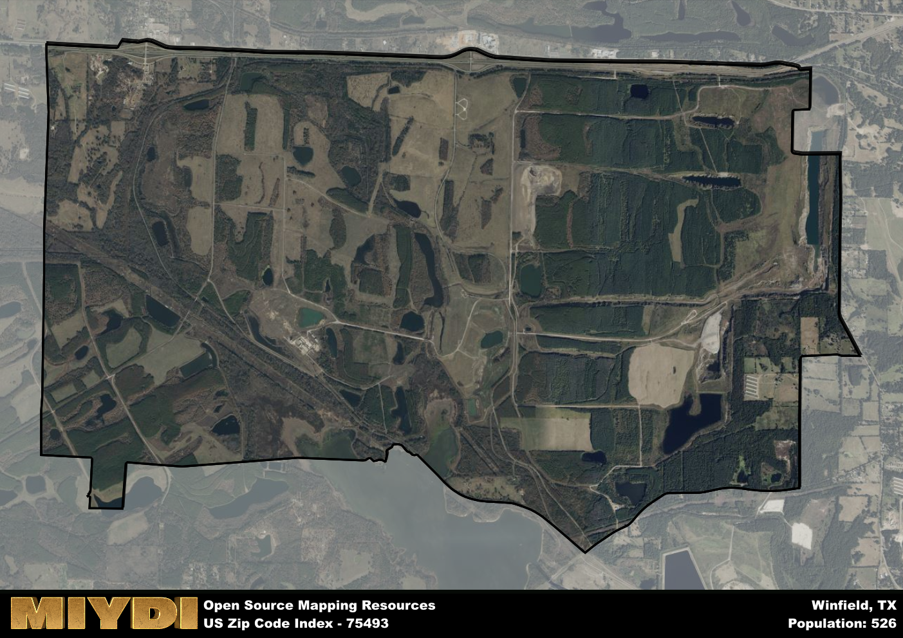

**Area Name:** Winfield

**Zip Code:** 75493

**State:** TX

Winfield is a part of the Mount Pleasant - TX Micro Area, and makes up  of the Metro's population.  

# Winfield, TX (75493): A Charming Community in Northeast Texas  

Located in the northeastern part of Texas, Winfield's zip code area 75493 encompasses a quaint community surrounded by lush greenery and rolling hills. Situated near the larger cities of Paris and Clarksville, Winfield serves as a peaceful retreat from the hustle and bustle of urban life while still maintaining convenient access to essential amenities and services. The area is characterized by its rural charm and close-knit community atmosphere, making it an ideal destination for those seeking a slower pace of life.  

Winfield has a rich historical background, originally settled in the mid-1800s by pioneers drawn to the fertile land and opportunities for agriculture. The area flourished with the arrival of the railroad, which facilitated trade and transportation, leading to a period of growth and prosperity. Over the years, Winfield has preserved its historic buildings and landmarks, offering visitors a glimpse into its past while embracing modern developments and infrastructure to support its residents.  

Today, Winfield boasts a thriving economy supported by agriculture, small businesses, and local services. The area is known for its friendly community atmosphere, with neighbors often coming together for events and gatherings. Residents and visitors can enjoy recreational activities such as fishing at nearby lakes, hiking along scenic trails, and exploring the charming downtown area lined with shops and eateries. Winfield's commitment to preserving its heritage is evident in its historic sites and cultural events, making it a unique and inviting destination in Northeast Texas.

# Winfield Demographics

The population of Winfield is 526.  
Winfield has a population density of 31.61 per square mile.  
The area of Winfield is 16.64 square miles.  

## Winfield AI and Census Variables

The values presented in this dataset for Winfield are AI-optimized, streamlined, and categorized into relevant buckets for enhanced utility in AI and mapping programs. These simplified values have been optimized to facilitate efficient analysis and integration into various technological applications, offering users accessible and actionable insights into demographics within the Winfield area.

| AI Variables for Winfield | Value |
|-------------|-------|
| Shape Area | 61616663 |
| Shape Length | 36297.4039455619 |
| CBSA Federal Processing Standard Code | 34420 |

## How to use this free AI optimized Geo-Spatial Data for Winfield, TX

This data is made freely available under the Creative Commons license, allowing for unrestricted use for any purpose. Users can access static resources directly from GitHub or leverage more advanced functionalities by utilizing the GeoJSON files. All datasets originate from official government or private sector sources and are meticulously compiled into relevant datasets within QGIS. However, the versatility of the data ensures compatibility with any mapping application.

## Data Accuracy Disclaimer
It's important to note that the data provided here may contain errors or discrepancies and should be considered as 'close enough' for business applications and AI rather than a definitive source of truth. This data is aggregated from multiple sources, some of which publish information on wildly different intervals, leading to potential inconsistencies. Additionally, certain data points may not be corrected for Covid-related changes, further impacting accuracy. Moreover, the assumption that demographic trends are consistent throughout a region may lead to discrepancies, as trends often concentrate in areas of highest population density. As a result, dense areas may be slightly underrepresented, while rural areas may be slightly overrepresented, resulting in a more conservative dataset. Furthermore, the focus primarily on areas within US Major and Minor Statistical areas means that approximately 40 million Americans living outside of these areas may not be fully represented. Lastly, the historical background and area descriptions generated using AI are susceptible to potential mistakes, so users should exercise caution when interpreting the information provided.
