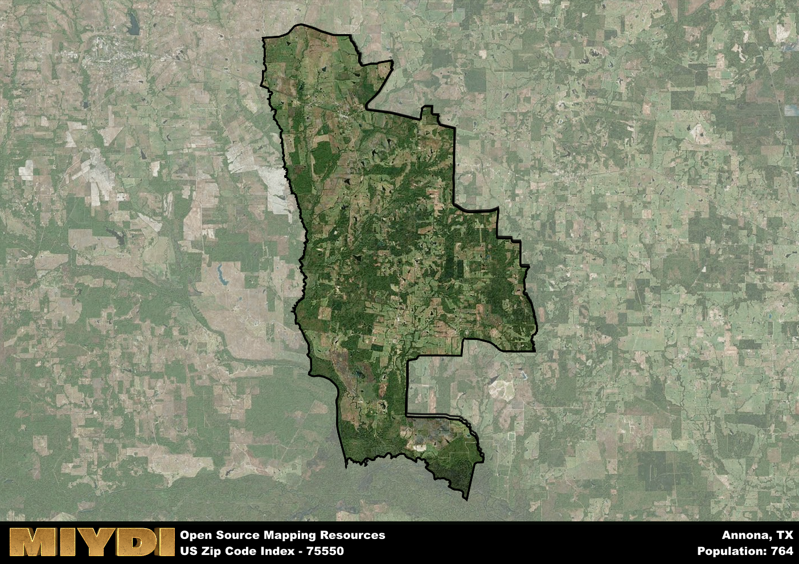

**Area Name:** Annona

**Zip Code:** 75550

**State:** TX

# Annona: A Historic and Vibrant Community in Zip Code 75550

Located in the northeastern region of Texas, zip code 75550 encompasses the charming community of Annona. This area is bordered by the city of Clarksville to the west and is situated within Red River County. Annona serves as a rural oasis within the larger metropolitan area, offering a tranquil escape while still maintaining connectivity to nearby urban centers.

Established in the late 19th century, Annona was originally a railroad town that thrived on the transportation of goods and passengers. The area was named after the Annona plant, a tropical fruit-bearing tree. Over the years, Annona has evolved into a tight-knit community with a rich agricultural heritage. The town's growth was further fueled by the discovery of oil in the region, attracting new residents and businesses to the area.

Today, Annona is a bustling community with a diverse economy that includes agriculture, oil production, and small businesses. Residents enjoy a range of amenities, such as local shops, restaurants, and parks. The town is also home to historic sites that showcase its past, including the Annona Depot Museum. With its blend of history and modernity, Annona remains a vibrant hub within the larger tapestry of northeastern Texas.

# Annona Demographics

The population of Annona is 764.  
Annona has a population density of 9.29 per square mile.  
The area of Annona is 82.2 square miles.  

## Annona Income and Economic Data

These demographic numbers are sourced from IRS return data, providing comprehensive insights into the population dynamics and economic trends within Annona.

**Breakdown of return types for Annona**

The table offers insight into the composition of tax returns filed with the IRS, categorizing them into three main types. Single returns represent filings by individuals, joint returns by married couples, and head of household returns by individuals who qualify as heads of households, typically having dependents. This breakdown provides an understanding of the different filing statuses adopted by taxpayers when submitting their tax documentation.

| Return Types filed for Annona                              | Percentage          |
|----------------------------------------------------------|---------------------|
| Single Returns                                            | 0.5 |
| Joint Returns                                             | 0.38 |
| Head Household Returns                                    | 0.13 |

The income and economic data presented here is sourced from the IRS income brackets, utilized for categorizing tax returns by income levels. This table displays income ranges for both single filers and married couples, along with the corresponding number of returns and the percentage within each bracket, providing valuable insight into the distribution of taxes across various income groups.

| Bracket Name       | Single Filer Income Range | Married Couple Range | Number of Returns | Percentage of Returns |
|--------------------|----------------------------|----------------------|-------------------|-----------------------|
| 10% Bracket        | Up to $10,275              | Up to $20,550        | 130 | 0.41% |
| 12% Bracket        | $10,276 - $41,775          | $20,551 - $83,550    | 90 | 0.28% |
| 22% Bracket        | $41,776 - $89,075          | $83,551 - $178,150   | 50 | 0.16% |
| 24% Bracket        | $89,076 - $170,050         | $178,151 - $340,100  | 50 | 0.16% |
| 32% Bracket        | $170,051 - $215,950        | $340,101 - $431,900  | 0 | 0% |
| 35% Bracket        | $215,951 - $539,900        | $431,901 - $647,850  | 0 | 0% |

### Exploring Taxpayer Diversity: A Breakdown of Different Types of Tax Returns in Annona

The table offers insights into various types of tax returns filed, reflecting different aspects of taxpayer activities and demographics. Categories include charitable returns for donations, dependent returns for claimed dependents, educator population, elderly population, real estate returns, self-employment returns, student loan returns, and unemployment returns, providing valuable insights into taxpayer behavior and demographics.

| Annona Filing Types                    | Count | Percentage |
|--------------------------------------|-------|------------|
| Charitable Donations                 | 0 | 0% |
| Dependents Claimed                   | 0 | 0% |
| Educator Residents                   | 0 | 0% |
| Elderly Population                   | 110 | 0.34% |
| Farming Population                   | 60 | 0.188% |
| Real Estate Transactions             | 0 | 0% |
| Self-Employed Individuals            | 30 | 0.094% |
| Student Loan Cases                   | 0 | 0% |
| Unemployment Benefit Filings         | 50 | 0.16% |

## Annona AI and Census Variables

The values presented in this dataset for Annona are AI-optimized, streamlined, and categorized into relevant buckets for enhanced utility in AI and mapping programs. These simplified values have been optimized to facilitate efficient analysis and integration into various technological applications, offering users accessible and actionable insights into demographics within the Annona area.

| AI Variables for Annona | Value |
|-------------|-------|
| Shape Area | 307065628.945313 |
| Shape Length | 120023.689167908 |

## How to use this free AI optimized Geo-Spatial Data for Annona, TX

This data is made freely available under the Creative Commons license, allowing for unrestricted use for any purpose. Users can access static resources directly from GitHub or leverage more advanced functionalities by utilizing the GeoJSON files. All datasets originate from official government or private sector sources and are meticulously compiled into relevant datasets within QGIS. However, the versatility of the data ensures compatibility with any mapping application.

## Data Accuracy Disclaimer
It's important to note that the data provided here may contain errors or discrepancies and should be considered as 'close enough' for business applications and AI rather than a definitive source of truth. This data is aggregated from multiple sources, some of which publish information on wildly different intervals, leading to potential inconsistencies. Additionally, certain data points may not be corrected for Covid-related changes, further impacting accuracy. Moreover, the assumption that demographic trends are consistent throughout a region may lead to discrepancies, as trends often concentrate in areas of highest population density. As a result, dense areas may be slightly underrepresented, while rural areas may be slightly overrepresented, resulting in a more conservative dataset. Furthermore, the focus primarily on areas within US Major and Minor Statistical areas means that approximately 40 million Americans living outside of these areas may not be fully represented. Lastly, the historical background and area descriptions generated using AI are susceptible to potential mistakes, so users should exercise caution when interpreting the information provided.
