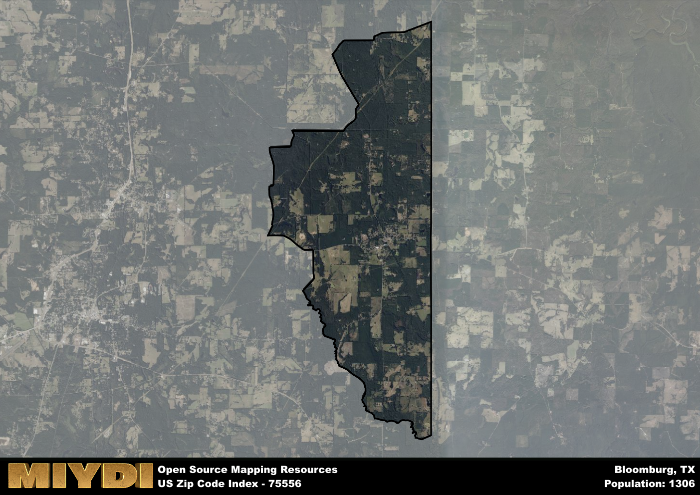

**Area Name:** Bloomburg

**Zip Code:** 75556

**State:** TX

# Bloomburg: A Quaint Community in Northeast Texas

Located in the northeastern corner of Texas, zip code 75556 encompasses the small town of Bloomburg. Situated in Cass County, Bloomburg is surrounded by the towns of Atlanta, Queen City, and Linden. While it is a rural area, Bloomburg is in close proximity to the larger city of Texarkana, offering residents access to more urban amenities and services.

Bloomburg was established in the late 19th century and was named after the many blooming flowers in the area. The town grew steadily with the development of agriculture and timber industries. One of the notable events in Bloomburg's history was the construction of the Kansas City Southern Railway, which facilitated transportation and trade in the region. Today, Bloomburg retains its small-town charm and is known for its friendly community and scenic surroundings.

Presently, Bloomburg is a peaceful community with a focus on agriculture and small businesses. The town offers essential services such as schools, churches, and local stores. Residents and visitors can enjoy outdoor activities at nearby Lake Wright Patman or explore the historic downtown area. Bloomburg also hosts events that celebrate its heritage, such as the annual Bloomburg Bluegrass Festival. This tight-knit community continues to thrive amidst the natural beauty of Northeast Texas.

# Bloomburg Demographics

The population of Bloomburg is 1306.  
Bloomburg has a population density of 69.73 per square mile.  
The area of Bloomburg is 18.73 square miles.  

## Bloomburg Income and Economic Data

These demographic numbers are sourced from IRS return data, providing comprehensive insights into the population dynamics and economic trends within Bloomburg.

**Breakdown of return types for Bloomburg**

The table offers insight into the composition of tax returns filed with the IRS, categorizing them into three main types. Single returns represent filings by individuals, joint returns by married couples, and head of household returns by individuals who qualify as heads of households, typically having dependents. This breakdown provides an understanding of the different filing statuses adopted by taxpayers when submitting their tax documentation.

| Return Types filed for Bloomburg                              | Percentage          |
|----------------------------------------------------------|---------------------|
| Single Returns                                            | 0.41 |
| Joint Returns                                             | 0.43 |
| Head Household Returns                                    | 0.15 |

The income and economic data presented here is sourced from the IRS income brackets, utilized for categorizing tax returns by income levels. This table displays income ranges for both single filers and married couples, along with the corresponding number of returns and the percentage within each bracket, providing valuable insight into the distribution of taxes across various income groups.

| Bracket Name       | Single Filer Income Range | Married Couple Range | Number of Returns | Percentage of Returns |
|--------------------|----------------------------|----------------------|-------------------|-----------------------|
| 10% Bracket        | Up to $10,275              | Up to $20,550        | 180 | 0.33% |
| 12% Bracket        | $10,276 - $41,775          | $20,551 - $83,550    | 150 | 0.28% |
| 22% Bracket        | $41,776 - $89,075          | $83,551 - $178,150   | 100 | 0.19% |
| 24% Bracket        | $89,076 - $170,050         | $178,151 - $340,100  | 50 | 0.09% |
| 32% Bracket        | $170,051 - $215,950        | $340,101 - $431,900  | 60 | 0.11% |
| 35% Bracket        | $215,951 - $539,900        | $431,901 - $647,850  | 0 | 0% |

### Exploring Taxpayer Diversity: A Breakdown of Different Types of Tax Returns in Bloomburg

The table offers insights into various types of tax returns filed, reflecting different aspects of taxpayer activities and demographics. Categories include charitable returns for donations, dependent returns for claimed dependents, educator population, elderly population, real estate returns, self-employment returns, student loan returns, and unemployment returns, providing valuable insights into taxpayer behavior and demographics.

| Bloomburg Filing Types                    | Count | Percentage |
|--------------------------------------|-------|------------|
| Charitable Donations                 | 0 | 0% |
| Dependents Claimed                   | 0 | 0% |
| Educator Residents                   | 0 | 0% |
| Elderly Population                   | 130 | 0.24% |
| Farming Population                   | 40 | 0.074% |
| Real Estate Transactions             | 0 | 0% |
| Self-Employed Individuals            | 60 | 0.111% |
| Student Loan Cases                   | 0 | 0% |
| Unemployment Benefit Filings         | 90 | 0.17% |

## Bloomburg AI and Census Variables

The values presented in this dataset for Bloomburg are AI-optimized, streamlined, and categorized into relevant buckets for enhanced utility in AI and mapping programs. These simplified values have been optimized to facilitate efficient analysis and integration into various technological applications, offering users accessible and actionable insights into demographics within the Bloomburg area.

| AI Variables for Bloomburg | Value |
|-------------|-------|
| Shape Area | 69376341.9257813 |
| Shape Length | 46346.1358825092 |

## How to use this free AI optimized Geo-Spatial Data for Bloomburg, TX

This data is made freely available under the Creative Commons license, allowing for unrestricted use for any purpose. Users can access static resources directly from GitHub or leverage more advanced functionalities by utilizing the GeoJSON files. All datasets originate from official government or private sector sources and are meticulously compiled into relevant datasets within QGIS. However, the versatility of the data ensures compatibility with any mapping application.

## Data Accuracy Disclaimer
It's important to note that the data provided here may contain errors or discrepancies and should be considered as 'close enough' for business applications and AI rather than a definitive source of truth. This data is aggregated from multiple sources, some of which publish information on wildly different intervals, leading to potential inconsistencies. Additionally, certain data points may not be corrected for Covid-related changes, further impacting accuracy. Moreover, the assumption that demographic trends are consistent throughout a region may lead to discrepancies, as trends often concentrate in areas of highest population density. As a result, dense areas may be slightly underrepresented, while rural areas may be slightly overrepresented, resulting in a more conservative dataset. Furthermore, the focus primarily on areas within US Major and Minor Statistical areas means that approximately 40 million Americans living outside of these areas may not be fully represented. Lastly, the historical background and area descriptions generated using AI are susceptible to potential mistakes, so users should exercise caution when interpreting the information provided.
