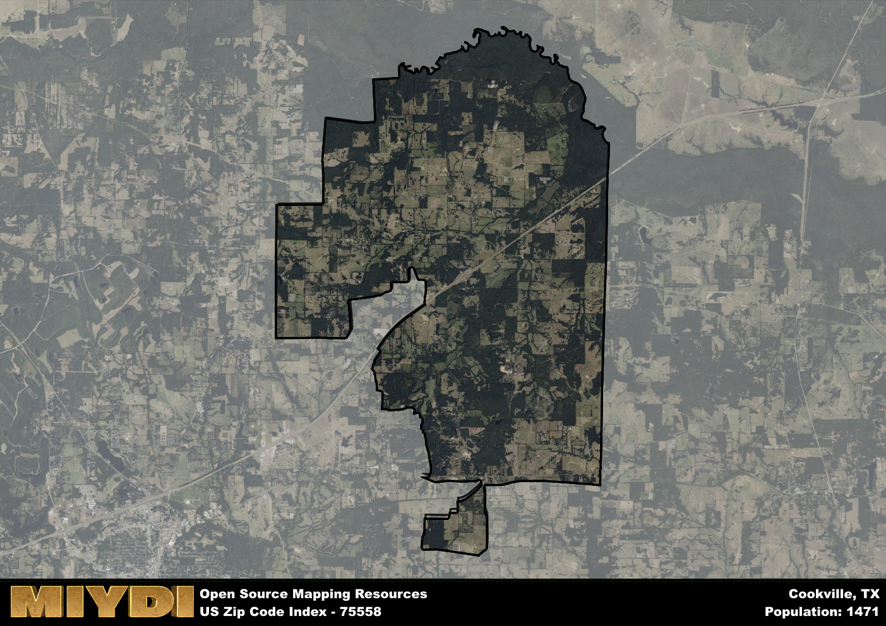

**Area Name:** Cookville

**Zip Code:** 75558

**State:** TX

Cookville is a part of the Mount Pleasant - TX Micro Area, and makes up  of the Metro's population.  

# Cookville: A Charming Neighborhood in Northeast Texas

Cookville, corresponding to the zip code 75558, is a small but vibrant community located in Northeast Texas. Bordered by the larger cities of Mount Pleasant to the east and Winnsboro to the west, Cookville serves as a peaceful residential area within close proximity to major population centers. The zip code area is characterized by its rural surroundings, with plenty of green spaces and a tight-knit community feel.

Originally settled in the mid-19th century, Cookville was named after a local landowner and has since grown into a quaint neighborhood with a rich historical background. The area saw significant development during the railroad boom of the late 1800s, which brought new opportunities and residents to the area. Over the years, Cookville has maintained its small-town charm while adapting to modern times, attracting new residents seeking a peaceful way of life.

Today, Cookville is a thriving community with a mix of residential and commercial spaces. The area is known for its agriculture and farming industries, with many residents working in these fields. Cookville offers a range of local services, including schools, shops, and restaurants, making it a self-sustaining neighborhood within the larger region. Residents and visitors alike can enjoy the area's parks, community events, and historic sites, showcasing the unique character of Cookville in Northeast Texas.

# Cookville Demographics

The population of Cookville is 1471.  
Cookville has a population density of 33.2 per square mile.  
The area of Cookville is 44.31 square miles.  

## Cookville Income and Economic Data

These demographic numbers are sourced from IRS return data, providing comprehensive insights into the population dynamics and economic trends within Cookville.

**Breakdown of return types for Cookville**

The table offers insight into the composition of tax returns filed with the IRS, categorizing them into three main types. Single returns represent filings by individuals, joint returns by married couples, and head of household returns by individuals who qualify as heads of households, typically having dependents. This breakdown provides an understanding of the different filing statuses adopted by taxpayers when submitting their tax documentation.

| Return Types filed for Cookville                              | Percentage          |
|----------------------------------------------------------|---------------------|
| Single Returns                                            | 0.38 |
| Joint Returns                                             | 0.47 |
| Head Household Returns                                    | 0.15 |

The income and economic data presented here is sourced from the IRS income brackets, utilized for categorizing tax returns by income levels. This table displays income ranges for both single filers and married couples, along with the corresponding number of returns and the percentage within each bracket, providing valuable insight into the distribution of taxes across various income groups.

| Bracket Name       | Single Filer Income Range | Married Couple Range | Number of Returns | Percentage of Returns |
|--------------------|----------------------------|----------------------|-------------------|-----------------------|
| 10% Bracket        | Up to $10,275              | Up to $20,550        | 210 | 0.32% |
| 12% Bracket        | $10,276 - $41,775          | $20,551 - $83,550    | 210 | 0.32% |
| 22% Bracket        | $41,776 - $89,075          | $83,551 - $178,150   | 110 | 0.17% |
| 24% Bracket        | $89,076 - $170,050         | $178,151 - $340,100  | 50 | 0.08% |
| 32% Bracket        | $170,051 - $215,950        | $340,101 - $431,900  | 80 | 0.12% |
| 35% Bracket        | $215,951 - $539,900        | $431,901 - $647,850  | 0 | 0% |

### Exploring Taxpayer Diversity: A Breakdown of Different Types of Tax Returns in Cookville

The table offers insights into various types of tax returns filed, reflecting different aspects of taxpayer activities and demographics. Categories include charitable returns for donations, dependent returns for claimed dependents, educator population, elderly population, real estate returns, self-employment returns, student loan returns, and unemployment returns, providing valuable insights into taxpayer behavior and demographics.

| Cookville Filing Types                    | Count | Percentage |
|--------------------------------------|-------|------------|
| Charitable Donations                 | 0 | 0% |
| Dependents Claimed                   | 0 | 0% |
| Educator Residents                   | 0 | 0% |
| Elderly Population                   | 190 | 0.29% |
| Farming Population                   | 100 | 0.152% |
| Real Estate Transactions             | 0 | 0% |
| Self-Employed Individuals            | 80 | 0.121% |
| Student Loan Cases                   | 0 | 0% |
| Unemployment Benefit Filings         | 80 | 0.12% |

## Cookville AI and Census Variables

The values presented in this dataset for Cookville are AI-optimized, streamlined, and categorized into relevant buckets for enhanced utility in AI and mapping programs. These simplified values have been optimized to facilitate efficient analysis and integration into various technological applications, offering users accessible and actionable insights into demographics within the Cookville area.

| AI Variables for Cookville | Value |
|-------------|-------|
| Shape Area | 164523298.71875 |
| Shape Length | 82603.689473965 |
| CBSA Federal Processing Standard Code | 34420 |

## How to use this free AI optimized Geo-Spatial Data for Cookville, TX

This data is made freely available under the Creative Commons license, allowing for unrestricted use for any purpose. Users can access static resources directly from GitHub or leverage more advanced functionalities by utilizing the GeoJSON files. All datasets originate from official government or private sector sources and are meticulously compiled into relevant datasets within QGIS. However, the versatility of the data ensures compatibility with any mapping application.

## Data Accuracy Disclaimer
It's important to note that the data provided here may contain errors or discrepancies and should be considered as 'close enough' for business applications and AI rather than a definitive source of truth. This data is aggregated from multiple sources, some of which publish information on wildly different intervals, leading to potential inconsistencies. Additionally, certain data points may not be corrected for Covid-related changes, further impacting accuracy. Moreover, the assumption that demographic trends are consistent throughout a region may lead to discrepancies, as trends often concentrate in areas of highest population density. As a result, dense areas may be slightly underrepresented, while rural areas may be slightly overrepresented, resulting in a more conservative dataset. Furthermore, the focus primarily on areas within US Major and Minor Statistical areas means that approximately 40 million Americans living outside of these areas may not be fully represented. Lastly, the historical background and area descriptions generated using AI are susceptible to potential mistakes, so users should exercise caution when interpreting the information provided.
