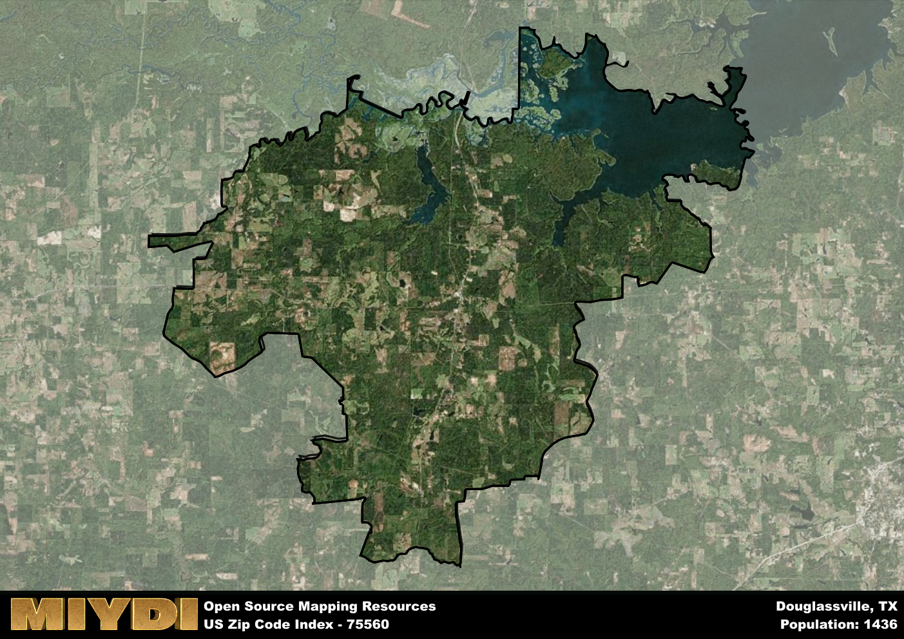

**Area Name:** Douglassville

**Zip Code:** 75560

**State:** TX

Douglassville is a part of the Texarkana - TX-AR Metro Area, and makes up  of the Metro's population.  

# Douglassville: A Historic and Vibrant Community in Zip Code 75560  

Located in the northeastern region of Texas, zip code 75560 encompasses the charming community of Douglassville. Situated within Cass County, Douglassville is surrounded by the cities of Atlanta to the west and Linden to the east. This zip code area is an integral part of the greater Texarkana metropolitan area, offering residents a peaceful rural setting while still being within a reasonable distance to urban amenities and employment opportunities.

Established in the mid-19th century, Douglassville has a rich history of agricultural development and logging industries. The area was originally settled by pioneers drawn to the fertile land and abundant natural resources. Over the years, Douglassville grew into a thriving community known for its strong sense of community and Southern hospitality. The name "Douglassville" is believed to have been derived from the surname of an early settler or prominent local figure.

Today, Douglassville continues to maintain its small-town charm while embracing modern conveniences. The area boasts a mix of agricultural and commercial enterprises, providing residents with employment opportunities and access to essential services. Outdoor enthusiasts can enjoy the natural beauty of the surrounding countryside through hiking trails and fishing spots. Douglassville also takes pride in its historic sites, such as the Douglassville Cemetery, which serves as a reminder of the area's heritage. With its welcoming atmosphere and picturesque surroundings, Douglassville remains a beloved community within the Texarkana region.

# Douglassville Demographics

The population of Douglassville is 1436.  
Douglassville has a population density of 14.64 per square mile.  
The area of Douglassville is 98.11 square miles.  

## Douglassville Income and Economic Data

These demographic numbers are sourced from IRS return data, providing comprehensive insights into the population dynamics and economic trends within Douglassville.

**Breakdown of return types for Douglassville**

The table offers insight into the composition of tax returns filed with the IRS, categorizing them into three main types. Single returns represent filings by individuals, joint returns by married couples, and head of household returns by individuals who qualify as heads of households, typically having dependents. This breakdown provides an understanding of the different filing statuses adopted by taxpayers when submitting their tax documentation.

| Return Types filed for Douglassville                              | Percentage          |
|----------------------------------------------------------|---------------------|
| Single Returns                                            | 0.44 |
| Joint Returns                                             | 0.37 |
| Head Household Returns                                    | 0.19 |

The income and economic data presented here is sourced from the IRS income brackets, utilized for categorizing tax returns by income levels. This table displays income ranges for both single filers and married couples, along with the corresponding number of returns and the percentage within each bracket, providing valuable insight into the distribution of taxes across various income groups.

| Bracket Name       | Single Filer Income Range | Married Couple Range | Number of Returns | Percentage of Returns |
|--------------------|----------------------------|----------------------|-------------------|-----------------------|
| 10% Bracket        | Up to $10,275              | Up to $20,550        | 180 | 0.42% |
| 12% Bracket        | $10,276 - $41,775          | $20,551 - $83,550    | 110 | 0.26% |
| 22% Bracket        | $41,776 - $89,075          | $83,551 - $178,150   | 60 | 0.14% |
| 24% Bracket        | $89,076 - $170,050         | $178,151 - $340,100  | 40 | 0.09% |
| 32% Bracket        | $170,051 - $215,950        | $340,101 - $431,900  | 40 | 0.09% |
| 35% Bracket        | $215,951 - $539,900        | $431,901 - $647,850  | 0 | 0% |

### Exploring Taxpayer Diversity: A Breakdown of Different Types of Tax Returns in Douglassville

The table offers insights into various types of tax returns filed, reflecting different aspects of taxpayer activities and demographics. Categories include charitable returns for donations, dependent returns for claimed dependents, educator population, elderly population, real estate returns, self-employment returns, student loan returns, and unemployment returns, providing valuable insights into taxpayer behavior and demographics.

| Douglassville Filing Types                    | Count | Percentage |
|--------------------------------------|-------|------------|
| Charitable Donations                 | 0 | 0% |
| Dependents Claimed                   | 0 | 0% |
| Educator Residents                   | 0 | 0% |
| Elderly Population                   | 130 | 0.3% |
| Farming Population                   | 40 | 0.093% |
| Real Estate Transactions             | 0 | 0% |
| Self-Employed Individuals            | 40 | 0.093% |
| Student Loan Cases                   | 0 | 0% |
| Unemployment Benefit Filings         | 50 | 0.12% |

## Douglassville AI and Census Variables

The values presented in this dataset for Douglassville are AI-optimized, streamlined, and categorized into relevant buckets for enhanced utility in AI and mapping programs. These simplified values have been optimized to facilitate efficient analysis and integration into various technological applications, offering users accessible and actionable insights into demographics within the Douglassville area.

| AI Variables for Douglassville | Value |
|-------------|-------|
| Shape Area | 363904400.839844 |
| Shape Length | 155649.060052698 |
| CBSA Federal Processing Standard Code | 45500 |

## How to use this free AI optimized Geo-Spatial Data for Douglassville, TX

This data is made freely available under the Creative Commons license, allowing for unrestricted use for any purpose. Users can access static resources directly from GitHub or leverage more advanced functionalities by utilizing the GeoJSON files. All datasets originate from official government or private sector sources and are meticulously compiled into relevant datasets within QGIS. However, the versatility of the data ensures compatibility with any mapping application.

## Data Accuracy Disclaimer
It's important to note that the data provided here may contain errors or discrepancies and should be considered as 'close enough' for business applications and AI rather than a definitive source of truth. This data is aggregated from multiple sources, some of which publish information on wildly different intervals, leading to potential inconsistencies. Additionally, certain data points may not be corrected for Covid-related changes, further impacting accuracy. Moreover, the assumption that demographic trends are consistent throughout a region may lead to discrepancies, as trends often concentrate in areas of highest population density. As a result, dense areas may be slightly underrepresented, while rural areas may be slightly overrepresented, resulting in a more conservative dataset. Furthermore, the focus primarily on areas within US Major and Minor Statistical areas means that approximately 40 million Americans living outside of these areas may not be fully represented. Lastly, the historical background and area descriptions generated using AI are susceptible to potential mistakes, so users should exercise caution when interpreting the information provided.
